# IPC Communication

This document explains how the main process and renderer processes communicate in Snaplark using Electron's Inter-Process Communication (IPC).

## Overview

Electron uses IPC (Inter-Process Communication) to enable communication between:
- **Main Process** → **Renderer Process** (one-way messages)
- **Renderer Process** → **Main Process** (requests with responses)
- **Renderer Process** ↔ **Main Process** (bidirectional)

## Communication Patterns

### High-Level IPC Architecture

```
┌─────────────────────────────────────────────────────────────────────────────┐
│                        ELECTRON IPC ARCHITECTURE                             │
├─────────────────────────────────────────────────────────────────────────────┤
│                                                                              │
│   MAIN PROCESS                    PRELOAD                    RENDERER        │
│   (Node.js)                       (Bridge)                   (Vue.js)        │
│                                                                              │
│   ┌─────────────┐              ┌─────────────┐           ┌─────────────┐    │
│   │             │              │             │           │             │    │
│   │  ipcMain    │◄────────────▶│ ipcRenderer │◄─────────▶│  Vue App    │    │
│   │             │              │             │           │             │    │
│   │  • handle() │   invoke()   │ contextBridge│  window.  │  • stores   │    │
│   │  • on()     │◄────────────▶│             │◄─────────▶│  • views    │    │
│   │  • send()   │   send()     │ exposeIn    │  electron │  • comps    │    │
│   │             │              │ MainWorld() │           │             │    │
│   └─────────────┘              └─────────────┘           └─────────────┘    │
│         │                            │                          │           │
│         │                            │                          │           │
│         ▼                            ▼                          ▼           │
│   ┌─────────────┐              ┌─────────────┐           ┌─────────────┐    │
│   │ Full Node   │              │ Limited API │           │ No Node.js  │    │
│   │ • fs        │              │ • Defined   │           │ • window.*  │    │
│   │ • os        │              │   methods   │           │ • DOM only  │    │
│   │ • electron  │              │   only      │           │             │    │
│   └─────────────┘              └─────────────┘           └─────────────┘    │
│                                                                              │
└─────────────────────────────────────────────────────────────────────────────┘
```

### IPC Patterns Visual Guide

```mermaid
flowchart TB
    subgraph Main["⚙️ MAIN PROCESS"]
        ipcMain["ipcMain"]
        handlers["IPC Handlers"]
        ipcMain --> handlers
    end

    subgraph Preload["🔒 PRELOAD SCRIPT"]
        ipcRenderer["ipcRenderer"]
        contextBridge["contextBridge"]
        ipcRenderer --> contextBridge
    end

    subgraph Renderer["🖥️ RENDERER PROCESS"]
        windowAPI["window.electron"]
        vue["Vue Components"]
        windowAPI --> vue
    end

    handlers <-->|"handle / invoke"| ipcRenderer
    handlers -->|"webContents.send"| ipcRenderer
    ipcRenderer -->|"send / sendSync"| handlers
    contextBridge -->|"exposeInMainWorld"| windowAPI
```



## Preload Bridge

**Location:** `src/preload.js`

The preload script creates a secure bridge between main and renderer:

```javascript
import { contextBridge, ipcRenderer } from 'electron'

// System operations
contextBridge.exposeInMainWorld('electron', {
    // One-way: Renderer → Main
    quit: () => ipcRenderer.send('quit-app'),

    // Request-response: Renderer → Main → Renderer
    getAppVersion: () => ipcRenderer.invoke('get-app-version'),
    getDeviceName: () => ipcRenderer.invoke('get-device-name'),
    openExternal: (url) => ipcRenderer.invoke('open-external', url),
    showItemInFolder: (path) => ipcRenderer.invoke('show-item-in-folder', path),
    writeToClipboard: (text) => ipcRenderer.invoke('write-to-clipboard', text),
    readFileAsBuffer: (path) => ipcRenderer.invoke('read-file-as-buffer', path),
    selectFolder: () => ipcRenderer.invoke('dialog:openDirectory'),

    // Screenshot operations
    startScreenshotMode: () => ipcRenderer.invoke('start-screenshot-mode'),
    takeScreenshot: (rect) => ipcRenderer.invoke('take-screenshot', rect),
    copyScreenshot: (dataUrl) => ipcRenderer.invoke('copy-screenshot', dataUrl),
    saveScreenshotDirectly: (data) => ipcRenderer.invoke('save-screenshot-directly', data),
    saveScreenshotWithDialog: (data) => ipcRenderer.invoke('save-screenshot-with-dialog', data),

    // Video operations
    startVideoRecordingMode: () => ipcRenderer.invoke('start-video-recording-mode'),
    getSources: () => ipcRenderer.invoke('get-sources'),
    initRecordingStream: (filename) => ipcRenderer.invoke('init-recording-stream', filename),
    appendRecordingChunk: (chunk) => ipcRenderer.invoke('append-recording-chunk', chunk),
    stopRecordingStream: () => ipcRenderer.invoke('stopRecordingStream'),
    saveVideo: (data) => ipcRenderer.invoke('saveVideo', data),

    // Event listeners: Main → Renderer
    onScreenshotTrigger: (callback) => {
        ipcRenderer.on('trigger-screenshot', callback)
    },
    onRecordingTrigger: (callback) => {
        ipcRenderer.on('trigger-video-recording', callback)
    },
    onQuickMenuTrigger: (callback) => {
        ipcRenderer.on('trigger-quick-menu', callback)
    }
})

// Window management
contextBridge.exposeInMainWorld('electronWindows', {
    createWindow: (type, options) => ipcRenderer.invoke('create-window', type, options),
    closeWindow: (type) => ipcRenderer.invoke('close-window', type),
    closeWindowsByType: (type) => ipcRenderer.invoke('close-windows-by-type', type),
    showWindow: (type) => ipcRenderer.invoke('show-window', type),
    hideWindow: (type) => ipcRenderer.invoke('hide-window', type),
    resizeWindow: (type, w, h) => ipcRenderer.invoke('resize-window', type, w, h),
    moveWindow: (type, x, y) => ipcRenderer.invoke('move-window', type, x, y),
    centerWindow: (type) => ipcRenderer.invoke('center-window', type),
    makeWindowBlocking: (type) => ipcRenderer.invoke('make-window-blocking', type),
    makeWindowNonBlocking: (type) => ipcRenderer.invoke('make-window-non-blocking', type)
})

// Persistent store
contextBridge.exposeInMainWorld('electronStore', {
    // Synchronous get (uses sendSync for immediate value)
    get: (key) => ipcRenderer.sendSync('store:get', key),

    // Async set
    set: (key, value) => ipcRenderer.invoke('store:set', key, value),

    // Sync and broadcast to other windows
    sync: (key, value) => ipcRenderer.invoke('store:sync', key, value),

    // Listen for updates from other windows
    onUpdate: (callback) => {
        ipcRenderer.on('store:update', (event, data) => callback(data))
    }
})

// Notifications
contextBridge.exposeInMainWorld('electronNotifications', {
    notify: (data) => ipcRenderer.invoke('notify', data),
    resize: (height) => ipcRenderer.invoke('notifications:resize', height),
    reposition: () => ipcRenderer.invoke('notifications:reposition'),
    show: () => ipcRenderer.invoke('notifications:show'),
    hide: () => ipcRenderer.invoke('notifications:hide'),
    close: () => ipcRenderer.invoke('notifications:close'),
    onVideoChunk: (callback) => {
        ipcRenderer.on('notifications:video-chunk', (event, data) => callback(data))
    },
    onVideoFinalize: (callback) => {
        ipcRenderer.on('notifications:video-finalize', (event, data) => callback(data))
    }
})

// Authentication
contextBridge.exposeInMainWorld('electronAuth', {
    onAuthResponse: (callback) => {
        ipcRenderer.on('auth-response', (event, data) => callback(data))
    }
})

// Connectivity
contextBridge.exposeInMainWorld('electronConnectivity', {
    sendStatus: (status) => ipcRenderer.send('connectivity-status', status),
    onStatusChange: (callback) => {
        ipcRenderer.on('connectivity-event', (event, data) => callback(data))
    }
})
```

## IPC Patterns

### Pattern 1: invoke/handle (Request-Response)

Used when the renderer needs a response from main:

```javascript
// Main process (main.js)
ipcMain.handle('get-app-version', () => {
    return app.getVersion()
})

ipcMain.handle('take-screenshot', async (event, rect) => {
    const screenshot = await screenshotService.capture(rect)
    return screenshot.toDataURL()
})

// Preload (preload.js)
getAppVersion: () => ipcRenderer.invoke('get-app-version')
takeScreenshot: (rect) => ipcRenderer.invoke('take-screenshot', rect)

// Renderer (component)
const version = await window.electron.getAppVersion()
const image = await window.electron.takeScreenshot(selectionRect)
```

### Pattern 2: send/on (One-Way, Renderer → Main)

Used for fire-and-forget messages:

```javascript
// Main process
ipcMain.on('quit-app', () => {
    app.quit()
})

ipcMain.on('connectivity-status', (event, data) => {
    console.log('Connectivity:', data.status)
})

// Preload
quit: () => ipcRenderer.send('quit-app')
sendStatus: (status) => ipcRenderer.send('connectivity-status', status)

// Renderer
window.electron.quit()
window.electronConnectivity.sendStatus({ isOnline: true })
```

### Pattern 3: send/on (One-Way, Main → Renderer)

Used for main process to notify renderer:

```javascript
// Main process
const mainWindow = windowManager.getWindow('main')
mainWindow.webContents.send('trigger-screenshot')
mainWindow.webContents.send('auth-response', { access_token: 'xxx' })

// Preload
onScreenshotTrigger: (callback) => {
    ipcRenderer.on('trigger-screenshot', callback)
}

// Renderer
window.electron.onScreenshotTrigger(() => {
    startScreenshotMode()
})
```

### Pattern 4: sendSync (Synchronous, Blocking)

Used when immediate value is needed (use sparingly):

```javascript
// Main process
ipcMain.on('store:get', (event, key) => {
    event.returnValue = store.get(key)
})

// Preload
get: (key) => ipcRenderer.sendSync('store:get', key)

// Renderer
const token = window.electronStore.get('auth_token')  // Blocks until response
```

## IPC Handlers in Main Process

### Window Management Handlers

```javascript
// src/services/window-manager.js
setupIPCHandlers() {
    ipcMain.handle('create-window', async (event, type, options) => {
        return this.createWindow(type, options)
    })

    ipcMain.handle('close-window', async (event, type) => {
        return this.closeWindow(type)
    })

    ipcMain.handle('close-windows-by-type', async (event, type) => {
        return this.closeWindowsByType(type)
    })

    ipcMain.handle('show-window', async (event, type) => {
        const win = this.getWindow(type)
        if (win) win.show()
    })

    ipcMain.handle('hide-window', async (event, type) => {
        const win = this.getWindow(type)
        if (win) win.hide()
    })

    ipcMain.handle('resize-window', async (event, type, width, height) => {
        const win = this.getWindow(type)
        if (win) win.setSize(width, height)
    })
}
```

### Screenshot Service Handlers

```javascript
// src/services/screenshot-service.js
setupIPCHandlers() {
    ipcMain.handle('start-screenshot-mode', async () => {
        return this.startScreenshotMode()
    })

    ipcMain.handle('take-screenshot', async (event, rect) => {
        return this.captureRegion(rect)
    })

    ipcMain.handle('copy-screenshot', async (event, dataUrl) => {
        const img = nativeImage.createFromDataURL(dataUrl)
        clipboard.writeImage(img)
        return { success: true }
    })

    ipcMain.handle('save-screenshot-directly', async (event, { dataUrl, filename }) => {
        const buffer = Buffer.from(dataUrl.split(',')[1], 'base64')
        const savePath = path.join(this.defaultSaveFolder, filename)
        fs.writeFileSync(savePath, buffer)
        return { success: true, path: savePath }
    })
}
```

### Store Service Handlers

```javascript
// src/services/store-service.js
setupIPCHandlers() {
    // Synchronous get (returns immediately)
    ipcMain.on('store:get', (event, key) => {
        event.returnValue = this.store.get(key)
    })

    // Async set
    ipcMain.handle('store:set', async (event, key, value) => {
        this.store.set(key, value)
        return true
    })

    // Sync and broadcast
    ipcMain.handle('store:sync', async (event, key, value) => {
        this.store.set(key, value)

        // Broadcast to all windows except sender
        this.windowManager.broadcastToAllWindowsExcept(
            event.sender.id,
            'store:update',
            { key, value }
        )

        return true
    })
}
```

## Cross-Window Communication

Windows can communicate via the store sync mechanism:


**Implementation:**

```javascript
// Window 1 (sender)
window.electronStore.sync('settings', newSettings)

// Main process
ipcMain.handle('store:sync', async (event, key, value) => {
    this.store.set(key, value)

    // Get all windows
    const windows = BrowserWindow.getAllWindows()

    // Send to all except sender
    windows.forEach(win => {
        if (win.webContents.id !== event.sender.id) {
            win.webContents.send('store:update', { key, value })
        }
    })
})

// Window 2 & 3 (receivers)
window.electronStore.onUpdate(({ key, value }) => {
    store.updateFromMain(key, value)
})
```

## Channel Reference

### Renderer → Main (invoke)

| Channel | Purpose | Returns |
|---------|---------|---------|
| `get-app-version` | Get app version | string |
| `get-device-name` | Get hostname | string |
| `open-external` | Open URL in browser | void |
| `dialog:openDirectory` | Show folder picker | { filePaths, canceled } |
| `start-screenshot-mode` | Begin screenshot | void |
| `take-screenshot` | Capture region | dataURL string |
| `copy-screenshot` | Copy to clipboard | { success } |
| `start-video-recording-mode` | Begin recording | void |
| `get-sources` | List screen sources | Source[] |
| `create-window` | Create window | void |
| `close-window` | Close window | void |
| `store:set` | Set store value | boolean |
| `store:sync` | Set and broadcast | boolean |

### Renderer → Main (send)

| Channel | Purpose |
|---------|---------|
| `quit-app` | Quit application |
| `connectivity-status` | Report network status |

### Main → Renderer (send)

| Channel | Purpose |
|---------|---------|
| `trigger-screenshot` | Shortcut activated |
| `trigger-video-recording` | Shortcut activated |
| `trigger-quick-menu` | Shortcut activated |
| `auth-response` | Auth completed |
| `store:update` | Store changed |
| `connectivity-event` | Network status change |

## Security Considerations

1. **Context Isolation**: Renderer cannot access Node.js directly
2. **Validated APIs**: Preload only exposes specific functions
3. **No arbitrary IPC**: Channels are predefined
4. **Path validation**: File operations restricted to home directory

```javascript
// Safe: Only allowed operations exposed
contextBridge.exposeInMainWorld('electron', {
    openExternal: (url) => ipcRenderer.invoke('open-external', url)
})

// Main validates URL
ipcMain.handle('open-external', (event, url) => {
    // Could add URL validation here
    shell.openExternal(url)
})
```

## Debugging IPC

Enable IPC logging in development:

```javascript
// preload.js (development only)
if (process.env.NODE_ENV === 'development') {
    const originalInvoke = ipcRenderer.invoke
    ipcRenderer.invoke = (channel, ...args) => {
        console.log('[IPC invoke]', channel, args)
        return originalInvoke(channel, ...args)
    }
}
```

## Next Steps

- [State Management](/architecture/state-management) - Pinia + electron-store
- [Window Management](/architecture/window-management) - Window lifecycle
- [Main Process](/architecture/main-process) - Handler implementations
