# Main Process

This document provides a detailed explanation of the Electron main process in Snaplark.

## Overview

The main process (`src/main.js`) is the entry point of the Electron application. It runs in a Node.js environment and has full access to system APIs.

**File:** `src/main.js` (920 lines)

## Responsibilities

1. **App Lifecycle** - Initialize, shutdown, single instance
2. **Window Management** - Create and manage BrowserWindows
3. **System Integration** - Tray, shortcuts, permissions
4. **IPC Handling** - Process requests from renderers
5. **Native Features** - File system, clipboard, dialogs
6. **Auto Updates** - Check and apply updates

## Code Structure

```
main.js
├── Imports and Configuration (1-50)
├── Single Instance Lock (51-71)
├── Protocol Client Setup (72-81)
├── Global State (82-95)
├── Permission Checking (96-123)
├── Window Creation (124-181)
├── Shortcut Registration (182-378)
├── Auto Updater Setup (379-390)
├── App Lifecycle Handlers (391-438)
├── Protocol Handlers (439-461)
├── IPC Handlers (462-868)
└── Deep Link Handlers (869-919)
```

## Initialization Sequence

### Application Startup Flow

```
┌─────────────────────────────────────────────────────────────────────────────┐
│                     MAIN PROCESS INITIALIZATION                              │
├─────────────────────────────────────────────────────────────────────────────┤
│                                                                              │
│   OS Launch                                                                  │
│       │                                                                      │
│       ▼                                                                      │
│   ┌───────────────────────────────────────────────────────────────────┐     │
│   │  STEP 1: Single Instance Lock                                      │     │
│   │  ┌─────────────────────┐    ┌─────────────────────┐               │     │
│   │  │  Lock Acquired?     │    │  NO: Quit app       │               │     │
│   │  │  app.requestSingle  │───▶│  Focus existing     │               │     │
│   │  │  InstanceLock()     │    │  instance           │               │     │
│   │  └─────────┬───────────┘    └─────────────────────┘               │     │
│   │            │ YES                                                   │     │
│   └────────────┼──────────────────────────────────────────────────────┘     │
│                ▼                                                             │
│   ┌───────────────────────────────────────────────────────────────────┐     │
│   │  STEP 2: app.whenReady()                                           │     │
│   │                                                                    │     │
│   │  ┌──────────────┐  ┌──────────────┐  ┌──────────────┐             │     │
│   │  │ Setup Auto   │  │ Setup        │  │ Setup IPC    │             │     │
│   │  │ Updater      │  │ Protocol     │  │ Handlers     │             │     │
│   │  │              │  │ Handlers     │  │              │             │     │
│   │  └──────────────┘  └──────────────┘  └──────────────┘             │     │
│   │                                                                    │     │
│   │  ┌──────────────┐  ┌──────────────┐                               │     │
│   │  │ Hide Dock    │  │ Set Login    │                               │     │
│   │  │ (macOS)      │  │ Item         │                               │     │
│   │  └──────────────┘  └──────────────┘                               │     │
│   └───────────────────────────────────────────────────────────────────┘     │
│                ▼                                                             │
│   ┌───────────────────────────────────────────────────────────────────┐     │
│   │  STEP 3: createWindow()                                            │     │
│   │                                                                    │     │
│   │  ┌─────────────────────────────────────────────────────────────┐  │     │
│   │  │  Check Permissions (macOS)                                   │  │     │
│   │  │  • Screen Recording    • Accessibility                       │  │     │
│   │  │  • Camera              • Microphone                          │  │     │
│   │  └─────────────────────────────────────────────────────────────┘  │     │
│   │            │                           │                          │     │
│   │   All Granted                 Missing Permissions                 │     │
│   │            │                           │                          │     │
│   │            ▼                           ▼                          │     │
│   │  ┌─────────────────┐         ┌─────────────────┐                 │     │
│   │  │ Create Main     │         │ Show Permission │                 │     │
│   │  │ Window          │         │ Request Window  │                 │     │
│   │  │ Initialize Tray │         │                 │                 │     │
│   │  │ Start Services  │         │ Wait for grants │                 │     │
│   │  └─────────────────┘         └─────────────────┘                 │     │
│   └───────────────────────────────────────────────────────────────────┘     │
│                ▼                                                             │
│   ┌───────────────────────────────────────────────────────────────────┐     │
│   │  STEP 4: Services Initialization                                   │     │
│   │                                                                    │     │
│   │  WindowManager ──▶ ScreenshotService ──▶ VideoRecordingService    │     │
│   │        │                                                           │     │
│   │        └──▶ NotificationService ──▶ StoreService                  │     │
│   │                                                                    │     │
│   └───────────────────────────────────────────────────────────────────┘     │
│                ▼                                                             │
│   ┌───────────────────────────────────────────────────────────────────┐     │
│   │  STEP 5: Register Global Shortcuts                                 │     │
│   │                                                                    │     │
│   │  ShortcutManager.registerAllShortcuts()                           │     │
│   │  • Cmd+Option+S → Screenshot                                       │     │
│   │  • Cmd+Option+R → Video Recording                                  │     │
│   │  • Cmd+Option+Q → Quick Menu                                       │     │
│   │                                                                    │     │
│   └───────────────────────────────────────────────────────────────────┘     │
│                                                                              │
│   ✅ App Ready                                                               │
│                                                                              │
└─────────────────────────────────────────────────────────────────────────────┘
```

### Sequence Diagram

```mermaid
sequenceDiagram
    autonumber
    participant OS as 💻 OS
    participant App as ⚙️ app.whenReady()
    participant AU as 🔄 Auto Updater
    participant WM as 🪟 Window Manager
    participant SM as ⌨️ Shortcut Manager
    participant SS as 📸 Services

    OS->>App: Launch application
    App->>App: Request single instance lock

    alt Lock acquired
        rect rgb(240, 248, 255)
            Note over App,AU: Setup Phase
            App->>AU: setupAutoUpdater()
            App->>App: setupProtocolHandlers()
            App->>App: setupIPCHandlers()
            App->>App: app.dock.hide() (macOS)
        end

        rect rgb(255, 248, 240)
            Note over App,WM: Window Creation
            App->>WM: new WindowManager()
            WM->>WM: Check permissions
            alt All permissions granted
                WM->>WM: createWindow('main')
                WM->>WM: Initialize SystemTray
            else Missing permissions
                WM->>WM: createWindow('permissions')
            end
        end

        rect rgb(240, 255, 240)
            Note over WM,SS: Service Initialization
            WM->>SS: new ScreenshotService()
            WM->>SS: new VideoRecordingService()
            WM->>SS: new NotificationService()
        end

        rect rgb(255, 240, 255)
            Note over App,SM: Shortcut Registration
            App->>SM: new ShortcutManager()
            SM->>SM: registerAllShortcuts()
        end
    else Lock not acquired
        App->>OS: Quit (another instance running)
    end
```



## Key Components

### Single Instance Lock

Ensures only one instance of Snaplark runs at a time:

```javascript
const gotTheLock = app.requestSingleInstanceLock()

if (!gotTheLock) {
    app.quit()
} else {
    app.on('second-instance', (event, commandLine, workingDirectory) => {
        // Focus existing window
        const mainWindow = windowManager?.getWindow('main')
        if (mainWindow) {
            if (mainWindow.isMinimized()) mainWindow.restore()
            mainWindow.show()
            mainWindow.focus()
        }

        // Handle deep links from second instance
        const url = commandLine.find(arg => arg.startsWith('snaplark://'))
        if (url) {
            handleProtocolUrl(url)
        }
    })
}
```

### Protocol Registration

Registers `snaplark://` protocol for authentication:

```javascript
if (process.defaultApp) {
    // Development: register with path to script
    if (process.argv.length >= 2) {
        app.setAsDefaultProtocolClient('snaplark', process.execPath, [
            path.resolve(process.argv[1])
        ])
    }
} else {
    // Production: register normally
    app.setAsDefaultProtocolClient('snaplark')
}
```

### Store Initialization

```javascript
const store = new Store({
    defaults: getPersistableDefaults(),
    encryptionKey: "snaplark-encryption-key"
})
```

**Storage location:**
- macOS: `~/Library/Application Support/Snaplark/config.json`
- Windows: `%APPDATA%/Snaplark/config.json`

### Auto Updater

```javascript
const setupAutoUpdater = () => {
    updateElectronApp({
        updateSource: {
            type: UpdateSourceType.StaticStorage,
            baseUrl: `https://usc1.contabostorage.com/.../releases/${process.platform}/${process.arch}`
        }
    })
}
```

## Window Creation

The `createWindow()` function initializes the main window and services:

```javascript
const createWindow = () => {
    // Create WindowManager with Vite URLs
    windowManager = new WindowManager(
        MAIN_WINDOW_VITE_DEV_SERVER_URL,
        MAIN_WINDOW_VITE_NAME,
        store,
        shortcutManager
    )

    // Create main window
    const mainWindow = windowManager.createWindow('main')

    // Initialize store service for IPC
    storeService = new StoreService(windowManager, store)

    // Handle external links
    mainWindow.webContents.setWindowOpenHandler((details) => {
        shell.openExternal(details.url)
        return { action: 'deny' }
    })

    // Check permissions (macOS)
    if (process.platform === 'darwin') {
        const { allGranted } = checkAppPermissions()
        if (!allGranted) {
            windowManager.createWindow('permissions').show()
            return
        }
    }

    // Initialize system tray
    tray = new SystemTray(windowManager)

    // Auto-show window (unless launched at login)
    const launchInfo = app.getLoginItemSettings()
    if (!launchInfo.wasOpenedAtLogin) {
        setTimeout(() => {
            tray.showMainAtTray(null, { force: true, gap: 5 })
        }, 500)
    }

    // Initialize services
    screenshotService = new ScreenshotService(windowManager, store)
    videoRecordingService = new VideoRecordingService(windowManager, store)
    notificationService = new NotificationService(windowManager)

    // Pre-capture optimization
    mainWindow.on('show', () => {
        setTimeout(() => {
            screenshotService?.preCaptureScreens()
            videoRecordingService?.preCaptureScreens()
        }, 100)
    })
}
```

## IPC Handlers

### System Handlers

```javascript
// Quit application
ipcMain.on('quit-app', () => {
    app.quit()
})

// Get device name
ipcMain.handle('get-device-name', () => {
    return os.hostname()
})

// Get app version
ipcMain.handle('get-app-version', () => {
    return app.getVersion()
})

// Open external URL
ipcMain.handle('open-external', (event, url) => {
    shell.openExternal(url)
})

// Show file in folder
ipcMain.handle('show-item-in-folder', (event, filePath) => {
    shell.showItemInFolder(filePath)
})

// Write to clipboard
ipcMain.handle('write-to-clipboard', (event, text) => {
    clipboard.writeText(text)
    return { success: true }
})
```

### File System Handlers

```javascript
ipcMain.handle('read-file-as-buffer', async (event, filePath) => {
    // Security: Only allow reading from home directory
    const allowedDir = os.homedir()
    if (!path.resolve(filePath).startsWith(path.resolve(allowedDir))) {
        throw new Error('File access is restricted to the user home directory.')
    }

    if (fs.existsSync(filePath)) {
        return fs.readFileSync(filePath)
    }
    throw new Error(`File not found at path: ${filePath}`)
})

ipcMain.handle('dialog:openDirectory', async () => {
    const result = await dialog.showOpenDialog({
        properties: ['openDirectory', 'createDirectory']
    })
    return result
})
```

### Permission Handlers

```javascript
// Check all permissions
ipcMain.handle('check-system-permissions', async () => {
    await new Promise(resolve => setTimeout(resolve, 100))
    const permissions = checkAppPermissions().statuses

    // Check recent grants (optimistic update)
    const now = Date.now()
    for (const [permId, timestamp] of Object.entries(permissionGrantTimestamps)) {
        if (now - timestamp < 10000 && !permissions[permId]) {
            permissions[permId] = true
        }
    }

    return permissions
})

// Request specific permission
ipcMain.handle('request-system-permission', async (event, permissionId) => {
    // ... permission request logic (see permissions.md)
})

// Relaunch app
ipcMain.handle('relaunch-app', () => {
    app.relaunch()
    app.quit()
})
```

### Shortcut Handlers

```javascript
// Validate shortcut
ipcMain.handle('validate-shortcut', async (event, storeKey, hotkeyValue) => {
    if (!shortcutManager) {
        return { valid: false, error: 'Shortcut manager not initialized' }
    }

    const shortcutEntry = Object.entries(SHORTCUT_DEFINITIONS)
        .find(([, def]) => def.storeKey === storeKey)

    if (!shortcutEntry) {
        return { valid: false, error: 'Shortcut not found' }
    }

    const [, definition] = shortcutEntry
    const validation = shortcutManager.validateHotkey(
        hotkeyValue,
        definition.type,
        definition.id
    )

    return validation
})

// Update shortcut
ipcMain.handle('update-shortcut', async (event, storeKey, hotkeyValue) => {
    // Validate, update store, re-register
    // ... (see shortcuts.md for details)
})
```

### Connectivity Handler

```javascript
ipcMain.on('connectivity-status', (event, data) => {
    console.log(`Connectivity: ${data.status} (${data.isOnline ? 'Online' : 'Offline'})`)

    // Broadcast to all windows
    windowManager.broadcastToAllWindows('connectivity-event', {
        type: 'status-update',
        ...data
    })
})
```

## Protocol Handlers

### Screenshot Image Protocol

Serves screenshot images from the file system:

```javascript
protocol.handle('screenshot-image', (request) => {
    try {
        const url = request.url.replace(/^screenshot-image:\/\//, '')
        const decodedPath = decodeURIComponent(url)
        const filePath = path.normalize(decodedPath)
        return net.fetch(`file://${filePath}`)
    } catch (error) {
        return new Response('File not found', { status: 404 })
    }
})
```

### Local Video Protocol

Serves local video files:

```javascript
protocol.registerFileProtocol('local-video', (request, callback) => {
    const url = request.url.replace('local-video://', '')
    const decodedPath = decodeURIComponent(url)
    callback({ path: decodedPath })
})
```

## Deep Link Handling

```javascript
const handleProtocolUrl = (url) => {
    console.log('Protocol URL received:', url)

    if (url.startsWith('snaplark://auth')) {
        try {
            const urlObj = new URL(url)
            const params = new URLSearchParams(urlObj.search)

            const authData = {
                access_token: params.get('access_token')
            }

            const mainWindow = windowManager.getWindow('main')
            if (mainWindow && mainWindow.webContents) {
                mainWindow.webContents.send('auth-response', authData)
            }
        } catch (error) {
            console.error('Error parsing auth URL:', error)
            // Send error to renderer
        }
    }
}

// Handle URL when app is running
app.on('open-url', (event, url) => {
    event.preventDefault()
    handleProtocolUrl(url)
})

// Handle URL from command line (cold start)
if (process.argv.length >= 2) {
    const url = process.argv.find(arg => arg.startsWith('snaplark://'))
    if (url) {
        app.whenReady().then(() => {
            setTimeout(() => handleProtocolUrl(url), 1000)
        })
    }
}
```

## App Lifecycle

```javascript
app.whenReady().then(() => {
    setupAutoUpdater()
    setupProtocolHandlers()
    setupIPCHandlers()

    // Set launch at startup
    if (app.isPackaged) {
        app.setLoginItemSettings({
            openAtLogin: store.get('settings.launchAtStartup'),
            openAsHidden: true
        })
    }

    // Hide dock icon (macOS)
    if (process.platform === 'darwin') {
        app.dock.hide()
    }

    shortcutManager = new ShortcutManager(store)
    createWindow()
    registerAllShortcuts()

    app.on('activate', () => {
        if (BrowserWindow.getAllWindows().length === 0) {
            createWindow()
        }
    })
})

app.on('window-all-closed', () => {
    if (process.platform !== 'darwin') {
        app.quit()
    }
})

app.on('will-quit', () => {
    unregisterAllShortcuts()
})
```

## Permission Handler Setup

```javascript
app.on('web-contents-created', (event, webContents) => {
    webContents.session.setPermissionRequestHandler(
        (webContents, permission, callback) => {
            console.log(`Permission requested: ${permission}`)

            // Allow camera and microphone
            if (permission === 'media' ||
                permission === 'camera' ||
                permission === 'microphone') {
                callback(true)
            } else {
                callback(false)
            }
        }
    )
})
```

## Imported Modules

```javascript
// Electron modules
import {
    app, BrowserWindow, shell, ipcMain, protocol, screen,
    net, dialog, globalShortcut, systemPreferences, clipboard
} from 'electron'

// Node.js modules
import path from 'node:path'
import os from 'node:os'
import fs from 'node:fs'

// Third-party
import started from 'electron-squirrel-startup'
import { initMain as initAudioLoopback } from 'electron-audio-loopback'
import Store from 'electron-store'
import { updateElectronApp, UpdateSourceType } from 'update-electron-app'

// Local services
import SystemTray from './services/system_tray.js'
import WindowManager from './services/window-manager.js'
import ScreenshotService from './services/screenshot-service.js'
import VideoRecordingService from './services/video-recording-service.js'
import NotificationService from './services/notification-service.js'
import StoreService from './services/store-service.js'
import ShortcutManager from './services/shortcut-manager.js'
import { getPersistableDefaults } from './store-defaults.js'
import { SHORTCUT_DEFINITIONS } from './config/shortcuts.js'
```

## Next Steps

- [Renderer Process](/architecture/renderer-process) - Vue app architecture
- [IPC Communication](/architecture/ipc-communication) - Message passing details
- [Window Management](/architecture/window-management) - Window lifecycle
