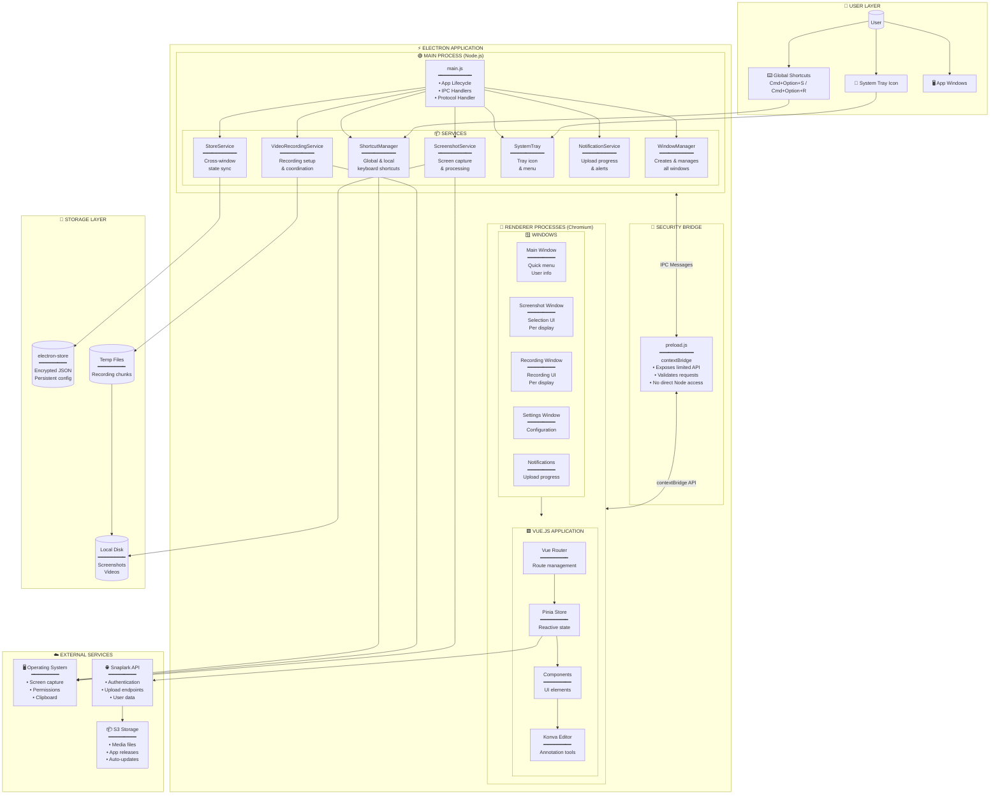
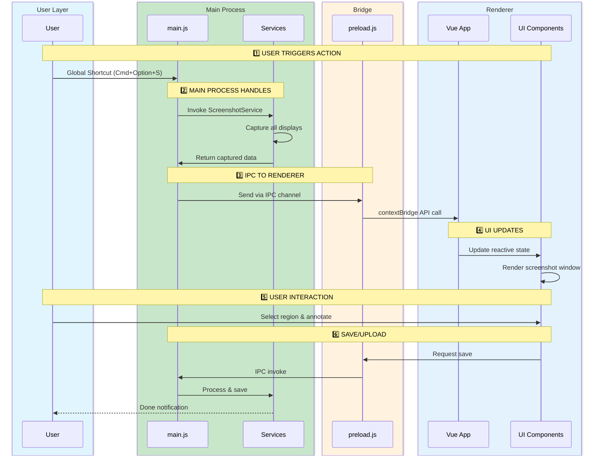
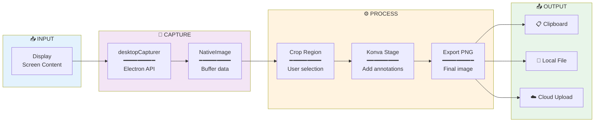
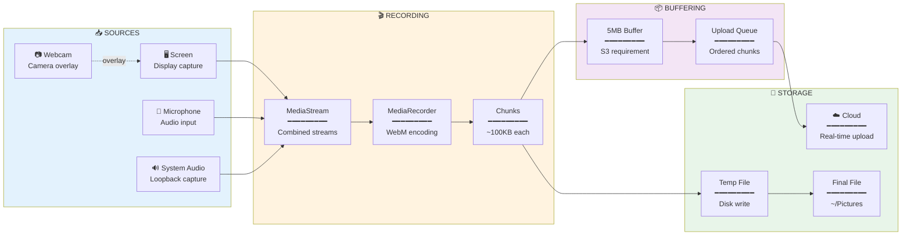
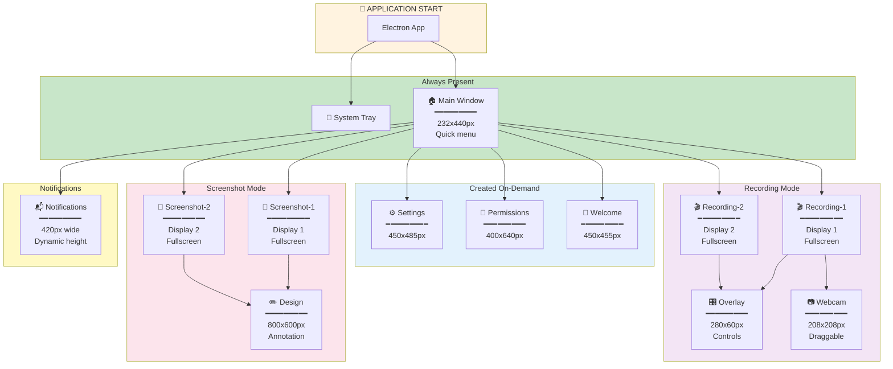
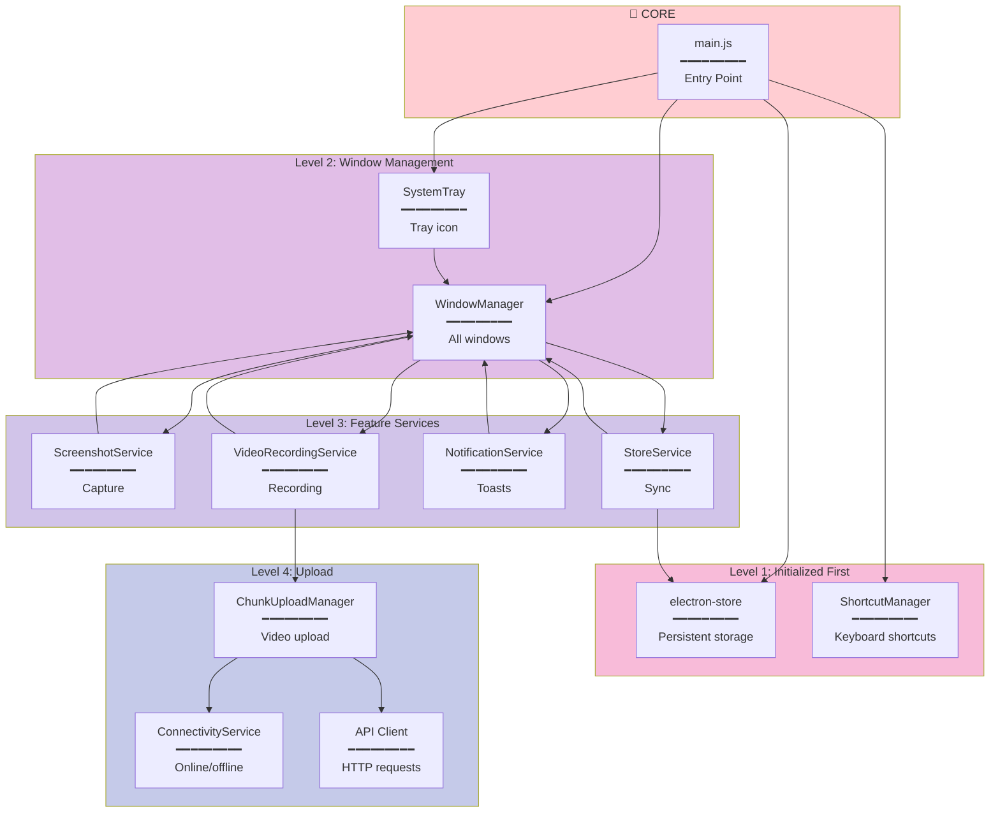

# Architecture Overview

This document provides a comprehensive view of Snaplark's architecture, explaining how all components work together layer by layer.

## System Architecture Diagram

The following diagram shows the complete system architecture with all layers:



## Layer-by-Layer Breakdown

### Layer 1: User Interaction

```
┌─────────────────────────────────────────────────────────────────┐
│                        USER INTERACTION                          │
├─────────────────────────────────────────────────────────────────┤
│                                                                  │
│   ⌨️ GLOBAL SHORTCUTS          🔲 SYSTEM TRAY         🖱️ UI    │
│   ━━━━━━━━━━━━━━━━━          ━━━━━━━━━━━━          ━━━━━━━   │
│   • Cmd+Option+S              • Left-click:         • Buttons  │
│     (Screenshot)                Show main           • Menus    │
│   • Cmd+Option+R              • Right-click:        • Forms    │
│     (Recording)                 Context menu                   │
│   • Cmd+Option+Q                                               │
│     (Quick Menu)                                               │
│                                                                 │
└─────────────────────────────────────────────────────────────────┘
                                   │
                                   ▼
```

### Layer 2: Electron Main Process

```
┌─────────────────────────────────────────────────────────────────┐
│                    MAIN PROCESS (Node.js)                        │
│                    Single process, full OS access                │
├─────────────────────────────────────────────────────────────────┤
│                                                                  │
│  ┌──────────────┐  ┌──────────────┐  ┌──────────────┐          │
│  │   main.js    │  │ WindowManager│  │ Screenshot   │          │
│  │  ━━━━━━━━━   │  │  ━━━━━━━━━   │  │  Service     │          │
│  │ Entry point  │──│ Creates all  │──│ ━━━━━━━━━    │          │
│  │ App lifecycle│  │ windows      │  │ Captures     │          │
│  │ IPC setup    │  │ Manages them │  │ screens      │          │
│  └──────────────┘  └──────────────┘  └──────────────┘          │
│          │                │                 │                   │
│  ┌──────────────┐  ┌──────────────┐  ┌──────────────┐          │
│  │  Shortcut    │  │   Video      │  │ Notification │          │
│  │  Manager     │  │  Recording   │  │   Service    │          │
│  │  ━━━━━━━━━   │  │  Service     │  │  ━━━━━━━━━   │          │
│  │ Registers    │  │  ━━━━━━━━━   │  │ Toast popups │          │
│  │ global keys  │  │ Recording    │  │ Upload       │          │
│  │              │  │ coordination │  │ progress     │          │
│  └──────────────┘  └──────────────┘  └──────────────┘          │
│                                                                  │
└─────────────────────────────────────────────────────────────────┘
                                   │
                                   │ IPC (ipcMain ↔ ipcRenderer)
                                   ▼
```

### Layer 3: Security Bridge (Preload)

```
┌─────────────────────────────────────────────────────────────────┐
│                    PRELOAD SCRIPT (Bridge)                       │
│               Runs in isolated context with limited access       │
├─────────────────────────────────────────────────────────────────┤
│                                                                  │
│   contextBridge.exposeInMainWorld('electron', {                 │
│       // Only these functions are available to renderer:        │
│       startScreenshotMode: () => ipcRenderer.invoke('...'),     │
│       takeScreenshot: (rect) => ipcRenderer.invoke('...'),      │
│       quit: () => ipcRenderer.send('quit-app'),                 │
│       // ... limited, validated API surface                     │
│   })                                                            │
│                                                                  │
│   ┌────────────────────────────────────────────────────────┐   │
│   │  ✅ ALLOWED                    ❌ BLOCKED              │   │
│   │  ─────────                     ─────────               │   │
│   │  • Specific IPC calls          • Direct fs access      │   │
│   │  • Window operations           • child_process         │   │
│   │  • Store get/set               • require()             │   │
│   │  • Defined events              • Node.js globals       │   │
│   └────────────────────────────────────────────────────────┘   │
│                                                                  │
└─────────────────────────────────────────────────────────────────┘
                                   │
                                   │ contextBridge (safe exposure)
                                   ▼
```

### Layer 4: Renderer Processes

```
┌─────────────────────────────────────────────────────────────────┐
│                 RENDERER PROCESSES (Chromium)                    │
│            One process per window, runs Vue.js app               │
├─────────────────────────────────────────────────────────────────┤
│                                                                  │
│  ┌─────────────────────────────────────────────────────────┐   │
│  │                    VUE.JS APPLICATION                    │   │
│  ├─────────────────────────────────────────────────────────┤   │
│  │                                                          │   │
│  │  ┌────────────┐   ┌────────────┐   ┌────────────┐      │   │
│  │  │ Vue Router │──▶│   Pinia    │──▶│ Components │      │   │
│  │  │ ━━━━━━━━━  │   │   Store    │   │ ━━━━━━━━━  │      │   │
│  │  │ /          │   │ ━━━━━━━━━  │   │ Views      │      │   │
│  │  │ /screenshot│   │ Reactive   │   │ Buttons    │      │   │
│  │  │ /recording │   │ state      │   │ Forms      │      │   │
│  │  │ /settings  │   │ management │   │ Modals     │      │   │
│  │  └────────────┘   └────────────┘   └────────────┘      │   │
│  │                                           │              │   │
│  │                                    ┌──────▼─────┐       │   │
│  │                                    │   Konva    │       │   │
│  │                                    │   Editor   │       │   │
│  │                                    │ ━━━━━━━━━  │       │   │
│  │                                    │ Drawing    │       │   │
│  │                                    │ Annotation │       │   │
│  │                                    └────────────┘       │   │
│  │                                                          │   │
│  └─────────────────────────────────────────────────────────┘   │
│                                                                  │
└─────────────────────────────────────────────────────────────────┘
```

## Process Communication Flow



## Data Flow Architecture

### Screenshot Data Pipeline



### Video Recording Pipeline



## Window Hierarchy



## Service Dependencies



## Security Model

```
┌─────────────────────────────────────────────────────────────────┐
│                      SECURITY ARCHITECTURE                       │
└─────────────────────────────────────────────────────────────────┘

┌─────────────────────────────────────────────────────────────────┐
│  MAIN PROCESS                                            TRUSTED │
│  ━━━━━━━━━━━━                                                   │
│  ✅ Full Node.js access                                         │
│  ✅ File system operations                                      │
│  ✅ Native module access                                        │
│  ✅ System API access                                           │
└───────────────────────────────┬─────────────────────────────────┘
                                │
                    ┌───────────▼───────────┐
                    │   PRELOAD SCRIPT      │
                    │   ━━━━━━━━━━━━━━━     │
                    │   🔐 contextBridge    │
                    │   • Limited API       │
                    │   • Validated calls   │
                    │   • No require()      │
                    └───────────┬───────────┘
                                │
┌───────────────────────────────▼─────────────────────────────────┐
│  RENDERER PROCESS                                    UNTRUSTED  │
│  ━━━━━━━━━━━━━━━━                                               │
│  ❌ No Node.js access                                           │
│  ❌ No file system                                              │
│  ❌ No native modules                                           │
│  ✅ Only window.electron.* APIs                                 │
└─────────────────────────────────────────────────────────────────┘

┌─────────────────────────────────────────────────────────────────┐
│  BUILD-TIME SECURITY (Fuses)                                    │
│  ━━━━━━━━━━━━━━━━━━━━━━━━━━                                     │
│                                                                  │
│  [DISABLED]                         [ENABLED]                   │
│  ──────────                         ─────────                   │
│  • RunAsNode: false                 • CookieEncryption: true    │
│  • NodeOptions: false               • ASARIntegrity: true       │
│  • InspectArgs: false               • OnlyLoadFromASAR: true    │
│                                                                  │
└─────────────────────────────────────────────────────────────────┘
```

## File System Layout

```
PROJECT STRUCTURE                    RUNTIME FILES
━━━━━━━━━━━━━━━━━                   ━━━━━━━━━━━━━━

snaplark/                            ~/Library/Application Support/Snaplark/
├── src/                             ├── config.json          # Settings
│   ├── main.js                      └── Cache/               # Chromium
│   ├── preload.js
│   ├── renderer.js                  ~/Pictures/Snaplark/
│   ├── services/                    ├── screenshot-*.png     # Captures
│   │   ├── window-manager.js        └── recording-*.webm     # Videos
│   │   ├── screenshot-service.js
│   │   ├── video-recording-service.js
│   │   └── ...                      $TMPDIR/
│   ├── views/                       └── snaplark-recording-* # Temp files
│   ├── components/
│   └── composables/
├── forge.config.js
└── package.json
```

## Next Steps

Now that you understand the architecture:

1. **[Main Process](/architecture/main-process)** - Deep dive into main.js and services
2. **[Renderer Process](/architecture/renderer-process)** - Vue app and components
3. **[IPC Communication](/architecture/ipc-communication)** - Message passing patterns
4. **[State Management](/architecture/state-management)** - Pinia + electron-store
5. **[Window Management](/architecture/window-management)** - Window lifecycle
