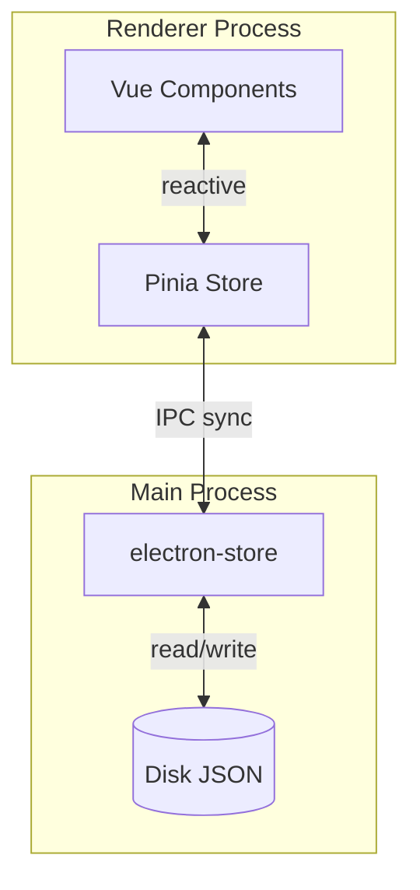
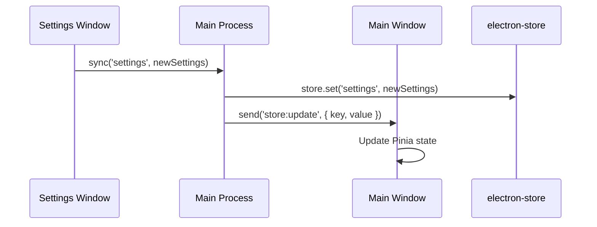
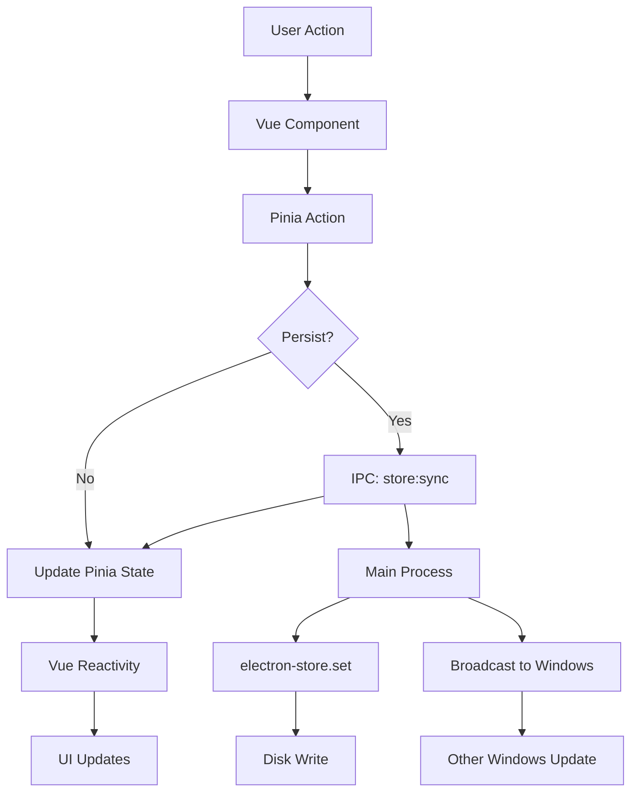
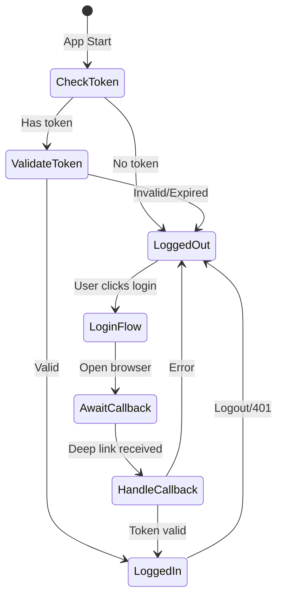

# State Management

This document explains how state is managed in Snaplark using Pinia (Vue store) and electron-store (persistent storage).

## Architecture Overview



## Two-Layer Architecture

### Layer 1: Pinia Store (Renderer)

- **Purpose**: Reactive state for Vue components
- **Scope**: Per-window (each renderer has its own Pinia instance)
- **Lifetime**: Window session
- **Technology**: Pinia 3.0.4

### Layer 2: electron-store (Main)

- **Purpose**: Persistent storage across sessions
- **Scope**: Application-wide (shared by all windows)
- **Lifetime**: Survives app restart
- **Technology**: electron-store 11.0.2

## Pinia Store

**Location:** `src/store.js`

```javascript
import { defineStore } from 'pinia'
import { apiClient } from '@/api/config'
import connectivityService from '@/services/connectivity'
import { getDefaultState, persistableKeys } from './store-defaults'

export const useStore = defineStore('main', {
    state: () => getDefaultState(),

    getters: {
        isAuthenticated: (state) => !!state.user && !!state.authToken,

        currentSettings: (state) => state.settings
    },

    actions: {
        // Authentication
        async initializeAuth() {
            const token = window.electronStore?.get('auth_token')
            if (token) {
                try {
                    const response = await apiClient.get('/user')
                    this.user = response.data
                    this.authToken = token
                } catch (error) {
                    this.logout()
                }
            }
        },

        async handleAuthSuccess(token) {
            this.authToken = token
            window.electronStore?.set('auth_token', token)

            const response = await apiClient.get('/user')
            this.user = response.data
        },

        logout(error = null) {
            this.user = null
            this.authToken = null
            this.authError = error
            window.electronStore?.set('auth_token', null)
        },

        // Settings
        updateSetting(key, value) {
            this.settings[key] = value
            window.electronStore?.sync('settings', this.settings)
        },

        // Cross-window sync
        initializeStoreSync() {
            window.electronStore?.onUpdate(({ key, value }) => {
                if (key === 'settings') {
                    this.settings = value
                } else if (key === 'user') {
                    this.user = value
                }
                // ... handle other keys
            })
        },

        // Connectivity
        initializeConnectivity() {
            this.isOnline = navigator.onLine

            window.addEventListener('online', () => {
                this.isOnline = true
            })

            window.addEventListener('offline', () => {
                this.isOnline = false
            })
        }
    },

    // Persist to electron-store
    persist: {
        key: 'snaplark-store',
        storage: {
            getItem: (key) => {
                const data = window.electronStore?.get(key)
                return data ? JSON.stringify(data) : null
            },
            setItem: (key, value) => {
                const data = JSON.parse(value)
                // Filter to only persistable keys
                const filtered = {}
                for (const k of persistableKeys) {
                    if (data[k] !== undefined) {
                        filtered[k] = data[k]
                    }
                }
                window.electronStore?.set(key, filtered)
            }
        }
    }
})
```

## Default State

**Location:** `src/store-defaults.js`

```javascript
// Platform detection
const isMac = typeof window !== 'undefined' &&
    window.navigator?.platform?.toLowerCase().includes('mac')

export const getDefaultState = () => ({
    // Authentication
    user: null,
    authToken: null,
    authError: null,
    isLoading: false,

    // Runtime state (not persisted)
    isOnline: true,
    connectivityStatus: 'online',

    // Persisted state
    welcomeCompleted: false,
    lastCapture: null,
    lastUpload: null,

    // Settings
    settings: {
        // General
        darkMode: false,
        launchAtStartup: true,
        showTooltips: true,
        defaultSaveFolder: '~/Pictures/Snaplark',

        // Hotkeys (platform-specific defaults)
        hotkeyScreenshot: isMac ? 'Cmd + Option + S' : 'Ctrl + Alt + S',
        hotkeyRecording: isMac ? 'Cmd + Option + R' : 'Ctrl + Alt + R',
        hotkeyQuickMenu: isMac ? 'Cmd + Option + Q' : 'Ctrl + Alt + Q',

        // Capture settings
        showMagnifier: true,
        showCrosshair: true,
        showCursor: true,

        // Recording settings
        recordingCountdown: true,
        flipCamera: false,
        webcamEnabled: false,
        systemAudioEnabled: false,
        selectedMicrophoneDeviceId: null,
        selectedWebcamDeviceId: null
    }
})

// Keys that should be persisted to electron-store
export const persistableKeys = [
    'welcomeCompleted',
    'lastCapture',
    'lastUpload',
    'settings'
]

// Helper for main process
export const getPersistableDefaults = () => {
    const defaults = getDefaultState()
    const persisted = {}
    for (const key of persistableKeys) {
        persisted[key] = defaults[key]
    }
    return persisted
}
```

## electron-store Configuration

**Location:** `src/main.js`

```javascript
import Store from 'electron-store'
import { getPersistableDefaults } from './store-defaults.js'

const store = new Store({
    defaults: getPersistableDefaults(),
    encryptionKey: "snaplark-encryption-key"
})
```

**Features:**
- **Encryption**: Sensitive data encrypted at rest
- **Defaults**: Fallback values if key doesn't exist
- **JSON Storage**: Human-readable (when not encrypted)

**Storage Location:**
- macOS: `~/Library/Application Support/Snaplark/config.json`
- Windows: `%APPDATA%/Snaplark/config.json`

## Cross-Window Synchronization

When one window updates state, other windows need to know:



**Implementation:**

```javascript
// Settings window updates a setting
store.updateSetting('darkMode', true)

// updateSetting action
updateSetting(key, value) {
    this.settings[key] = value
    window.electronStore?.sync('settings', this.settings)
}

// Preload: sync broadcasts to other windows
sync: (key, value) => ipcRenderer.invoke('store:sync', key, value)

// Main process handles sync
ipcMain.handle('store:sync', async (event, key, value) => {
    store.set(key, value)

    // Broadcast to all windows except sender
    BrowserWindow.getAllWindows().forEach(win => {
        if (win.webContents.id !== event.sender.id) {
            win.webContents.send('store:update', { key, value })
        }
    })
})

// Other windows listen for updates
initializeStoreSync() {
    window.electronStore?.onUpdate(({ key, value }) => {
        if (key === 'settings') {
            this.settings = value
        }
    })
}
```

## State Flow Diagram



## Usage Examples

### Reading State in Components

```vue
<script setup>
import { useStore } from '@/store'
import { computed } from 'vue'

const store = useStore()

// Direct access
const user = store.user
const settings = store.settings

// Computed (reactive)
const isAuthenticated = computed(() => store.isAuthenticated)
const darkMode = computed(() => store.settings.darkMode)
</script>

<template>
    <div :class="{ 'dark': darkMode }">
        <span v-if="isAuthenticated">{{ user.name }}</span>
    </div>
</template>
```

### Updating Settings

```vue
<script setup>
import { useStore } from '@/store'

const store = useStore()

const toggleDarkMode = () => {
    store.updateSetting('darkMode', !store.settings.darkMode)
}

const updateHotkey = (newHotkey) => {
    store.updateSetting('hotkeyScreenshot', newHotkey)
}
</script>
```

### Accessing Store from Main Process

```javascript
// main.js
const store = new Store({ /* config */ })

// Read
const settings = store.get('settings')
const token = store.get('auth_token')

// Write
store.set('settings.darkMode', true)
store.set('lastCapture', { timestamp: Date.now() })

// Delete
store.delete('auth_token')

// Check existence
if (store.has('welcomeCompleted')) {
    // ...
}
```

## Authentication State Flow



## State Categories

### Runtime State (Not Persisted)

```javascript
{
    user: null,           // From API, not stored
    authToken: null,      // Stored separately
    isLoading: false,
    isOnline: true,
    connectivityStatus: 'online'
}
```

### Persisted State

```javascript
{
    welcomeCompleted: false,
    lastCapture: null,
    lastUpload: null,
    settings: {
        // All settings persisted
    }
}
```

### Sensitive Data (Encrypted)

```javascript
{
    auth_token: 'xxx'     // Stored with encryption
}
```

## Debugging

### Inspect Store in DevTools

```javascript
// In renderer DevTools console
const store = window.__PINIA_STORE__
console.log(store.state)
```

### View electron-store on Disk

```bash
# macOS
cat ~/Library/Application\ Support/Snaplark/config.json | jq

# Windows (PowerShell)
Get-Content $env:APPDATA\Snaplark\config.json | ConvertFrom-Json
```

### Clear Store

```javascript
// Main process
store.clear()

// Or delete the file
// macOS: ~/Library/Application Support/Snaplark/config.json
```

## Next Steps

- [Window Management](/architecture/window-management) - How windows use state
- [IPC Communication](/architecture/ipc-communication) - State sync mechanism
- [Renderer Process](/architecture/renderer-process) - Pinia in components
