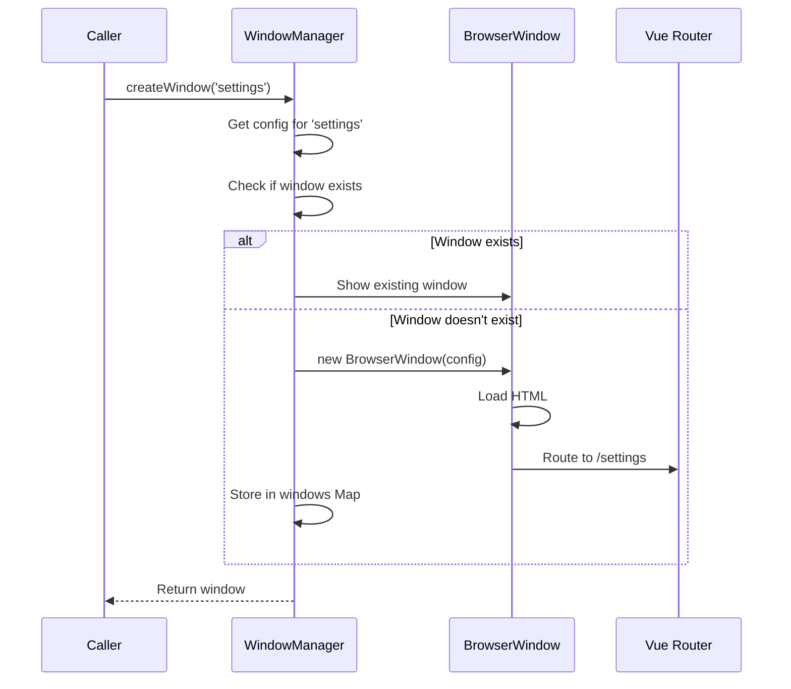
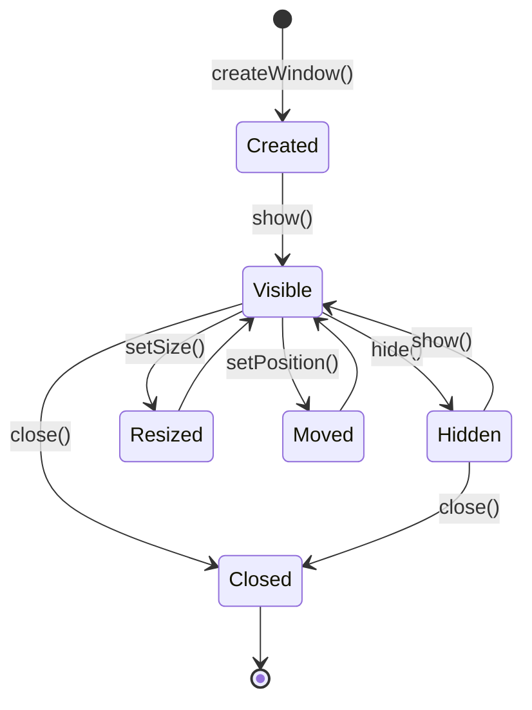

# Window Management

This document explains how Snaplark manages its multiple windows using the WindowManager service.

## Overview

Snaplark uses multiple windows for different purposes:
- **Main Window** - Quick access menu (always exists)
- **Screenshot Windows** - One per display during capture
- **Recording Windows** - One per display during recording
- **Settings Window** - Configuration UI
- **Webcam Window** - Camera preview during recording
- **Notification Window** - Upload progress toasts
- And more...

## WindowManager Service

**Location:** `src/services/window-manager.js` (775 lines)

The WindowManager is a class that handles:
- Window creation with proper configuration
- Window lifecycle (show, hide, close)
- Window positioning and sizing
- IPC handler registration
- Multi-display support

### Class Structure

```javascript
class WindowManager {
    constructor(devServerUrl, viteName, store, shortcutManager) {
        this.devServerUrl = devServerUrl
        this.viteName = viteName
        this.store = store
        this.shortcutManager = shortcutManager
        this.windows = new Map()  // type -> BrowserWindow

        this.setupIPCHandlers()
    }

    // Window operations
    createWindow(type, options = {})
    getWindow(type)
    closeWindow(type)
    closeWindowsByType(type)
    showWindow(type)
    hideWindow(type)
    resizeWindow(type, width, height)
    moveWindow(type, x, y)

    // Utility
    broadcastToAllWindows(channel, data)
    broadcastToAllWindowsExcept(excludeId, channel, data)
}
```

## Window Configuration

Each window type has specific configuration:

```javascript
const windowConfigs = {
    main: {
        width: 232,
        height: 440,  // Increases to 540 when logged in
        frame: false,
        transparent: true,
        resizable: false,
        alwaysOnTop: true,
        skipTaskbar: true,
        webPreferences: {
            contextIsolation: true,
            preload: PRELOAD_PATH
        }
    },

    settings: {
        width: 450,
        height: 485,
        frame: false,
        transparent: true,
        resizable: false,
        center: true
    },

    screenshot: {
        // Created per display
        width: display.bounds.width,
        height: display.bounds.height,
        x: display.bounds.x,
        y: display.bounds.y,
        frame: false,
        transparent: true,
        alwaysOnTop: true,
        fullscreen: true,
        skipTaskbar: true,
        hasShadow: false
    },

    recording: {
        // Similar to screenshot
        width: display.bounds.width,
        height: display.bounds.height,
        frame: false,
        transparent: true,
        alwaysOnTop: true,
        fullscreen: true
    },

    webcam: {
        width: 208,
        height: 208,
        frame: false,
        transparent: true,
        alwaysOnTop: true,
        resizable: true,
        movable: true
    },

    'recording-overlay': {
        width: 280,
        height: 60,
        frame: false,
        transparent: true,
        alwaysOnTop: true,
        skipTaskbar: true,
        focusable: false  // Doesn't steal focus
    },

    notifications: {
        width: 420,
        height: 10,  // Dynamic, resizes based on content
        frame: false,
        transparent: true,
        alwaysOnTop: true,
        skipTaskbar: true,
        focusable: false
    },

    permissions: {
        width: 400,
        height: 640,
        frame: false,
        transparent: true,
        resizable: false,
        center: true
    },

    welcome: {
        width: 450,
        height: 455,
        frame: false,
        transparent: true,
        resizable: false,
        center: true
    },

    design: {
        width: 800,
        height: 600,
        frame: false,
        transparent: true,
        resizable: true
    }
}
```

## Window Creation Flow



### Implementation

```javascript
createWindow(type, options = {}) {
    // Check if window already exists
    let existingWindow = this.windows.get(type)
    if (existingWindow && !existingWindow.isDestroyed()) {
        existingWindow.show()
        existingWindow.focus()
        return existingWindow
    }

    // Get configuration for this window type
    const config = this.getWindowConfig(type, options)

    // Create BrowserWindow
    const window = new BrowserWindow({
        ...config,
        webPreferences: {
            preload: path.join(__dirname, 'preload.js'),
            contextIsolation: true,
            nodeIntegration: false,
            ...config.webPreferences
        }
    })

    // Load content
    if (this.devServerUrl) {
        // Development: Vite dev server
        window.loadURL(`${this.devServerUrl}#/${type}`)
    } else {
        // Production: Built files
        window.loadFile(
            path.join(__dirname, `../renderer/${this.viteName}/index.html`),
            { hash: type }
        )
    }

    // Track window
    this.windows.set(type, window)

    // Cleanup on close
    window.on('closed', () => {
        this.windows.delete(type)
    })

    return window
}
```

## Multi-Display Support

For screenshot and recording, windows are created per display:

```javascript
createScreenshotWindows() {
    const displays = screen.getAllDisplays()

    displays.forEach((display, index) => {
        const windowId = `screenshot-${display.id}`

        const window = new BrowserWindow({
            width: display.bounds.width,
            height: display.bounds.height,
            x: display.bounds.x,
            y: display.bounds.y,
            frame: false,
            transparent: true,
            alwaysOnTop: true,
            fullscreen: true,
            skipTaskbar: true,
            webPreferences: {
                preload: PRELOAD_PATH,
                contextIsolation: true
            }
        })

        window.loadURL(`${this.devServerUrl}#/screenshot?display=${display.id}`)

        this.windows.set(windowId, window)
    })
}
```

## Window Lifecycle



## IPC Handlers

WindowManager registers handlers for window operations:

```javascript
setupIPCHandlers() {
    ipcMain.handle('create-window', async (event, type, options) => {
        return this.createWindow(type, options)
    })

    ipcMain.handle('close-window', async (event, type) => {
        return this.closeWindow(type)
    })

    ipcMain.handle('close-windows-by-type', async (event, typePrefix) => {
        // Close all windows starting with typePrefix
        // e.g., 'screenshot' closes 'screenshot-1', 'screenshot-2', etc.
        for (const [key, window] of this.windows) {
            if (key.startsWith(typePrefix)) {
                if (!window.isDestroyed()) {
                    window.close()
                }
                this.windows.delete(key)
            }
        }
    })

    ipcMain.handle('show-window', async (event, type) => {
        const window = this.getWindow(type)
        if (window && !window.isDestroyed()) {
            window.show()
        }
    })

    ipcMain.handle('hide-window', async (event, type) => {
        const window = this.getWindow(type)
        if (window && !window.isDestroyed()) {
            window.hide()
        }
    })

    ipcMain.handle('resize-window', async (event, type, width, height) => {
        const window = this.getWindow(type)
        if (window && !window.isDestroyed()) {
            window.setSize(Math.round(width), Math.round(height))
        }
    })

    ipcMain.handle('move-window', async (event, type, x, y) => {
        const window = this.getWindow(type)
        if (window && !window.isDestroyed()) {
            window.setPosition(Math.round(x), Math.round(y))
        }
    })

    ipcMain.handle('center-window', async (event, type) => {
        const window = this.getWindow(type)
        if (window && !window.isDestroyed()) {
            window.center()
        }
    })

    ipcMain.handle('make-window-blocking', async (event, type) => {
        const window = this.getWindow(type)
        if (window && !window.isDestroyed()) {
            window.setIgnoreMouseEvents(false)
        }
    })

    ipcMain.handle('make-window-non-blocking', async (event, type) => {
        const window = this.getWindow(type)
        if (window && !window.isDestroyed()) {
            window.setIgnoreMouseEvents(true, { forward: true })
        }
    })
}
```

## Broadcasting to Windows

Send messages to all or specific windows:

```javascript
broadcastToAllWindows(channel, data) {
    for (const [, window] of this.windows) {
        if (!window.isDestroyed()) {
            window.webContents.send(channel, data)
        }
    }
}

broadcastToAllWindowsExcept(excludeWebContentsId, channel, data) {
    for (const [, window] of this.windows) {
        if (!window.isDestroyed() &&
            window.webContents.id !== excludeWebContentsId) {
            window.webContents.send(channel, data)
        }
    }
}
```

## Main Window Positioning

The main window appears near the system tray:

```javascript
// system_tray.js
showMainAtTray(event, options = {}) {
    const mainWindow = this.windowManager.getWindow('main')
    if (!mainWindow) return

    const trayBounds = this.tray.getBounds()
    const windowBounds = mainWindow.getBounds()
    const display = screen.getDisplayNearestPoint({
        x: trayBounds.x,
        y: trayBounds.y
    })

    let x, y

    if (process.platform === 'darwin') {
        // macOS: Below tray icon
        x = Math.round(trayBounds.x + trayBounds.width / 2 - windowBounds.width / 2)
        y = Math.round(trayBounds.y + trayBounds.height + (options.gap || 5))
    } else {
        // Windows: Above taskbar
        x = Math.round(trayBounds.x + trayBounds.width / 2 - windowBounds.width / 2)
        y = Math.round(trayBounds.y - windowBounds.height - (options.gap || 5))
    }

    // Clamp to screen bounds
    x = Math.max(display.bounds.x, Math.min(x, display.bounds.x + display.bounds.width - windowBounds.width))
    y = Math.max(display.bounds.y, Math.min(y, display.bounds.y + display.bounds.height - windowBounds.height))

    mainWindow.setPosition(x, y)
    mainWindow.show()
}
```

## Window Type Reference

| Type | Purpose | Count | Persistent |
|------|---------|-------|------------|
| `main` | Quick menu | 1 | Yes (hidden) |
| `settings` | Configuration | 0-1 | No |
| `welcome` | Onboarding | 0-1 | No |
| `permissions` | Permission UI | 0-1 | No |
| `screenshot-{id}` | Selection per display | 0-N | No |
| `recording-{id}` | Recording per display | 0-N | No |
| `webcam` | Camera preview | 0-1 | No |
| `recording-overlay` | Recording controls | 0-1 | No |
| `design` | Annotation editor | 0-1 | No |
| `notifications` | Upload toasts | 0-1 | Yes (hidden) |

## Common Properties

### Frame: false

All windows are frameless (no title bar):
- Custom title bar in CSS
- Custom close/minimize buttons
- Drag regions defined in CSS

### Transparent: true

Windows have transparent backgrounds:
- Rounded corners
- Drop shadows
- See-through overlays

### Always On Top

Most windows stay above other apps:
- Screenshot/recording overlays
- Main menu (quick access)
- Notifications

### Skip Taskbar

Most windows don't appear in taskbar/dock:
- Clean UI appearance
- Only tray icon visible

## Next Steps

- [Main Process](/architecture/main-process) - WindowManager initialization
- [IPC Communication](/architecture/ipc-communication) - Window IPC handlers
- [System Tray](/architecture/overview) - Tray integration
