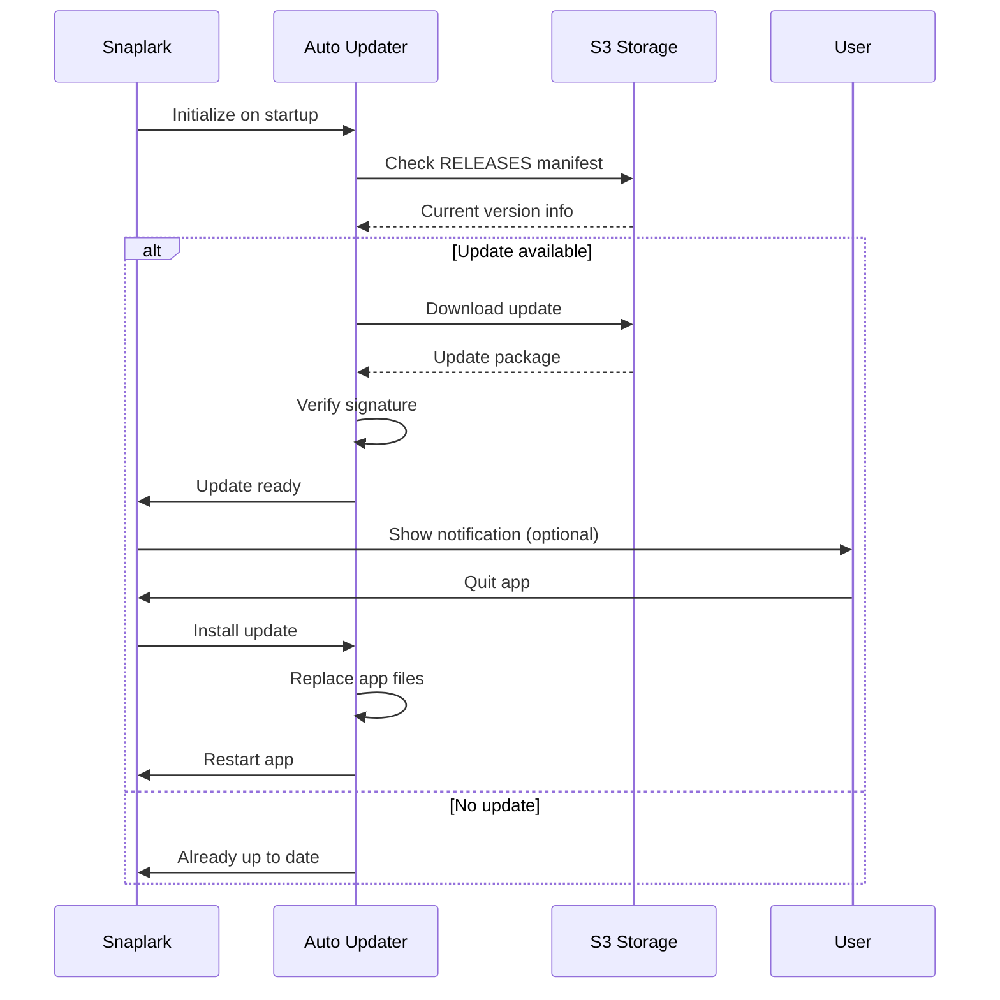
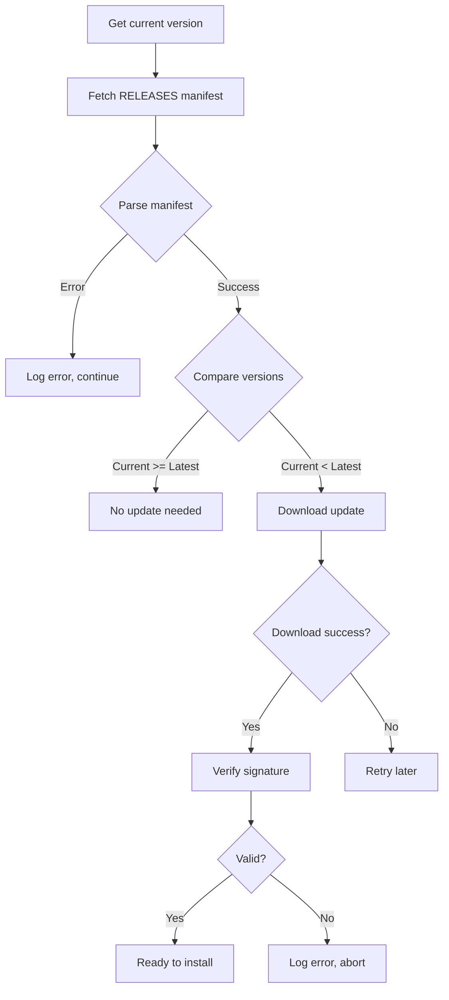

# Auto Updates

This document explains how Snaplark delivers automatic updates to users on macOS and Windows.

## Overview

Snaplark uses **update-electron-app** for automatic updates:

- **macOS**: Uses Electron's native `autoUpdater` with Squirrel.Mac
- **Windows**: Uses Squirrel.Windows
- **Linux**: Not supported (use package manager)

Updates are served from S3-compatible storage (Contabo).

## Update Flow



## Configuration

**`src/main.js`:**

```javascript
import { updateElectronApp, UpdateSourceType } from 'update-electron-app'

const setupAutoUpdater = () => {
    updateElectronApp({
        updateSource: {
            type: UpdateSourceType.StaticStorage,
            baseUrl: `https://usc1.contabostorage.com/72e7132000f0495a956688c26ebee898:main-storage/releases/${process.platform}/${process.arch}`
        }
    })
}

// Call on app ready
app.whenReady().then(() => {
    setupAutoUpdater()
    // ...
})
```

## Platform-Specific Behavior

### macOS

**Mechanism:** Squirrel.Mac

**Update URL Structure:**
```
https://usc1.contabostorage.com/.../releases/darwin/arm64/
├── RELEASES.json
└── Snaplark-darwin-arm64-1.1.4.zip
```

**RELEASES.json:**
```json
{
    "currentRelease": "1.1.4",
    "releases": [
        {
            "version": "1.1.4",
            "updateTo": {
                "version": "1.1.4",
                "pub_date": "2024-01-15T00:00:00.000Z",
                "url": "https://usc1.contabostorage.com/.../Snaplark-darwin-arm64-1.1.4.zip",
                "notes": "Bug fixes and improvements"
            }
        }
    ]
}
```

**Update Process:**
1. App checks RELEASES.json
2. Compares versions
3. Downloads ZIP in background
4. Extracts and verifies signature
5. On next restart, new version runs

### Windows

**Mechanism:** Squirrel.Windows

**Update URL Structure:**
```
https://usc1.contabostorage.com/.../releases/win32/x64/
├── RELEASES
├── Snaplark-1.1.4-full.nupkg
└── Snaplark-1.1.4-delta.nupkg (optional)
```

**RELEASES file:**
```
SHA1_HASH Snaplark-1.1.4-full.nupkg SIZE_IN_BYTES
SHA1_HASH Snaplark-1.1.4-delta.nupkg SIZE_IN_BYTES
```

**Update Process:**
1. App checks RELEASES file
2. Downloads delta or full nupkg
3. Squirrel extracts and applies update
4. On next restart, new version runs

**Squirrel Installer (forge.config.js):**
```javascript
{
    name: '@electron-forge/maker-squirrel',
    config: (arch) => ({
        setupIcon: 'src/assets/icons/icon.ico',
        loadingGif: 'src/assets/icons/loading.gif',
        remoteReleases: `https://usc1.contabostorage.com/.../releases/win32/${arch}`
    })
}
```

The `remoteReleases` URL tells Squirrel where to find updates.

## Update Check Timing

`update-electron-app` checks for updates:
- On app startup
- Every 10 minutes (configurable)

```javascript
updateElectronApp({
    updateSource: { /* ... */ },
    updateInterval: '10 minutes'  // Default
})
```

## User Experience

### Silent Updates (Default)

By default, updates are downloaded silently and installed on next restart:

1. User launches app
2. Update downloads in background
3. Next time user quits and reopens, new version runs

### Notify User (Optional)

To notify users about updates:

```javascript
import { autoUpdater } from 'electron'

autoUpdater.on('update-downloaded', (event, releaseNotes, releaseName) => {
    const mainWindow = windowManager.getWindow('main')
    mainWindow.webContents.send('update-ready', {
        version: releaseName,
        notes: releaseNotes
    })
})

// In renderer
window.electron.onUpdateReady(({ version, notes }) => {
    // Show notification UI
    showUpdateNotification(version, notes)
})
```

### Force Restart

To immediately install update:

```javascript
// After user confirms
autoUpdater.quitAndInstall()
```

## Version Checking Logic



## Code Signing Requirement

**macOS:** Updates must be signed with the same certificate as the original app. Unsigned updates will be rejected.

**Windows:** Squirrel verifies the nupkg signature. If you sign the installer, updates must also be signed.

## Testing Updates

### Local Testing

1. Build version 1.0.0 and install
2. Build version 1.0.1
3. Host 1.0.1 on local server
4. Point `baseUrl` to local server
5. Launch 1.0.0 and watch for update

### Staging Environment

Consider having a separate staging bucket:

```javascript
const updateUrl = process.env.NODE_ENV === 'production'
    ? 'https://releases.snaplark.com/...'
    : 'https://staging-releases.snaplark.com/...'
```

## Rollback Strategy

If a bad update is released:

1. **Don't delete** the broken version (users may need to reference it)
2. Build and publish a new version with the fix
3. Users will update again to the fixed version

For critical issues:
1. Update RELEASES.json to point to the previous working version
2. Users will "update" backwards to the working version

## Debugging Updates

### Check Update Status

```javascript
import { autoUpdater } from 'electron'

autoUpdater.on('checking-for-update', () => {
    console.log('Checking for update...')
})

autoUpdater.on('update-available', (info) => {
    console.log('Update available:', info)
})

autoUpdater.on('update-not-available', (info) => {
    console.log('No update available:', info)
})

autoUpdater.on('error', (err) => {
    console.error('Update error:', err)
})

autoUpdater.on('download-progress', (progress) => {
    console.log(`Download progress: ${progress.percent}%`)
})

autoUpdater.on('update-downloaded', (info) => {
    console.log('Update downloaded:', info)
})
```

### Common Issues

| Issue | Cause | Solution |
|-------|-------|----------|
| Update not detected | Wrong URL | Check baseUrl matches S3 path |
| Download fails | Network/CORS | Ensure S3 is publicly accessible |
| Signature error | Certificate mismatch | Re-sign with correct certificate |
| Windows update hangs | Squirrel issue | Check RELEASES file format |

### Log Locations

**macOS:**
```
~/Library/Logs/Snaplark/
```

**Windows:**
```
%LOCALAPPDATA%/Snaplark/SquirrelSetup.log
```

## Security Considerations

1. **Always use HTTPS** for update URLs
2. **Sign all releases** with the same certificate
3. **Validate signatures** before applying updates
4. **Use checksums** in RELEASES files

## Platform Support Summary

| Platform | Update Method | Auto-Update | Manual Update |
|----------|--------------|-------------|---------------|
| macOS ARM64 | Squirrel.Mac | Yes | DMG |
| macOS x64 | Squirrel.Mac | Yes | DMG |
| Windows x64 | Squirrel.Windows | Yes | Installer |
| Windows x86 | Squirrel.Windows | Yes | Installer |
| Linux | N/A | No | deb/rpm |

## Next Steps

- [Publishing](/deployment/publishing) - How releases are uploaded
- [Code Signing](/deployment/code-signing) - Signing requirements
- [Build Process](/deployment/build-process) - Complete build guide
