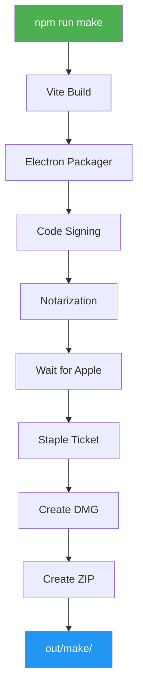

# Build Process

This document explains how to build Snaplark for distribution on macOS, Windows, and Linux.

## Overview

Snaplark uses **Electron Forge** for building, packaging, and distributing the application. The build process:

1. **Compiles** TypeScript/Vue code with Vite
2. **Packages** into platform-specific bundles
3. **Creates installers** (DMG, Squirrel, deb, rpm)
4. **Signs and notarizes** (macOS)
5. **Publishes** to S3 storage

## Build Commands

```bash
# Development
npm start                 # Start dev server with hot reload

# Production builds
npm run package           # Package app (no installer)
npm run make             # Create platform installers
npm run publish          # Build + publish to S3
```

## Build Configuration

**Location:** `forge.config.js`

```javascript
require('dotenv').config()  // Load .env variables

module.exports = {
    packagerConfig: {
        appBundleId: 'com.snaplark.snaplark',
        appCategoryType: 'public.app-category.utilities',
        icon: 'src/assets/icons/icon',
        extraResource: ['./resources/icons'],
        asar: true,

        // macOS Info.plist entries
        extendInfo: {
            NSCameraUsageDescription: '...',
            NSMicrophoneUsageDescription: '...',
            NSScreenCaptureUsageDescription: '...',
            NSAccessibilityUsageDescription: '...',
            NSAudioCaptureUsageDescription: '...'
        },

        // Code signing (macOS)
        osxSign: {
            identity: process.env.APP_IDENTITY,
            hardenedRuntime: true,
            'gatekeeper-assess': false,
            entitlements: 'entitlements.plist',
            'entitlements-inherit': 'entitlements.plist'
        },

        // Notarization (macOS)
        osxNotarize: {
            appleId: process.env.APPLE_ID,
            appleIdPassword: process.env.APPLE_PASSWORD,
            teamId: process.env.APPLE_TEAM_ID
        }
    },

    // Platform-specific installers
    makers: [
        // Windows: Squirrel installer
        {
            name: '@electron-forge/maker-squirrel',
            config: (arch) => ({
                setupIcon: 'src/assets/icons/icon.ico',
                loadingGif: 'src/assets/icons/loading.gif',
                iconUrl: `file://${path.resolve(__dirname, 'src/assets/icons/icon.ico')}`,
                remoteReleases: `https://usc1.contabostorage.com/.../releases/win32/${arch}`
            })
        },

        // macOS: DMG installer
        {
            name: '@electron-forge/maker-dmg',
            config: {
                icon: 'src/assets/icons/icon.icns',
                background: 'src/assets/icons/background.png',
                format: 'ULFO',
                window: {
                    size: { width: 660, height: 450 }
                },
                iconSize: 80,
                contents: (opts) => [
                    { x: 200, y: 200, type: 'file', path: opts.appPath },
                    { x: 470, y: 200, type: 'link', path: '/Applications' }
                ]
            }
        },

        // macOS: ZIP for auto-updates
        {
            name: '@electron-forge/maker-zip',
            platforms: ['darwin'],
            config: (arch) => ({
                macUpdateManifestBaseUrl: `https://usc1.contabostorage.com/.../releases/darwin/${arch}`
            })
        },

        // Linux: DEB package
        { name: '@electron-forge/maker-deb', config: {} },

        // Linux: RPM package
        { name: '@electron-forge/maker-rpm', config: {} }
    ],

    // S3 publisher
    publishers: [
        {
            name: '@electron-forge/publisher-s3',
            config: {
                bucket: process.env.AWS_BUCKET,
                region: process.env.AWS_DEFAULT_REGION,
                accessKeyId: process.env.AWS_ACCESS_KEY_ID,
                secretAccessKey: process.env.AWS_SECRET_ACCESS_KEY,
                endpoint: `https://${process.env.AWS_DEFAULT_REGION}.contabostorage.com`,
                s3ForcePathStyle: true,
                public: true,
                acl: 'public-read',
                folder: 'releases'
            }
        }
    ],

    // Vite plugin for build
    plugins: [
        {
            name: '@electron-forge/plugin-vite',
            config: {
                build: [
                    { entry: 'src/main.js', config: 'vite.main.config.mjs', target: 'main' },
                    { entry: 'src/preload.js', config: 'vite.preload.config.mjs', target: 'preload' }
                ],
                renderer: [
                    { name: 'main_window', config: 'vite.renderer.config.mjs' }
                ]
            }
        },

        // Security fuses
        new FusesPlugin({
            version: FuseVersion.V1,
            [FuseV1Options.RunAsNode]: false,
            [FuseV1Options.EnableCookieEncryption]: true,
            [FuseV1Options.EnableNodeOptionsEnvironmentVariable]: false,
            [FuseV1Options.EnableNodeCliInspectArguments]: false,
            [FuseV1Options.EnableEmbeddedAsarIntegrityValidation]: true,
            [FuseV1Options.OnlyLoadAppFromAsar]: true
        })
    ]
}
```

## Environment Variables

**File:** `.env` (never commit this file)

```env
# Apple Developer (macOS code signing & notarization)
APPLE_ID=developer@example.com
APPLE_PASSWORD=xxxx-xxxx-xxxx-xxxx    # App-specific password
APPLE_TEAM_ID=XXXXXXXXXX
APP_IDENTITY="Developer ID Application: Company Name (XXXXXXXXXX)"

# S3 Storage (Contabo)
AWS_ACCESS_KEY_ID=your-access-key
AWS_SECRET_ACCESS_KEY=your-secret-key
AWS_DEFAULT_REGION=usc1
AWS_BUCKET=main-storage
```

## Build Output

After `npm run make`, outputs are in `out/`:

```
out/
├── make/
│   ├── Snaplark-1.1.4-arm64.dmg      # macOS ARM64 installer
│   ├── Snaplark-1.1.4-x64.dmg        # macOS Intel installer
│   ├── Snaplark-1.1.4.Setup.exe      # Windows installer
│   ├── snaplark_1.1.4_amd64.deb      # Debian/Ubuntu
│   └── snaplark-1.1.4.x86_64.rpm     # Fedora/RHEL
└── Snaplark-darwin-arm64/            # Unpacked app (macOS)
    └── Snaplark.app/
```

## Platform-Specific Builds

### macOS Build

```bash
# Build for current architecture
npm run make

# Build for specific architecture
npm run make -- --arch=arm64
npm run make -- --arch=x64
```

**Output:**
- `Snaplark-1.1.4-arm64.dmg` - Apple Silicon
- `Snaplark-1.1.4-x64.dmg` - Intel
- `Snaplark-darwin-arm64-1.1.4.zip` - For auto-updates

**macOS Build Flow:**

```
┌─────────────────────────────────────────────────────────────────────────────┐
│                           macOS BUILD PIPELINE                               │
├─────────────────────────────────────────────────────────────────────────────┤
│                                                                              │
│   npm run make                                                               │
│        │                                                                     │
│        ▼                                                                     │
│   ┌─────────────────────────────────────────────────────────────────────┐   │
│   │ 1. VITE BUILD                                                        │   │
│   │    • Main process: src/main.js → .vite/build/main.js                │   │
│   │    • Preload: src/preload.js → .vite/build/preload.js               │   │
│   │    • Renderer: Vue app → .vite/renderer/main_window/                │   │
│   └─────────────────────────────────────────────────────────────────────┘   │
│        │                                                                     │
│        ▼                                                                     │
│   ┌─────────────────────────────────────────────────────────────────────┐   │
│   │ 2. ELECTRON PACKAGER                                                 │   │
│   │    • Bundle into Snaplark.app                                        │   │
│   │    • Include node_modules                                            │   │
│   │    • Set app icon, Info.plist                                        │   │
│   └─────────────────────────────────────────────────────────────────────┘   │
│        │                                                                     │
│        ▼                                                                     │
│   ┌─────────────────────────────────────────────────────────────────────┐   │
│   │ 3. CODE SIGNING (Automatic)                                          │   │
│   │    • Sign with Developer ID certificate                              │   │
│   │    • Apply hardened runtime                                          │   │
│   │    • Include entitlements                                            │   │
│   └─────────────────────────────────────────────────────────────────────┘   │
│        │                                                                     │
│        ▼                                                                     │
│   ┌─────────────────────────────────────────────────────────────────────┐   │
│   │ 4. NOTARIZATION (Automatic)                                          │   │
│   │    • Upload to Apple servers                                         │   │
│   │    • Wait for approval (~2-10 minutes)                               │   │
│   │    • Staple ticket to app                                            │   │
│   └─────────────────────────────────────────────────────────────────────┘   │
│        │                                                                     │
│        ▼                                                                     │
│   ┌─────────────────────────────────────────────────────────────────────┐   │
│   │ 5. CREATE INSTALLERS                                                 │   │
│   │    • DMG (drag-to-install)                                           │   │
│   │    • ZIP (for auto-updates)                                          │   │
│   └─────────────────────────────────────────────────────────────────────┘   │
│        │                                                                     │
│        ▼                                                                     │
│   out/make/                                                                  │
│   ├── Snaplark-1.1.4-arm64.dmg                                              │
│   ├── Snaplark-1.1.4-x64.dmg                                                │
│   └── Snaplark-darwin-arm64-1.1.4.zip                                       │
│                                                                              │
└─────────────────────────────────────────────────────────────────────────────┘
```



### Windows Build

```bash
# Build on Windows
npm run make
```

**Output:**
- `Snaplark-1.1.4.Setup.exe` - Squirrel installer
- `RELEASES` - Update manifest

**Important:** Windows code signing is done **separately** after `npm run make`:

1. Run `npm run make` to generate unsigned `.exe`
2. Take the `.exe` to separate signing process
3. Sign with purchased certificate using external tool
4. Replace unsigned with signed `.exe`
5. Then publish

See [Code Signing](/deployment/code-signing) for details.

### Linux Build

```bash
# Build on Linux
npm run make
```

**Output:**
- `snaplark_1.1.4_amd64.deb`
- `snaplark-1.1.4.x86_64.rpm`

## Vite Configuration

### Main Process (`vite.main.config.mjs`)

```javascript
import { defineConfig } from 'vite'

export default defineConfig({
    // Basic config, uses defaults
})
```

### Renderer Process (`vite.renderer.config.mjs`)

```javascript
import { defineConfig } from 'vite'
import vue from '@vitejs/plugin-vue'
import path from 'path'

export default defineConfig({
    plugins: [vue()],
    resolve: {
        alias: {
            '@': path.resolve(__dirname, 'src')
        }
    }
})
```

### Preload Script (`vite.preload.config.mjs`)

```javascript
import { defineConfig } from 'vite'

export default defineConfig({
    // Uses defaults
})
```

## Native Module Rebuilding

Some modules need to be rebuilt for Electron:

```bash
npm run rebuild
```

This runs `electron-rebuild` to compile native modules for the Electron version.

**Native modules in Snaplark:**
- `electron-audio-loopback` - System audio capture

## Asset Requirements

### Icons

| File | Format | Size | Used For |
|------|--------|------|----------|
| `icon.icns` | ICNS | Multi-size | macOS app icon |
| `icon.ico` | ICO | Multi-size | Windows app icon |
| `icon.png` | PNG | 1024x1024 | Source icon |
| `tray.png` | PNG | 22x22 | macOS tray |
| `win-tray.ico` | ICO | 16x16 | Windows tray |
| `background.png` | PNG | 660x450 | DMG background |
| `loading.gif` | GIF | Any | Windows installer |

### Entitlements

**File:** `entitlements.plist`

```xml
<?xml version="1.0" encoding="UTF-8"?>
<!DOCTYPE plist PUBLIC "-//Apple//DTD PLIST 1.0//EN" "...">
<plist version="1.0">
  <dict>
    <key>com.apple.security.cs.allow-jit</key>
    <true/>
    <key>com.apple.security.cs.allow-unsigned-executable-memory</key>
    <true/>
    <key>com.apple.security.device.camera</key>
    <true/>
    <key>com.apple.security.device.microphone</key>
    <true/>
    <key>com.apple.security.device.audio-input</key>
    <true/>
    <key>com.apple.security.automation.apple-events</key>
    <true/>
  </dict>
</plist>
```

## Build Checklist

Before building for release:

1. [ ] Update version in `package.json`
2. [ ] Commit all changes
3. [ ] Test in development mode
4. [ ] Verify `.env` has correct credentials
5. [ ] Run `npm run rebuild` if native modules changed
6. [ ] Run `npm run make` and test locally
7. [ ] Run `npm run publish` to release

## Troubleshooting

### Build Fails with Native Module Error

```bash
# Rebuild native modules
npm run rebuild

# Or clean rebuild
rm -rf node_modules
npm install
npm run rebuild
```

### Notarization Fails

1. Check Apple ID credentials in `.env`
2. Verify app-specific password is current
3. Check Team ID matches certificate
4. Ensure hardened runtime is enabled

### DMG Creation Fails

1. Check `background.png` exists
2. Verify icon paths are correct
3. Ensure `hdiutil` is available (macOS only)

### Windows Signing Issues

See [Code Signing](/deployment/code-signing) for Windows-specific process.

## Next Steps

- [Code Signing](/deployment/code-signing) - Detailed signing guide
- [Publishing](/deployment/publishing) - S3 upload process
- [Auto Updates](/deployment/auto-updates) - Update delivery
