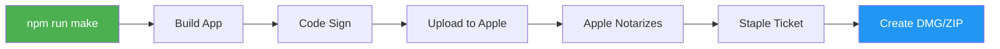
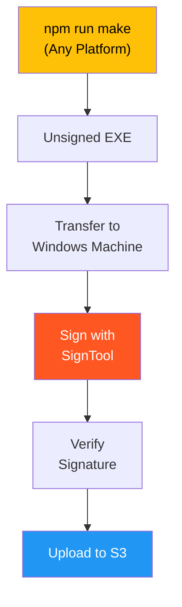

# Code Signing

This document explains the code signing process for Snaplark on macOS and Windows.

## Why Code Signing?

Code signing provides:
- **User Trust** - Users see verified publisher name
- **OS Acceptance** - No "unknown developer" warnings
- **Auto-Updates** - Required for Squirrel updates on Windows
- **Notarization** - Required for macOS Gatekeeper

## macOS Code Signing

### Overview

macOS signing is **automatic** when using Electron Forge with proper configuration:

```
┌─────────────────────────────────────────────────────────────────────────────┐
│                      macOS CODE SIGNING (AUTOMATIC)                          │
├─────────────────────────────────────────────────────────────────────────────┤
│                                                                              │
│   npm run make                                                               │
│        │                                                                     │
│        ▼                                                                     │
│   ┌───────────────┐    ┌───────────────┐    ┌───────────────┐              │
│   │   BUILD APP   │───▶│  CODE SIGN    │───▶│   NOTARIZE    │              │
│   │               │    │               │    │               │              │
│   │ Snaplark.app  │    │ • Identity    │    │ • Apple ID    │              │
│   │               │    │ • Entitlement │    │ • Team ID     │              │
│   │               │    │ • Hardened    │    │ • Upload      │              │
│   └───────────────┘    └───────────────┘    └───────┬───────┘              │
│                                                      │                       │
│                              ┌───────────────────────┘                       │
│                              ▼                                               │
│                        ┌───────────────┐    ┌───────────────┐              │
│                        │  STAPLE       │───▶│   CREATE      │              │
│                        │  TICKET       │    │   INSTALLERS  │              │
│                        │               │    │               │              │
│                        │ Embed Apple   │    │ • DMG         │              │
│                        │ approval      │    │ • ZIP         │              │
│                        └───────────────┘    └───────────────┘              │
│                                                                              │
│   ✅ Result: Signed, notarized, ready for distribution                      │
│                                                                              │
└─────────────────────────────────────────────────────────────────────────────┘
```



### Requirements

1. **Apple Developer Account** ($99/year)
2. **Developer ID Application Certificate**
3. **App-Specific Password** for notarization

### Setup Steps

#### 1. Create Certificate

1. Go to [Apple Developer Portal](https://developer.apple.com)
2. Navigate to Certificates, Identifiers & Profiles
3. Create new certificate: "Developer ID Application"
4. Download and install in Keychain

#### 2. Create App-Specific Password

1. Go to [Apple ID](https://appleid.apple.com)
2. Sign In → Security → App-Specific Passwords
3. Generate new password
4. Save it securely

#### 3. Configure Environment

```env
# .env
APPLE_ID=developer@example.com
APPLE_PASSWORD=xxxx-xxxx-xxxx-xxxx
APPLE_TEAM_ID=2K7985L2RH
APP_IDENTITY="Developer ID Application: Snaplark PTE Limited (2K7985L2RH)"
```

### Configuration

**`forge.config.js`:**

```javascript
packagerConfig: {
    // Code signing
    osxSign: {
        identity: process.env.APP_IDENTITY,
        hardenedRuntime: true,
        'gatekeeper-assess': false,
        entitlements: 'entitlements.plist',
        'entitlements-inherit': 'entitlements.plist'
    },

    // Notarization
    osxNotarize: {
        appleId: process.env.APPLE_ID,
        appleIdPassword: process.env.APPLE_PASSWORD,
        teamId: process.env.APPLE_TEAM_ID
    }
}
```

### Entitlements

**`entitlements.plist`:**

```xml
<?xml version="1.0" encoding="UTF-8"?>
<!DOCTYPE plist PUBLIC "-//Apple//DTD PLIST 1.0//EN"
  "http://www.apple.com/DTDs/PropertyList-1.0.dtd">
<plist version="1.0">
  <dict>
    <!-- Required for Electron -->
    <key>com.apple.security.cs.allow-jit</key>
    <true/>
    <key>com.apple.security.cs.allow-unsigned-executable-memory</key>
    <true/>

    <!-- Hardware access -->
    <key>com.apple.security.device.camera</key>
    <true/>
    <key>com.apple.security.device.microphone</key>
    <true/>
    <key>com.apple.security.device.audio-input</key>
    <true/>

    <!-- Automation -->
    <key>com.apple.security.automation.apple-events</key>
    <true/>
  </dict>
</plist>
```

### Build Process

```bash
# Full build with signing and notarization
npm run make

# Output
# out/make/Snaplark-1.1.4-arm64.dmg (signed, notarized)
# out/make/Snaplark-darwin-arm64-1.1.4.zip (signed, notarized)
```

### Verification

```bash
# Verify code signature
codesign --verify --deep --strict --verbose=2 "out/Snaplark-darwin-arm64/Snaplark.app"

# Check notarization
spctl --assess --verbose=4 --type execute "out/Snaplark-darwin-arm64/Snaplark.app"

# View entitlements
codesign -d --entitlements :- "out/Snaplark-darwin-arm64/Snaplark.app"
```

---

## Windows Code Signing

### Overview

Windows signing is **NOT automatic** in Snaplark. It requires a separate manual process:

```
┌─────────────────────────────────────────────────────────────────────────────┐
│                      WINDOWS CODE SIGNING (MANUAL)                           │
├─────────────────────────────────────────────────────────────────────────────┤
│                                                                              │
│   ⚠️  IMPORTANT: This is a SEPARATE manual process after npm run make       │
│                                                                              │
│   STEP 1: Build (Any Platform)          STEP 2: Sign (Windows Only)         │
│   ┌───────────────────────────┐         ┌───────────────────────────┐       │
│   │                           │         │                           │       │
│   │  npm run make             │         │  signtool sign            │       │
│   │  --platform=win32         │         │  /f certificate.pfx       │       │
│   │                           │────────▶│  /p password              │       │
│   │  Output: UNSIGNED .exe    │         │  /tr timestamp.digicert   │       │
│   │                           │         │                           │       │
│   └───────────────────────────┘         │  Output: SIGNED .exe      │       │
│                                         │                           │       │
│   Can run on macOS/Linux               │  MUST run on Windows      │       │
│                                         │  or use cloud signing     │       │
│                                         └───────────────────────────┘       │
│                                                      │                       │
│                                                      ▼                       │
│                                         ┌───────────────────────────┐       │
│                                         │                           │       │
│                                         │  Manual upload to S3      │       │
│                                         │  or CI/CD pipeline        │       │
│                                         │                           │       │
│                                         └───────────────────────────┘       │
│                                                                              │
│   WHY MANUAL?                                                                │
│   • Electron Forge on macOS/Linux cannot access Windows certificates        │
│   • EV certificates often require hardware tokens (USB)                      │
│   • Cloud signing services require specific integration                      │
│                                                                              │
└─────────────────────────────────────────────────────────────────────────────┘
```



### Requirements

1. **Code Signing Certificate** (purchased from certificate authority)
   - DigiCert, Sectigo, GlobalSign, etc.
   - EV certificate recommended for SmartScreen reputation
2. **SignTool** (from Windows SDK)
3. **Certificate file** (.pfx) and password

### Why Manual?

Electron Forge on macOS/Linux cannot directly use Windows certificates. The signing must be done:
- On a Windows machine, OR
- Using a cloud signing service, OR
- Using a CI/CD pipeline on Windows

### Process

#### Step 1: Build Unsigned

```bash
# Run on any platform
npm run make -- --platform=win32

# Output: out/make/squirrel.windows/x64/
# ├── Snaplark-1.1.4 Setup.exe (unsigned)
# └── nupkg files
```

#### Step 2: Sign the Executable

On a Windows machine:

```powershell
# Using SignTool
signtool sign /f "certificate.pfx" /p "password" /tr http://timestamp.digicert.com /td sha256 /fd sha256 "Snaplark-1.1.4 Setup.exe"

# Verify signature
signtool verify /pa "Snaplark-1.1.4 Setup.exe"
```

Or using a cloud signing service (e.g., Azure SignTool):

```powershell
# Azure SignTool example
AzureSignTool sign -kvu "https://vault.azure.net" -kvi "client-id" -kvt "tenant-id" -kvs "client-secret" -kvc "cert-name" -tr http://timestamp.digicert.com "Snaplark-1.1.4 Setup.exe"
```

#### Step 3: Publish

After signing, manually upload to S3 or use a custom script.

### Certificate Types

| Type | Cost | SmartScreen | Recommended |
|------|------|-------------|-------------|
| Standard OV | $100-300/yr | Builds reputation | Development |
| EV (Extended) | $300-600/yr | Instant trust | Production |

**EV Certificate Benefits:**
- Immediate SmartScreen reputation
- No "unknown publisher" warnings
- Required for kernel-mode drivers

### Alternative: CI/CD Signing

For automated builds, use GitHub Actions with Windows runner:

```yaml
# .github/workflows/build.yml
jobs:
  build-windows:
    runs-on: windows-latest
    steps:
      - uses: actions/checkout@v3

      - name: Install dependencies
        run: npm ci

      - name: Build
        run: npm run make

      - name: Sign
        env:
          CERTIFICATE_BASE64: ${{ secrets.CERTIFICATE_BASE64 }}
          CERTIFICATE_PASSWORD: ${{ secrets.CERTIFICATE_PASSWORD }}
        run: |
          # Decode certificate
          $certBytes = [Convert]::FromBase64String($env:CERTIFICATE_BASE64)
          [IO.File]::WriteAllBytes("cert.pfx", $certBytes)

          # Sign
          signtool sign /f cert.pfx /p $env:CERTIFICATE_PASSWORD /tr http://timestamp.digicert.com /td sha256 /fd sha256 "out/make/squirrel.windows/x64/*.exe"

      - name: Upload artifacts
        uses: actions/upload-artifact@v3
        with:
          name: windows-installer
          path: out/make/squirrel.windows/x64/
```

---

## Comparison

| Aspect | macOS | Windows |
|--------|-------|---------|
| Built-in to Forge | Yes | No |
| Automatic | Yes | Manual |
| Certificate Cost | $99/yr (Apple Dev) | $100-600/yr |
| Notarization | Required | N/A |
| SmartScreen | N/A | Recommended |

---

## Troubleshooting

### macOS: "Developer cannot be verified"

1. Ensure certificate is "Developer ID Application" (not "Mac Distribution")
2. Check certificate isn't expired
3. Verify Team ID matches certificate

### macOS: Notarization Fails

```
Error: Apple returned errors for this request
```

1. Check hardened runtime is enabled
2. Verify entitlements are correct
3. Ensure no unsigned libraries
4. Check Apple Developer account status

### Windows: SmartScreen Warning

1. Use EV certificate for instant trust
2. Or build reputation over time with OV certificate
3. Submit app to Microsoft for analysis

### Windows: Invalid Signature

1. Verify certificate hasn't expired
2. Check timestamp server is accessible
3. Ensure .pfx file is valid

---

## Certificate Management

### Renewing macOS Certificate

1. Create new "Developer ID Application" certificate
2. Download and install
3. Update `APP_IDENTITY` if name changed
4. Rebuild and publish

### Renewing Windows Certificate

1. Purchase renewal from CA
2. Download new .pfx file
3. Update signing scripts with new certificate
4. Re-sign and publish

---

## Next Steps

- [Publishing](/deployment/publishing) - Upload to S3
- [Auto Updates](/deployment/auto-updates) - Update delivery
- [Build Process](/deployment/build-process) - Full build guide
