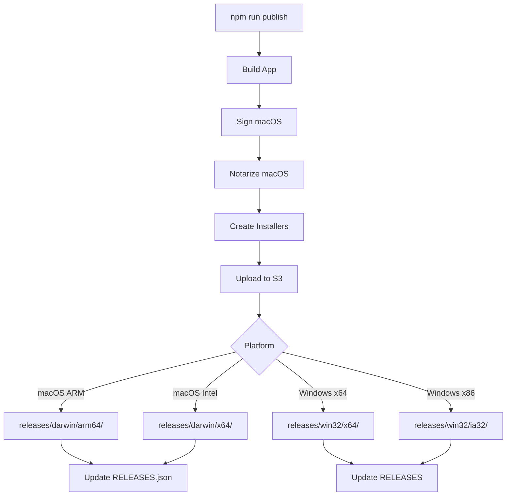

# Publishing

This document explains how to publish Snaplark releases to S3 storage for distribution and auto-updates.

## Overview

Snaplark uses **Contabo S3-compatible storage** for hosting releases:

```
https://usc1.contabostorage.com/72e7132000f0495a956688c26ebee898:main-storage/
└── releases/
    ├── darwin/
    │   ├── arm64/
    │   │   ├── Snaplark-darwin-arm64-1.1.4.zip
    │   │   └── RELEASES.json
    │   └── x64/
    │       ├── Snaplark-darwin-x64-1.1.4.zip
    │       └── RELEASES.json
    └── win32/
        ├── x64/
        │   ├── Snaplark-1.1.4-full.nupkg
        │   ├── Snaplark-1.1.4 Setup.exe
        │   └── RELEASES
        └── ia32/
            └── ...
```

## Publishing Command

```bash
npm run publish
```

This command:
1. Builds the application (`npm run make`)
2. Uploads artifacts to S3
3. Updates release manifests

## S3 Configuration

**`forge.config.js`:**

```javascript
publishers: [
    {
        name: '@electron-forge/publisher-s3',
        config: {
            bucket: process.env.AWS_BUCKET,        // 'main-storage'
            region: process.env.AWS_DEFAULT_REGION, // 'usc1'
            accessKeyId: process.env.AWS_ACCESS_KEY_ID,
            secretAccessKey: process.env.AWS_SECRET_ACCESS_KEY,
            endpoint: `https://${process.env.AWS_DEFAULT_REGION}.contabostorage.com`,
            s3ForcePathStyle: true,
            public: true,
            acl: 'public-read',
            folder: 'releases'
        }
    }
]
```

**`.env`:**

```env
AWS_ACCESS_KEY_ID=your-access-key
AWS_SECRET_ACCESS_KEY=your-secret-key
AWS_DEFAULT_REGION=usc1
AWS_BUCKET=main-storage
```

## Release Structure

### macOS Releases

```
releases/darwin/{arch}/
├── Snaplark-darwin-{arch}-{version}.zip   # App bundle for updates
├── RELEASES.json                           # Update manifest
└── Snaplark-{version}-{arch}.dmg          # Installer for downloads
```

**RELEASES.json format:**

```json
{
  "currentRelease": "1.1.4",
  "releases": [
    {
      "version": "1.1.4",
      "updateTo": {
        "version": "1.1.4",
        "pub_date": "2024-01-15T00:00:00.000Z",
        "url": "https://usc1.contabostorage.com/.../Snaplark-darwin-arm64-1.1.4.zip"
      }
    }
  ]
}
```

### Windows Releases

```
releases/win32/{arch}/
├── Snaplark-{version}-full.nupkg          # Squirrel update package
├── Snaplark-{version}-delta.nupkg         # Delta update (if available)
├── Snaplark-{version} Setup.exe           # Installer
└── RELEASES                               # Squirrel manifest
```

**RELEASES format:**

```
9F3A1B2C... Snaplark-1.1.4-full.nupkg 123456789
```

## Publishing Flow



## Manual Publishing (Windows)

Since Windows signing is separate, you may need to publish manually:

### Step 1: Build

```bash
npm run make -- --platform=win32
```

### Step 2: Sign (on Windows)

```powershell
signtool sign /f cert.pfx /p password /tr http://timestamp.digicert.com /td sha256 /fd sha256 "out/make/squirrel.windows/x64/*.exe"
```

### Step 3: Upload to S3

Using AWS CLI:

```bash
# Configure AWS CLI for Contabo
aws configure
# AWS Access Key ID: your-key
# AWS Secret Access Key: your-secret
# Default region: usc1

# Upload files
aws s3 cp "out/make/squirrel.windows/x64/" \
    "s3://main-storage/releases/win32/x64/" \
    --recursive \
    --endpoint-url https://usc1.contabostorage.com \
    --acl public-read
```

Or using a script:

```javascript
// publish-windows.js
const AWS = require('aws-sdk')
const fs = require('fs')
const path = require('path')

const s3 = new AWS.S3({
    accessKeyId: process.env.AWS_ACCESS_KEY_ID,
    secretAccessKey: process.env.AWS_SECRET_ACCESS_KEY,
    endpoint: 'https://usc1.contabostorage.com',
    s3ForcePathStyle: true
})

const files = [
    'Snaplark-1.1.4 Setup.exe',
    'Snaplark-1.1.4-full.nupkg',
    'RELEASES'
]

for (const file of files) {
    const filePath = path.join('out/make/squirrel.windows/x64', file)

    s3.upload({
        Bucket: 'main-storage',
        Key: `releases/win32/x64/${file}`,
        Body: fs.createReadStream(filePath),
        ACL: 'public-read'
    }).promise().then(() => {
        console.log(`Uploaded: ${file}`)
    })
}
```

## Version Management

### Update package.json

Before publishing, update the version:

```json
{
    "version": "1.1.5"
}
```

### Version Format

Follow semantic versioning: `MAJOR.MINOR.PATCH`

- **MAJOR** - Breaking changes
- **MINOR** - New features
- **PATCH** - Bug fixes

## Pre-Release Workflow

1. **Test locally**
   ```bash
   npm start  # Test in development
   npm run make  # Build and test production
   ```

2. **Update version**
   ```bash
   # Edit package.json version
   ```

3. **Commit and tag**
   ```bash
   git add .
   git commit -m "Release v1.1.5"
   git tag v1.1.5
   ```

4. **Publish**
   ```bash
   npm run publish
   ```

5. **Push tags**
   ```bash
   git push && git push --tags
   ```

## S3 Bucket Permissions

Ensure the S3 bucket has public read access for updates:

```json
{
    "Version": "2012-10-17",
    "Statement": [
        {
            "Effect": "Allow",
            "Principal": "*",
            "Action": "s3:GetObject",
            "Resource": "arn:aws:s3:::main-storage/releases/*"
        }
    ]
}
```

## CDN Considerations

For faster downloads, consider adding a CDN:

1. **Cloudflare** - Free tier available
2. **AWS CloudFront** - Native S3 integration
3. **Contabo CDN** - If available

Configure CDN to cache:
- `.exe`, `.dmg`, `.zip` - Long cache (immutable)
- `RELEASES`, `RELEASES.json` - Short cache (1 hour)

## Rollback

To rollback to a previous version:

1. Don't delete old release files
2. Update RELEASES.json to point to older version
3. Users will "update" to the older version

## Monitoring

Check release status:

```bash
# List releases
aws s3 ls s3://main-storage/releases/darwin/arm64/ \
    --endpoint-url https://usc1.contabostorage.com

# Check manifest
curl https://usc1.contabostorage.com/72e7132000f0495a956688c26ebee898:main-storage/releases/darwin/arm64/RELEASES.json
```

## Troubleshooting

### Upload Fails

1. Check AWS credentials
2. Verify endpoint URL
3. Check bucket permissions
4. Ensure file paths are correct

### Users Can't Download

1. Verify ACL is `public-read`
2. Check S3 bucket policy
3. Test URL in browser

### Updates Not Working

1. Check RELEASES.json format
2. Verify version numbers match
3. Ensure ZIP is properly signed (macOS)
4. Check Squirrel RELEASES format (Windows)

## Next Steps

- [Auto Updates](/deployment/auto-updates) - How updates reach users
- [Code Signing](/deployment/code-signing) - Signing requirements
- [Build Process](/deployment/build-process) - Complete build guide
