# Annotation Tools

This document explains the annotation/drawing system used in Snaplark for editing screenshots before saving or uploading.

## Overview

The annotation system allows users to:
- Draw shapes (lines, arrows, rectangles, ellipses)
- Freehand drawing with pencil and highlighter
- Add text with word wrap
- Apply blur for privacy
- Erase individual elements
- Undo/redo changes
- Choose colors
- Drag and resize annotations

## Technology: Konva.js

All annotation functionality is built on **Konva.js**, a 2D canvas library for HTML5.

**Why Konva.js?**
- High-performance canvas rendering
- Built-in shape primitives
- Transform tool for resizing/moving
- Filters (blur, brightness, etc.)
- Layer management
- Event system for interaction

## Architecture Diagram

### Konva.js Canvas Structure

```
┌─────────────────────────────────────────────────────────────────────────────┐
│                         KONVA EDITOR ARCHITECTURE                            │
├─────────────────────────────────────────────────────────────────────────────┤
│                                                                              │
│   ┌─────────────────────────────────────────────────────────────────────┐   │
│   │                         KONVA STAGE                                  │   │
│   │                    (Canvas Container)                                │   │
│   │  ┌───────────────────────────────────────────────────────────────┐  │   │
│   │  │                        LAYER                                   │  │   │
│   │  │                                                                │  │   │
│   │  │   ┌─────────────────────────────────────────────────────────┐ │  │   │
│   │  │   │              BACKGROUND IMAGE                            │ │  │   │
│   │  │   │         (Captured screenshot region)                     │ │  │   │
│   │  │   └─────────────────────────────────────────────────────────┘ │  │   │
│   │  │                           │                                   │  │   │
│   │  │   ┌─────────────────────────────────────────────────────────┐ │  │   │
│   │  │   │              ANNOTATION OBJECTS                          │ │  │   │
│   │  │   │  ┌─────┐  ┌─────┐  ┌─────┐  ┌─────┐  ┌─────┐          │ │  │   │
│   │  │   │  │Line │  │Arrow│  │Rect │  │Ellip│  │Text │          │ │  │   │
│   │  │   │  └─────┘  └─────┘  └─────┘  └─────┘  └─────┘          │ │  │   │
│   │  │   │  ┌─────┐  ┌─────┐  ┌─────┐                             │ │  │   │
│   │  │   │  │Pencl│  │Highlt│  │Blur │                            │ │  │   │
│   │  │   │  └─────┘  └─────┘  └─────┘                             │ │  │   │
│   │  │   └─────────────────────────────────────────────────────────┘ │  │   │
│   │  │                           │                                   │  │   │
│   │  │   ┌─────────────────────────────────────────────────────────┐ │  │   │
│   │  │   │              TRANSFORMER                                 │ │  │   │
│   │  │   │    (Resize/move handles for selected object)            │ │  │   │
│   │  │   └─────────────────────────────────────────────────────────┘ │  │   │
│   │  │                                                                │  │   │
│   │  └───────────────────────────────────────────────────────────────┘  │   │
│   └─────────────────────────────────────────────────────────────────────┘   │
│                                                                              │
└─────────────────────────────────────────────────────────────────────────────┘
```

### Tool Flow Diagram

```mermaid
flowchart TB
    subgraph Input["🖱️ User Input"]
        click["Mouse Click"]
        drag["Mouse Drag"]
        release["Mouse Release"]
    end

    subgraph Tools["🛠️ Tool Selection"]
        line["━━ Line"]
        arrow["➜ Arrow"]
        rect["▢ Rectangle"]
        ellipse["◯ Ellipse"]
        pencil["✏️ Pencil"]
        highlighter["🖌️ Highlighter"]
        text["T Text"]
        blur["◼ Blur"]
        eraser["⌫ Eraser"]
    end

    subgraph Actions["⚡ Tool Actions"]
        shape_create["Create Shape"]
        shape_update["Update on Drag"]
        shape_finish["Finalize Shape"]
        text_input["Show Text Input"]
        blur_region["Apply Blur Filter"]
        delete_obj["Delete Object"]
    end

    subgraph History["📚 History Stack"]
        undo["↩ Undo"]
        redo["↪ Redo"]
        stack["History Array"]
    end

    click --> Tools
    Tools --> |Drawing Tools| shape_create
    drag --> shape_update
    release --> shape_finish

    text --> text_input
    blur --> blur_region
    eraser --> delete_obj

    shape_finish --> stack
    text_input --> stack
    blur_region --> stack
    delete_obj --> stack

    stack --> undo
    stack --> redo
```



### Tool Behavior Matrix

```
┌─────────────────────────────────────────────────────────────────────────────┐
│                           TOOL BEHAVIOR MATRIX                               │
├─────────────────────────────────────────────────────────────────────────────┤
│                                                                              │
│   Tool        │ On Click      │ On Drag           │ On Release │ Draggable  │
│   ────────────┼───────────────┼───────────────────┼────────────┼────────────│
│   Line        │ Set start pt  │ Update end point  │ Finalize   │ ✓          │
│   Arrow       │ Set start pt  │ Update end point  │ Finalize   │ ✓          │
│   Rectangle   │ Set corner    │ Update dimensions │ Finalize   │ ✓          │
│   Ellipse     │ Set center    │ Update radii      │ Finalize   │ ✓          │
│   Pencil      │ Start path    │ Append points     │ Finalize   │ ✓          │
│   Highlighter │ Start path    │ Append points     │ Finalize   │ ✓          │
│   Text        │ Set position  │ Draw text box     │ Open input │ ✓          │
│   Blur        │ Set corner    │ Update region     │ Apply blur │ ✓          │
│   Eraser      │ Delete target │ -                 │ -          │ -          │
│                                                                              │
└─────────────────────────────────────────────────────────────────────────────┘
```

### Undo/Redo State Management

```
┌─────────────────────────────────────────────────────────────────────────────┐
│                        UNDO/REDO IMPLEMENTATION                              │
├─────────────────────────────────────────────────────────────────────────────┤
│                                                                              │
│   HISTORY STACK                              REDO STACK                      │
│   ┌───────────────────┐                     ┌───────────────────┐           │
│   │ [entry 1]         │                     │ (empty)           │           │
│   │ [entry 2]         │                     │                   │           │
│   │ [entry 3]         │  ◄── Current        │                   │           │
│   │ [entry 4]         │                     │                   │           │
│   └───────────────────┘                     └───────────────────┘           │
│          │                                           ▲                       │
│          │ UNDO                                      │                       │
│          ▼                                           │                       │
│   ┌───────────────────┐                     ┌───────────────────┐           │
│   │ [entry 1]         │                     │ [entry 4]         │           │
│   │ [entry 2]         │                     │                   │           │
│   │ [entry 3]         │  ◄── Current        │                   │           │
│   └───────────────────┘                     └───────────────────┘           │
│                                                      │                       │
│                                              REDO   │                       │
│                                                      ▼                       │
│   Entry Types:                              ┌───────────────────┐           │
│   • node_add: { node, parent, zIndex }     │ Restore entry 4   │           │
│   • node_remove: { node, parent, zIndex }  │ Move back to      │           │
│                                            │ history stack     │           │
│                                            └───────────────────┘           │
│                                                                              │
└─────────────────────────────────────────────────────────────────────────────┘
```

## Tool Reference

### Line Tool

Draws a straight line between two points.

```javascript
currentShape = new Konva.Line({
    points: [startPos.x, startPos.y, endPos.x, endPos.y],
    stroke: selectedColor,
    strokeWidth: 2
})
```

**Behavior:**
- Click and drag to define start and end points
- Line follows mouse during drag
- Released on mouseup

### Arrow Tool

Draws a line with an arrowhead at the end.

```javascript
currentShape = new Konva.Arrow({
    points: [startPos.x, startPos.y, endPos.x, endPos.y],
    stroke: selectedColor,
    fill: selectedColor,
    strokeWidth: 2,
    pointerLength: 10,
    pointerWidth: 10
})
```

**Behavior:**
- Same as line, but with arrowhead
- Arrowhead points toward the end point

### Rectangle Tool

Draws a hollow rectangle.

```javascript
currentShape = new Konva.Rect({
    x: Math.min(startPos.x, pos.x),
    y: Math.min(startPos.y, pos.y),
    width: Math.abs(pos.x - startPos.x),
    height: Math.abs(pos.y - startPos.y),
    stroke: selectedColor,
    strokeWidth: 2
})
```

**Behavior:**
- Click and drag to define opposite corners
- Can drag in any direction (normalizes coordinates)
- Outline only, no fill

### Ellipse Tool

Draws a hollow ellipse/circle.

```javascript
currentShape = new Konva.Ellipse({
    x: startPos.x + width / 2,
    y: startPos.y + height / 2,
    radiusX: Math.abs(width / 2),
    radiusY: Math.abs(height / 2),
    stroke: selectedColor,
    strokeWidth: 2
})
```

**Behavior:**
- Click and drag to define bounding box
- Center is calculated from start and end points
- Can create circles by dragging equally

### Pencil Tool

Freehand drawing with smooth lines.

```javascript
currentShape = new Konva.Line({
    points: [startPos.x, startPos.y],
    stroke: selectedColor,
    strokeWidth: 2,
    lineCap: 'round',
    lineJoin: 'round',
    tension: 0.5,  // Smooth interpolation
    globalCompositeOperation: 'source-over'
})

// On mousemove, append points
const oldPoints = currentShape.points()
currentShape.points([...oldPoints, pos.x, pos.y])
```

**Behavior:**
- Points collected continuously during drag
- `tension: 0.5` smooths the line
- Round caps and joins for natural appearance

### Highlighter Tool

Semi-transparent freehand drawing.

```javascript
currentShape = new Konva.Line({
    points: [startPos.x, startPos.y],
    stroke: selectedColor,
    strokeWidth: 15,      // Wide stroke
    opacity: 0.3,         // Semi-transparent
    lineCap: 'round',
    lineJoin: 'round',
    globalCompositeOperation: 'multiply'  // Blends with content
})
```

**Behavior:**
- Same as pencil but wider and transparent
- `multiply` blend mode simulates real highlighter

### Text Tool

Creates resizable text boxes with word wrap.

```javascript
// Create a group containing rect and text
const textGroup = new Konva.Group({
    x: position.x,
    y: position.y,
    draggable: true,
    isTextGroup: true
})

const bgRect = new Konva.Rect({
    width: width,
    height: height,
    fillEnabled: false
})

const textNode = new Konva.Text({
    width: width,
    text: '',
    fontSize: 16,
    lineHeight: 1.2,
    fontFamily: 'Inter, system-ui, sans-serif',
    fill: selectedColor,
    wrap: 'word'
})

textGroup.add(bgRect)
textGroup.add(textNode)
textGroup.clip({ x: 0, y: 0, width: width, height: height })
```

**Behavior:**
1. Click and drag to define text area bounds
2. HTML textarea appears for input
3. Enter commits, Escape cancels
4. Double-click to edit existing text
5. Transform handles to resize
6. Text wraps within bounds

### Blur Tool

Creates pixelated/blurred regions for privacy.

```javascript
// Implementation with Konva filters
const blurred = new Konva.Image({
    image: backgroundImage,
    x: rect.x,
    y: rect.y,
    width: rect.width,
    height: rect.height,
    crop: {
        x: rect.x * scaleX,
        y: rect.y * scaleY,
        width: rect.width * scaleX,
        height: rect.height * scaleY
    }
})

blurred.cache()
blurred.filters([Konva.Filters.Blur])
blurred.blurRadius(15 * blurScale)  // Scale for HiDPI
```

**How it works:**
1. User draws a rectangle to blur
2. Copy that region from the background image
3. Apply Konva's blur filter
4. Place the blurred copy over the original

**HiDPI Handling:**
```javascript
// Scale blur radius based on device pixel ratio
const scaleX = bgImage.naturalWidth / stage.width()
const scaleY = bgImage.naturalHeight / stage.height()
const blurScale = Math.max(scaleX, scaleY, 1)
blurred.blurRadius(15 * blurScale)
```

### Eraser Tool

Deletes annotations on click.

```javascript
if (activeTool === 'eraser') {
    let target = stage.getIntersection(pointerPos)

    if (target) {
        // Check if it's part of a text group
        const textGroup = target.findAncestors(
            n => n.getAttr && n.getAttr('isTextGroup')
        )[0]

        const nodeToRemove = textGroup || target

        // Store for undo
        pushHistory({
            type: 'node_remove',
            node: nodeToRemove,
            parent: nodeToRemove.getLayer()
        })

        nodeToRemove.destroy()
        layer.batchDraw()
    }
}
```

**Behavior:**
- Click to delete element under cursor
- Deletes entire text group if clicking text
- Adds to history for undo

## Color Picker

```javascript
const colors = [
    '#2178FF',  // Blue (default)
    '#FF4444',  // Red
    '#44FF44',  // Green
    '#FFFF44',  // Yellow
    '#FF44FF',  // Pink
    '#44FFFF',  // Cyan
    '#FFFFFF',  // White
    '#000000'   // Black
]
```

**UI Component:** `ColorPalette.vue`

## Undo/Redo System

The annotation editor maintains two stacks:
- `history[]` - Actions that can be undone
- `redoStack[]` - Actions that can be redone

**History Entry Types:**

```javascript
// Node added (shape, text group, blur)
{
    type: 'node_add',
    node: konvaNode,
    parent: layer,
    zIndex: node.zIndex()
}

// Node removed (via eraser)
{
    type: 'node_remove',
    node: konvaNode,
    parent: layer,
    zIndex: node.zIndex()
}
```

**Undo Logic:**
```javascript
function undo() {
    const entry = history.pop()

    switch (entry.type) {
        case 'node_add':
            // Remove the node
            entry.node.remove()
            redoStack.push(entry)
            break

        case 'node_remove':
            // Restore the node
            entry.node.moveTo(entry.parent)
            entry.node.setZIndex(entry.zIndex)
            redoStack.push(entry)
            break
    }

    layer.batchDraw()
}
```

## Transformer (Resize/Move)

Konva's Transformer allows resizing and moving shapes:

```javascript
transformer = new Konva.Transformer({
    rotateEnabled: false,       // No rotation
    enabledAnchors: [
        'top-left', 'top-center', 'top-right',
        'middle-left', 'middle-right',
        'bottom-left', 'bottom-center', 'bottom-right'
    ],
    anchorSize: 6,
    ignoreStroke: true
})

// Attach to selected node
transformer.nodes([selectedShape])
```

**Behavior:**
- Click on shape to select
- Drag handles to resize
- Drag shape to move
- Click empty area to deselect

## Toolbar

The toolbar is a floating, draggable component with:

1. **Drag handle** - Move toolbar position
2. **Undo/Redo buttons** - History navigation
3. **Tool buttons** - Line, Arrow, Rect, Ellipse, Pencil, Highlighter, Eraser, Blur, Text
4. **Color picker** - Choose annotation color
5. **Delete button** - Cancel/discard
6. **Done button** - Save/export

**Toolbar Dragging:**
```javascript
const handleToolbarDragStart = (e) => {
    const toolbar = e.currentTarget.closest('.toolbar-container')
    const rect = toolbar.getBoundingClientRect()

    dragOffsetX = e.clientX - rect.left
    dragOffsetY = e.clientY - rect.top

    document.addEventListener('mousemove', handleToolbarDragMove)
    document.addEventListener('mouseup', handleToolbarDragEnd)
}

const handleToolbarDragMove = (e) => {
    customToolbarPosition.value = {
        x: e.clientX - dragOffsetX,
        y: e.clientY - dragOffsetY
    }
}
```

## Export

The final annotated image is exported as PNG:

```javascript
const exportPNG = (options = {}) => {
    return stage.toDataURL({
        pixelRatio: window.devicePixelRatio || 1,
        mimeType: 'image/png',
        ...options
    })
}
```

**Important:** The `pixelRatio` ensures exports are crisp on HiDPI displays.

## Keyboard Shortcuts

| Shortcut | Action |
|----------|--------|
| `Enter` | Commit text |
| `Escape` | Cancel text / Deselect |
| `Delete` / `Backspace` | Delete selected |

## File Location

All annotation code is in:
- `src/components/KonvaEditor.vue` (1,066 lines)

Supporting components:
- `src/components/ColorPalette.vue`
- `src/components/Tooltip.vue`
- `src/components/icons/*.vue`

## Performance Considerations

1. **Layer batching:**
   ```javascript
   layer.batchDraw()  // Efficient redraw
   ```

2. **Blur caching:**
   ```javascript
   blurred.cache()  // Cache filtered result
   ```

3. **Cleanup on unmount:**
   ```javascript
   onUnmounted(() => {
       stage.destroy()
   })
   ```

## Next Steps

- [Screenshot Capture](/features/screenshot) - How captures reach the editor
- [Video Recording](/features/video-recording) - Recording feature
- [Cloud Upload](/features/cloud-upload) - How uploads work
