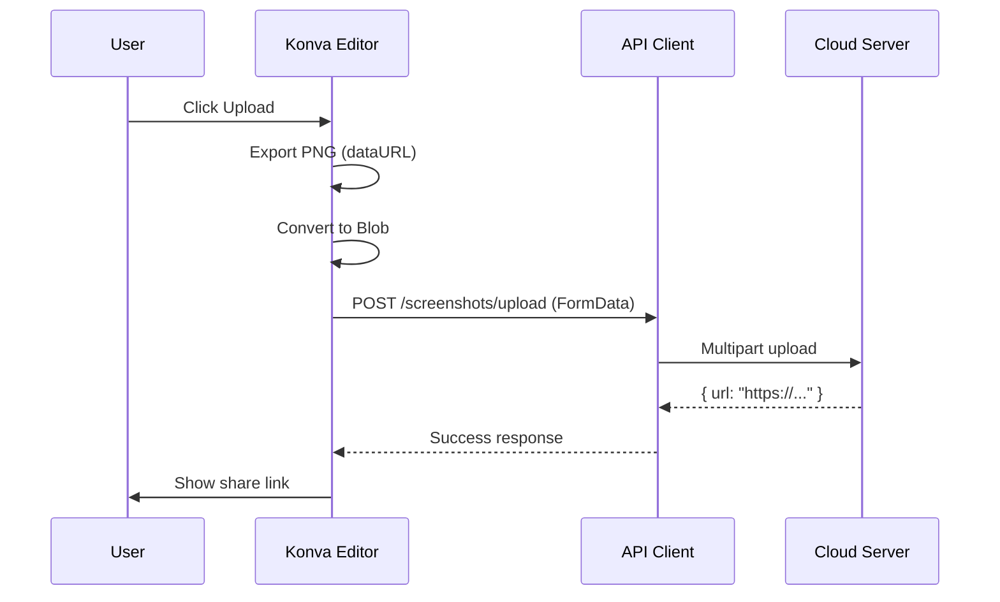
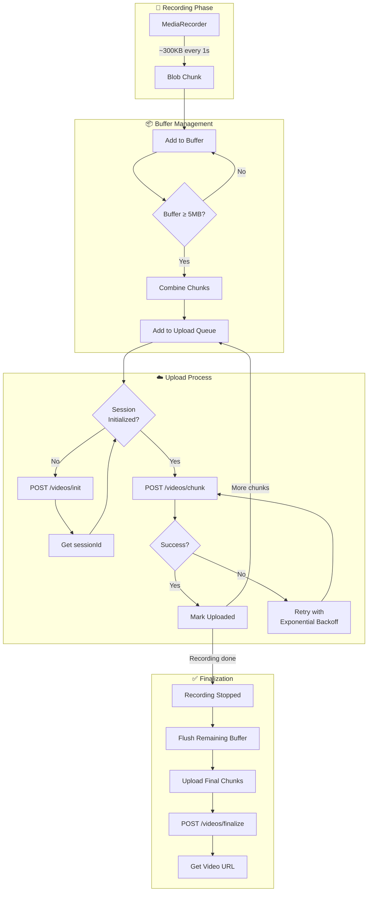

# Cloud Upload

This document explains how Snaplark uploads screenshots and videos to the cloud, including the chunked upload system for videos.

## Overview

Snaplark supports cloud upload for:
- **Screenshots** - Single image upload after annotation
- **Videos** - Real-time chunked upload during recording

All uploads go to `https://snaplark.com/api/v1`.

## Screenshot Upload Flow



**Implementation:**

```javascript
// Convert dataURL to Blob
const response = await fetch(dataUrl)
const blob = await response.blob()

// Create FormData
const formData = new FormData()
formData.append('file', blob, `screenshot-${Date.now()}.png`)

// Upload
const result = await apiClient.post('/screenshots/upload', formData, {
    headers: { 'Content-Type': 'multipart/form-data' }
})

// Get share URL
const shareUrl = result.data.url
```

## Video Upload Flow

Videos use a chunked upload system for:
- Real-time upload during recording
- Handling large files efficiently
- Resuming on network failure

### Architecture

```
┌─────────────────────────────────────────────────────────────────────────────┐
│                       CLOUD UPLOAD ARCHITECTURE                              │
├─────────────────────────────────────────────────────────────────────────────┤
│                                                                              │
│   SCREENSHOTS (Simple Upload)          VIDEOS (Chunked Upload)              │
│   ┌───────────────────────┐           ┌───────────────────────┐            │
│   │                       │           │                       │            │
│   │   PNG ───▶ FormData   │           │   WebM ───▶ 5MB       │            │
│   │         ───▶ POST     │           │          chunks       │            │
│   │         ───▶ URL      │           │         ───▶ S3       │            │
│   │                       │           │         multipart     │            │
│   └───────────────────────┘           └───────────────────────┘            │
│            │                                    │                           │
│            ▼                                    ▼                           │
│   ┌─────────────────────────────────────────────────────────────────────┐  │
│   │                          CLOUD API                                   │  │
│   │                    https://snaplark.com/api/v1                       │  │
│   └─────────────────────────────────────────────────────────────────────┘  │
│            │                                    │                           │
│            ▼                                    ▼                           │
│   ┌─────────────────────────────────────────────────────────────────────┐  │
│   │                          S3 STORAGE                                  │  │
│   │                    CDN: cdn.snaplark.com                            │  │
│   └─────────────────────────────────────────────────────────────────────┘  │
│                                                                              │
└─────────────────────────────────────────────────────────────────────────────┘
```

### Detailed Video Upload Flow



### Upload State Machine

```
┌─────────────────────────────────────────────────────────────────────────────┐
│                    CHUNK UPLOAD MANAGER STATE MACHINE                        │
├─────────────────────────────────────────────────────────────────────────────┤
│                                                                              │
│                        ┌─────────────────┐                                   │
│                        │      IDLE       │                                   │
│                        │   (No session)  │                                   │
│                        └────────┬────────┘                                   │
│                                 │                                            │
│                                 │ queueInit()                                │
│                                 ▼                                            │
│                        ┌─────────────────┐                                   │
│                        │  INITIALIZING   │ ──────── POST /videos/init        │
│                        │                 │                                   │
│                        └────────┬────────┘                                   │
│                                 │                                            │
│                                 │ sessionId received                         │
│                                 ▼                                            │
│   ┌──────────────────────────────────────────────────────────────────┐      │
│   │                       UPLOADING                                   │      │
│   │                                                                   │      │
│   │   ┌─────────────┐    ┌─────────────┐    ┌─────────────┐        │      │
│   │   │  BUFFERING  │───▶│  QUEUED     │───▶│  UPLOADING  │        │      │
│   │   │  (< 5MB)    │    │  (≥ 5MB)    │    │  (in flight)│        │      │
│   │   └─────────────┘    └─────────────┘    └──────┬──────┘        │      │
│   │         ▲                                       │                │      │
│   │         │                                       │                │      │
│   │         └───────────────────────────────────────┘                │      │
│   │                        success                                   │      │
│   └──────────────────────────────────────────────────────────────────┘      │
│                                 │                                            │
│                                 │ markRecordingFinished()                    │
│                                 ▼                                            │
│                        ┌─────────────────┐                                   │
│                        │   FINALIZING    │ ──────── POST /videos/finalize    │
│                        │                 │                                   │
│                        └────────┬────────┘                                   │
│                                 │                                            │
│                                 │ success                                    │
│                                 ▼                                            │
│                        ┌─────────────────┐                                   │
│                        │   COMPLETED     │                                   │
│                        │   (URL ready)   │                                   │
│                        └─────────────────┘                                   │
│                                                                              │
└─────────────────────────────────────────────────────────────────────────────┘
```

### Connectivity Handling

```
┌─────────────────────────────────────────────────────────────────────────────┐
│                        OFFLINE RESILIENCE                                    │
├─────────────────────────────────────────────────────────────────────────────┤
│                                                                              │
│   ONLINE                                      OFFLINE                        │
│   ┌───────────────────────────┐              ┌───────────────────────────┐  │
│   │                           │              │                           │  │
│   │  Chunks upload normally   │              │  Chunks queue locally     │  │
│   │  ───────────────────▶     │              │  ─────────┐               │  │
│   │                           │              │           │               │  │
│   │  [====▶ S3]              │   Network    │  [====] [====] [====]     │  │
│   │                           │    Lost     │     ▲                     │  │
│   │                           │ ──────────▶ │     │ Waiting             │  │
│   │                           │              │     │                     │  │
│   └───────────────────────────┘              └───────────────────────────┘  │
│                                                       │                      │
│                                              Network  │                      │
│                                              Restored │                      │
│                                                       ▼                      │
│                                              ┌───────────────────────────┐  │
│                                              │                           │  │
│                                              │  Resume upload queue      │  │
│                                              │  ───────────────────▶     │  │
│                                              │                           │  │
│                                              │  [====▶ S3]              │  │
│                                              │  [====▶ S3]              │  │
│                                              │  [====▶ S3]              │  │
│                                              │                           │  │
│                                              └───────────────────────────┘  │
│                                                                              │
│   No data loss - all chunks preserved in queue until upload succeeds        │
│                                                                              │
└─────────────────────────────────────────────────────────────────────────────┘
```

### Step 1: Session Initialization

Before uploading chunks, a session must be created:

```javascript
// API Request
POST /videos/init
{
    "filename": "recording-1234567890.webm",
    "timestamp": 1234567890,
    "fps": 30,
    "codec": "vp9",
    "bitrate": 2500000,
    "resolution": "1920x1080"
}

// Response
{
    "sessionId": "abc123-def456-ghi789"
}
```

**Implementation:**

```javascript
async initializeSession(metadata) {
    const response = await apiClient.post('/videos/init', {
        filename: metadata.filename,
        timestamp: metadata.timestamp,
        fps: metadata.fps,
        codec: metadata.codec,
        bitrate: metadata.bitrate,
        resolution: metadata.resolution
    })

    this.sessionId = response.data.sessionId
    return this.sessionId
}
```

### Step 2: Chunk Buffering

MediaRecorder produces small chunks frequently. These are buffered to create 5MB+ chunks for S3 compatibility:

```javascript
// Why 5MB minimum?
// AWS S3 multipart upload requires parts to be at least 5MB (except the last part)
this.minChunkSize = 5 * 1024 * 1024  // 5MB in bytes

addToBuffer(chunkBlob, originalChunkIndex) {
    // Add to buffer
    this.chunkBuffer.push(chunkBlob)
    this.chunkBufferSize += chunkBlob.size

    // Create 5MB chunks when threshold reached
    while (this.chunkBufferSize >= this.minChunkSize) {
        const chunksToCombine = []
        let combinedSize = 0

        while (combinedSize < this.minChunkSize && this.chunkBuffer.length > 0) {
            const chunk = this.chunkBuffer.shift()
            chunksToCombine.push(chunk)
            combinedSize += chunk.size
        }

        const combinedBlob = new Blob(chunksToCombine, { type: 'video/webm' })
        this.chunkBufferSize -= combinedSize

        // Queue for upload
        this.queueChunkDirectly(combinedBlob, this.nextChunkIndex++)
    }
}
```

### Step 3: Chunk Upload

Each chunk is uploaded via multipart form:

```javascript
// API Request
POST /videos/chunk
Content-Type: multipart/form-data

sessionId: "abc123-def456-ghi789"
chunkIndex: 0
chunk: <binary data>

// Response
{
    "received": true,
    "chunkIndex": 0
}
```

**Implementation:**

```javascript
async uploadChunk(chunkBlob, chunkIndex) {
    const formData = new FormData()
    formData.append('sessionId', this.sessionId)
    formData.append('chunkIndex', chunkIndex.toString())
    formData.append('chunk', chunkBlob, `chunk_${chunkIndex}.webm`)

    const response = await apiClient.post('/videos/chunk', formData, {
        headers: { 'Content-Type': 'multipart/form-data' }
    })

    this.uploadedChunks.add(chunkIndex)
    return response.data
}
```

### Step 4: Retry Logic

Failed uploads are retried with exponential backoff:

```javascript
retryDelays = [1000, 2000, 4000, 8000, 16000]  // 1s, 2s, 4s, 8s, 16s

async uploadChunk(chunkBlob, chunkIndex) {
    const retryCount = this.failedChunks.get(chunkIndex) || 0

    try {
        // ... upload attempt ...
    } catch (error) {
        this.failedChunks.set(chunkIndex, retryCount + 1)

        // Calculate delay
        const delay = this.retryDelays[
            Math.min(retryCount, this.retryDelays.length - 1)
        ]

        await new Promise(r => setTimeout(r, delay))

        // Retry (no max limit - keeps trying)
        return this.uploadChunk(chunkBlob, chunkIndex)
    }
}
```

### Step 5: Queue Processing

Chunks are processed sequentially to maintain order:

```javascript
async processQueue() {
    if (this.isProcessing) return
    this.isProcessing = true

    while (this.uploadQueue.length > 0 && connectivityService.isOnline) {
        const item = this.uploadQueue[0]

        if (item.type === 'init') {
            await this.initializeSession(item.metadata)
            this.uploadQueue.shift()
        } else if (item.type === 'chunk') {
            if (!this.sessionId) {
                await new Promise(r => setTimeout(r, 500))
                continue
            }

            await this.uploadChunk(item.blob, item.chunkIndex)
            this.uploadQueue.shift()
        }
    }

    this.isProcessing = false
}
```

### Step 6: Session Finalization

When recording stops, remaining buffer is flushed and session finalized:

```javascript
async finalizeSession(finalMetadata) {
    // Mark recording as finished
    this.recordingFinished = true

    // Flush remaining buffer (last chunk can be < 5MB)
    this.flushBuffer()

    // Wait for all chunks to upload
    while (this.uploadQueue.length > 0 || this.isProcessing) {
        await new Promise(r => setTimeout(r, 500))
    }

    // Finalize with server
    const response = await apiClient.post('/videos/finalize', {
        sessionId: this.sessionId,
        totalChunks: this.uploadedChunks.size,
        uploadedChunks: Array.from(this.uploadedChunks).sort((a, b) => a - b),
        duration: finalMetadata.duration,
        metadata: { ...this.metadata, ...finalMetadata }
    })

    return {
        success: true,
        sessionId: this.sessionId,
        key: response.data.key,
        uploadedChunks: this.uploadedChunks.size
    }
}
```

## Connectivity Handling

The upload manager responds to network changes:

```javascript
// Listen for connectivity events
connectivityService.on('restored', () => {
    console.log('Connectivity restored - resuming uploads...')

    if (this.uploadQueue.length > 0) {
        this.processQueue()
    }
})

connectivityService.on('lost', () => {
    console.log('Connectivity lost - uploads paused')
    // Queue preserved for when connection returns
})
```

**Offline Behavior:**
- Chunks continue to be queued
- Processing pauses automatically
- Resumes when online
- No data loss

## Progress Tracking

```javascript
getProgress() {
    const uploaded = this.uploadedChunks.size
    const pending = this.uploadQueue.length
    const total = uploaded + pending

    return {
        uploaded,
        pending,
        failed: this.failedChunks.size,
        percentage: total > 0 ? Math.round((uploaded / total) * 100) : 0,
        isOnline: connectivityService.isOnline,
        hasSession: !!this.sessionId
    }
}
```

## Notification Service

Upload progress is displayed via toast notifications:

```javascript
// src/services/notification-service.js
notificationService.notify({
    type: 'upload-progress',
    title: 'Uploading video...',
    progress: 45,
    filename: 'recording-123.webm'
})
```

**Notification Window:**
- Position: Bottom-right corner
- Width: 420px
- Shows: Title, progress bar, percentage

## API Reference

### POST /videos/init

Initialize upload session.

**Request:**
```json
{
    "filename": "recording-1234567890.webm",
    "timestamp": 1234567890,
    "fps": 30,
    "codec": "vp9",
    "bitrate": 2500000,
    "resolution": "1920x1080"
}
```

**Response:**
```json
{
    "sessionId": "abc123-def456-ghi789"
}
```

### POST /videos/chunk

Upload a video chunk.

**Request:** `multipart/form-data`
- `sessionId`: string
- `chunkIndex`: number
- `chunk`: file (5MB+ except last)

**Response:**
```json
{
    "received": true,
    "chunkIndex": 0
}
```

### POST /videos/finalize

Complete upload session.

**Request:**
```json
{
    "sessionId": "abc123-def456-ghi789",
    "totalChunks": 10,
    "uploadedChunks": [0, 1, 2, 3, 4, 5, 6, 7, 8, 9],
    "duration": 30.5,
    "metadata": { ... }
}
```

**Response:**
```json
{
    "key": "videos/abc123/recording.webm",
    "url": "https://cdn.snaplark.com/videos/abc123/recording.webm"
}
```

### POST /screenshots/upload

Upload a screenshot.

**Request:** `multipart/form-data`
- `file`: PNG image

**Response:**
```json
{
    "url": "https://cdn.snaplark.com/screenshots/abc123.png"
}
```

## Configuration

### API Client Setup

```javascript
// src/api/config.js
export const apiClient = axios.create({
    baseURL: 'https://snaplark.com/api/v1',
    timeout: 0,              // No timeout for uploads
    maxContentLength: Infinity,
    maxBodyLength: Infinity,
    headers: {
        'Content-Type': 'application/json',
        'Accept': 'application/json'
    }
})

// Automatic token injection
apiClient.interceptors.request.use((config) => {
    const token = TokenManager.getToken()
    if (token) {
        config.headers.Authorization = `Bearer ${token}`
    }
    return config
})
```

## Error Handling

| Error | Handling |
|-------|----------|
| 401 Unauthorized | Clear token, redirect to login |
| Network error | Pause uploads, retry when online |
| Chunk upload failed | Retry with exponential backoff |
| Session expired | Re-initialize session |
| 500 Server error | Retry after delay |

## File Locations

| File | Purpose |
|------|---------|
| `src/services/chunk-upload-manager.js` | Video chunk management |
| `src/services/connectivity.js` | Network monitoring |
| `src/services/notification-service.js` | Progress notifications |
| `src/api/config.js` | API client configuration |

## Troubleshooting

### Upload Stuck

1. Check network connectivity
2. Verify session is initialized
3. Check for failed chunks in queue
4. Look for error messages in console

### Chunks Missing

1. Check `uploadedChunks` set
2. Verify chunk indices are sequential
3. Check for gaps in finalize request

### Progress Not Updating

1. Verify notification service is running
2. Check IPC communication
3. Ensure progress events are being emitted

## Next Steps

- [Video Recording](/features/video-recording) - How recording works
- [Architecture Overview](/architecture/overview) - System architecture
- [Auto Updates](/deployment/auto-updates) - Update delivery system
