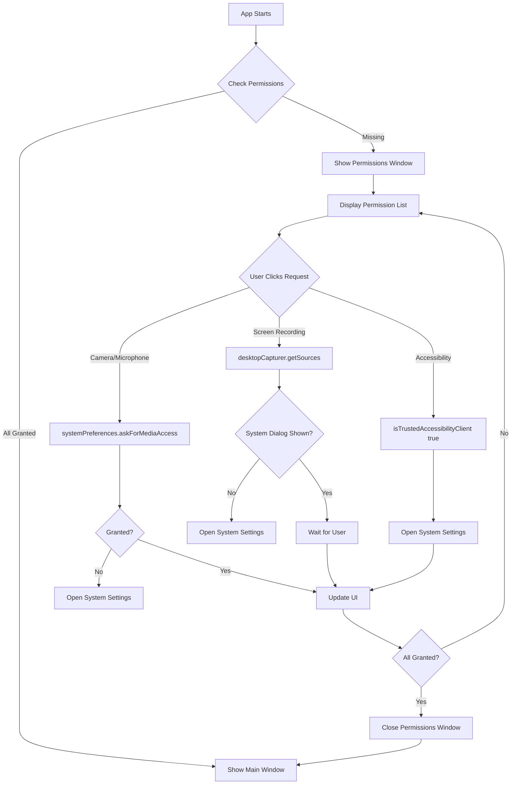
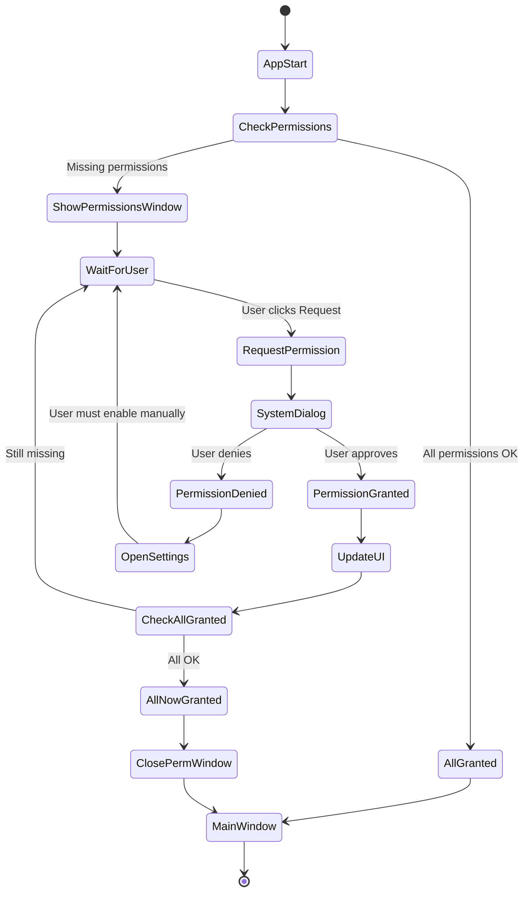

# System Permissions

This document explains the system permissions required by Snaplark, particularly on macOS, and how the permission request flow works.

## Overview

Snaplark requires the following permissions to function:

| Permission | Purpose | Platform |
|------------|---------|----------|
| Screen Recording | Capture screen content | macOS |
| Camera | Webcam overlay in recordings | macOS, Windows |
| Microphone | Audio recording | macOS, Windows |
| Accessibility | Record specific windows | macOS only |

## macOS Permission Requirements

macOS has strict privacy controls. Users must explicitly grant permissions in System Settings.

### Permission States

Each permission can be in one of these states:

| State | Meaning |
|-------|---------|
| `not-determined` | User hasn't been asked yet |
| `granted` | User approved |
| `denied` | User denied |
| `restricted` | System policy prevents access |

### Checking Permissions

```javascript
// main.js
const checkAppPermissions = () => {
    if (process.platform !== 'darwin') {
        return {
            allGranted: true,
            statuses: { camera: true, microphone: true, screen: true, accessibility: true }
        }
    }

    const camera = systemPreferences.getMediaAccessStatus('camera') === 'granted'
    const microphone = systemPreferences.getMediaAccessStatus('microphone') === 'granted'
    const screen = systemPreferences.getMediaAccessStatus('screen') === 'granted'
    const accessibility = systemPreferences.isTrustedAccessibilityClient(false)

    return {
        allGranted: camera && microphone && screen && accessibility,
        statuses: { camera, microphone, screen, accessibility }
    }
}
```

## Permission Request Flow



## Permission Window

**Location:** `src/views/PermissionsView.vue`

The permission window shows:
- List of required permissions
- Status icon for each (granted/denied/pending)
- "Request" button for each permission
- "Continue" button (enabled when all granted)

**Window Configuration:**

```javascript
// window-manager.js
permissions: {
    width: 400,
    height: 640,
    frame: false,
    transparent: true,
    resizable: false,
    center: true
}
```

## Requesting Individual Permissions

### Camera & Microphone

```javascript
ipcMain.handle('request-system-permission', async (event, permissionId) => {
    if (permissionId === 'camera' || permissionId === 'microphone') {
        const status = systemPreferences.getMediaAccessStatus(permissionId)

        if (status === 'not-determined') {
            // Ask for permission (shows system dialog)
            const granted = await systemPreferences.askForMediaAccess(permissionId)
            return granted
        } else if (status === 'granted') {
            return true
        } else {
            // Denied - open System Settings
            const privacyType = permissionId === 'camera'
                ? 'Privacy_Camera'
                : 'Privacy_Microphone'
            await shell.openExternal(
                `x-apple.systempreferences:com.apple.preference.security?${privacyType}`
            )
            return false
        }
    }
})
```

### Screen Recording

Screen recording permission cannot be requested programmatically on macOS. The app must trigger the permission dialog by attempting to capture:

```javascript
if (permissionId === 'screen') {
    const status = systemPreferences.getMediaAccessStatus('screen')

    if (status === 'granted') {
        return true
    }

    // Trigger permission dialog by attempting capture
    const { desktopCapturer } = require('electron')

    // Create hidden window to trigger permission
    const permissionWindow = new BrowserWindow({ show: false })

    // This triggers the system permission dialog
    const sources = await desktopCapturer.getSources({
        types: ['screen', 'window'],
        thumbnailSize: { width: 150, height: 150 }
    })

    permissionWindow.destroy()

    // Check if permission was granted
    const newStatus = systemPreferences.getMediaAccessStatus('screen')
    if (newStatus === 'granted') {
        return true
    }

    // If still not granted, open System Settings
    await shell.openExternal(
        'x-apple.systempreferences:com.apple.preference.security?Privacy_ScreenCapture'
    )
    return false
}
```

### Accessibility

```javascript
if (permissionId === 'accessibility') {
    const isTrusted = systemPreferences.isTrustedAccessibilityClient(false)

    if (isTrusted) {
        return true
    }

    // Prompt for accessibility (shows system dialog)
    systemPreferences.isTrustedAccessibilityClient(true)

    // Open System Settings for manual enable
    await shell.openExternal(
        'x-apple.systempreferences:com.apple.preference.security?Privacy_Accessibility'
    )
    return false
}
```

## Entitlements (Code Signing)

**Location:** `entitlements.plist`

For notarized macOS apps, certain capabilities must be declared:

```xml
<?xml version="1.0" encoding="UTF-8"?>
<!DOCTYPE plist PUBLIC "-//Apple//DTD PLIST 1.0//EN" "...">
<plist version="1.0">
  <dict>
    <!-- Basic Electron permissions -->
    <key>com.apple.security.cs.allow-jit</key>
    <true/>
    <key>com.apple.security.cs.allow-unsigned-executable-memory</key>
    <true/>

    <!-- Hardware Access -->
    <key>com.apple.security.device.camera</key>
    <true/>
    <key>com.apple.security.device.microphone</key>
    <true/>
    <key>com.apple.security.device.audio-input</key>
    <true/>

    <!-- Login Items / Launch at Startup -->
    <key>com.apple.security.automation.apple-events</key>
    <true/>
  </dict>
</plist>
```

## Usage Description Strings

**Location:** `forge.config.js`

macOS requires human-readable descriptions for why permissions are needed:

```javascript
extendInfo: {
    NSCameraUsageDescription:
        'Snaplark needs camera access to record videos with webcam.',
    NSMicrophoneUsageDescription:
        'Snaplark needs microphone access to record audio in your videos.',
    NSScreenCaptureUsageDescription:
        'Snaplark needs screen recording permission to capture your screen.',
    NSAccessibilityUsageDescription:
        'Snaplark needs accessibility access to record specific windows.',
    NSAudioCaptureUsageDescription:
        'Snaplark needs audio capture access to record system audio in your videos.'
}
```

These strings are shown in the system permission dialogs.

## Optimistic Permission Updates

Sometimes macOS takes a moment to update permission status after granting. To improve UX, we track recent grants:

```javascript
// main.js
const permissionGrantTimestamps = {}

const markPermissionGranted = (permId) => {
    permissionGrantTimestamps[permId] = Date.now()
}

// When checking permissions
ipcMain.handle('check-system-permissions', async () => {
    const permissions = checkAppPermissions().statuses

    // Check if we recently granted permissions
    const now = Date.now()
    for (const [permId, timestamp] of Object.entries(permissionGrantTimestamps)) {
        // If permission was granted in the last 10 seconds, consider it granted
        if (now - timestamp < 10000 && !permissions[permId]) {
            permissions[permId] = true
        }
    }

    return permissions
})
```

## Refocusing After System Dialog

When system dialogs open, the app loses focus. We refocus after:

```javascript
const focusPermissionsWindow = async () => {
    const permissionsWindow = windowManager?.getWindow('permissions')

    if (permissionsWindow && !permissionsWindow.isDestroyed()) {
        // Wait for system dialog to close
        await new Promise(resolve => setTimeout(resolve, 500))

        permissionsWindow.show()
        permissionsWindow.focus()

        // Ensure app is brought to front on macOS
        if (process.platform === 'darwin') {
            app.focus({ steal: true })
        }
    }
}
```

## Windows Permissions

Windows handles permissions differently:
- Camera/Microphone: System prompts automatically on first use
- Screen Recording: No permission required
- Accessibility: Not applicable

For Windows, the permission check returns all granted:

```javascript
if (process.platform !== 'darwin') {
    return {
        allGranted: true,
        statuses: {
            camera: true,
            microphone: true,
            screen: true,
            accessibility: true
        }
    }
}
```

## Permission Flow Diagram



## Troubleshooting

### Permission Stuck as "Denied"

1. Open System Settings → Privacy & Security
2. Find the relevant permission category
3. Enable Snaplark in the list
4. Restart the app

### Permission Dialog Not Appearing

1. Reset permissions: `tccutil reset Camera com.snaplark.snaplark`
2. Restart the app
3. Try requesting again

### App Crashes After Granting Permission

Some permissions require app restart to take effect:
1. Close Snaplark completely
2. Reopen the app
3. Permission should now work

## File Locations

| File | Purpose |
|------|---------|
| `src/main.js` | Permission checking and requesting |
| `src/views/PermissionsView.vue` | Permission UI |
| `entitlements.plist` | macOS entitlements |
| `forge.config.js` | Usage description strings |

## Next Steps

- [Screenshot Capture](/features/screenshot) - Uses screen permission
- [Video Recording](/features/video-recording) - Uses all permissions
- [Build Process](/deployment/build-process) - How entitlements are applied
