# Screenshot Capture

This document explains how screenshot capture works in Snaplark, from the moment the user triggers a screenshot to the final saved/uploaded image.

## Overview

The screenshot feature allows users to:
- Capture any region of any connected display
- Use a magnifier for pixel-perfect selection
- See crosshairs for alignment
- Extract text via OCR
- Annotate with drawing tools
- Save locally, copy to clipboard, or upload to cloud

## Complete Flow Diagram

### High-Level Architecture

```
┌─────────────────────────────────────────────────────────────────────────────┐
│                           SCREENSHOT CAPTURE FLOW                            │
├─────────────────────────────────────────────────────────────────────────────┤
│                                                                              │
│   ┌──────────────┐      ┌──────────────┐      ┌──────────────┐             │
│   │    TRIGGER   │      │   CAPTURE    │      │   ANNOTATE   │             │
│   │              │      │              │      │              │             │
│   │  • Shortcut  │─────▶│  • Screens   │─────▶│  • Konva.js  │             │
│   │  • Tray Menu │      │  • Selection │      │  • Tools     │             │
│   │  • UI Button │      │  • Multi-mon │      │  • Export    │             │
│   └──────────────┘      └──────────────┘      └──────────────┘             │
│          │                     │                     │                      │
│          ▼                     ▼                     ▼                      │
│   ┌──────────────────────────────────────────────────────────────────┐     │
│   │                     OUTPUT OPTIONS                                │     │
│   ├──────────────────┬──────────────────┬──────────────────┐         │     │
│   │   Save Local     │   Clipboard      │   Cloud Upload   │         │     │
│   │   ~/Pictures/    │   writeImage()   │   POST /upload   │         │     │
│   └──────────────────┴──────────────────┴──────────────────┘         │     │
│                                                                              │
└─────────────────────────────────────────────────────────────────────────────┘
```

### Detailed Sequence Diagram

```mermaid
sequenceDiagram
    autonumber
    participant U as 👤 User
    participant MP as ⚙️ Main Process
    participant SS as 📸 Screenshot Service
    participant WM as 🪟 Window Manager
    participant SW as 🖼️ Screenshot Window
    participant KE as 🎨 Konva Editor
    participant API as ☁️ Cloud API

    rect rgb(240, 248, 255)
        Note over U,MP: PHASE 1: TRIGGER
        U->>MP: Global Shortcut (Cmd+Option+S)
        MP->>MP: trigger-screenshot via IPC
        MP->>SS: startScreenshotMode()
    end

    rect rgb(255, 248, 240)
        Note over SS,SW: PHASE 2: SCREEN CAPTURE
        SS->>SS: desktopCapturer.getSources()
        SS->>SS: Cache thumbnails (8K max)
        loop For each connected display
            SS->>WM: Create screenshot window
            WM->>SW: New fullscreen transparent window
            SW->>SW: Load ScreenshotView.vue
        end
    end

    rect rgb(240, 255, 240)
        Note over U,SW: PHASE 3: SELECTION
        U->>SW: Move mouse across displays
        SW->>SW: Detect active display
        SW->>MP: Close other screenshot windows
        U->>SW: Click and drag selection
        SW->>SW: Render selection UI
        Note right of SW: • Dark overlay<br/>• Selection rect<br/>• Magnifier (4x)<br/>• Crosshairs<br/>• Dimension pill
    end

    rect rgb(255, 240, 255)
        Note over SW,KE: PHASE 4: ANNOTATION
        U->>SW: Release mouse (selection complete)
        SW->>KE: Initialize Konva stage
        KE->>KE: Load captured region as background
        U->>KE: Draw annotations (optional)
        Note right of KE: Tools: Line, Arrow, Rect,<br/>Ellipse, Pencil, Highlighter,<br/>Text, Blur, Eraser
    end

    rect rgb(248, 248, 248)
        Note over KE,API: PHASE 5: EXPORT
        U->>KE: Click action button
        alt 💾 Save Locally
            KE->>KE: stage.toDataURL()
            KE->>MP: save-screenshot-directly
            MP->>MP: fs.writeFileSync()
            MP->>U: Show success notification
        else 📋 Copy to Clipboard
            KE->>KE: stage.toDataURL()
            KE->>MP: copy-screenshot
            MP->>MP: clipboard.writeImage()
            MP->>U: Show "Copied!" notification
        else ☁️ Upload to Cloud
            KE->>KE: stage.toDataURL()
            KE->>API: POST /screenshots/upload
            API-->>KE: { url: "https://..." }
            KE->>MP: writeToClipboard(url)
            MP->>U: Show notification with link
        end
    end

    SW->>WM: Close screenshot window
    WM->>MP: Restore main window
```



### Layer Breakdown

```
┌─────────────────────────────────────────────────────────────────────────────┐
│                        SCREENSHOT SYSTEM LAYERS                             │
├─────────────────────────────────────────────────────────────────────────────┤
│                                                                              │
│  LAYER 1: TRIGGER LAYER                                                      │
│  ┌────────────────────────────────────────────────────────────────────┐     │
│  │  Global Shortcut (Cmd+Option+S)                                     │     │
│  │  └─▶ main.js: shortcutManager.register()                           │     │
│  │      └─▶ ipcMain.send('trigger-screenshot')                        │     │
│  │          └─▶ MainView.vue: onScreenshotTrigger()                   │     │
│  └────────────────────────────────────────────────────────────────────┘     │
│                              │                                               │
│                              ▼                                               │
│  LAYER 2: CAPTURE LAYER                                                      │
│  ┌────────────────────────────────────────────────────────────────────┐     │
│  │  screenshot-service.js                                              │     │
│  │  ├─▶ preCaptureScreens()                                           │     │
│  │  │   └─▶ desktopCapturer.getSources({ types: ['screen'] })         │     │
│  │  │       └─▶ thumbnailSize: 7680x4320 (8K)                         │     │
│  │  └─▶ startScreenshotMode()                                         │     │
│  │      └─▶ windowManager.createWindow('screenshot', { display })      │     │
│  └────────────────────────────────────────────────────────────────────┘     │
│                              │                                               │
│                              ▼                                               │
│  LAYER 3: UI LAYER                                                           │
│  ┌────────────────────────────────────────────────────────────────────┐     │
│  │  ScreenshotView.vue                                                 │     │
│  │  ├─▶ Dark overlay (rgba(0,0,0,0.4))                                │     │
│  │  ├─▶ Selection rectangle (transparent cutout)                       │     │
│  │  ├─▶ Magnifier (200px circle, 4x zoom)                             │     │
│  │  ├─▶ Crosshairs (full-screen alignment lines)                       │     │
│  │  └─▶ Dimension pill (WxH pixels)                                    │     │
│  └────────────────────────────────────────────────────────────────────┘     │
│                              │                                               │
│                              ▼                                               │
│  LAYER 4: ANNOTATION LAYER                                                   │
│  ┌────────────────────────────────────────────────────────────────────┐     │
│  │  KonvaEditor.vue (Konva.js Canvas)                                  │     │
│  │  ├─▶ Stage (container)                                             │     │
│  │  │   └─▶ Layer                                                      │     │
│  │  │       ├─▶ Background Image (captured region)                     │     │
│  │  │       ├─▶ Shape objects (lines, arrows, rects...)               │     │
│  │  │       ├─▶ Text groups (editable text boxes)                      │     │
│  │  │       └─▶ Blur regions (filtered image copies)                   │     │
│  │  └─▶ Transformer (resize/move handles)                              │     │
│  └────────────────────────────────────────────────────────────────────┘     │
│                              │                                               │
│                              ▼                                               │
│  LAYER 5: OUTPUT LAYER                                                       │
│  ┌────────────────────────────────────────────────────────────────────┐     │
│  │  Export: stage.toDataURL({ pixelRatio, mimeType: 'image/png' })    │     │
│  │  ├─▶ Save: fs.writeFileSync(path, buffer)                          │     │
│  │  ├─▶ Copy: clipboard.writeImage(nativeImage)                       │     │
│  │  └─▶ Upload: apiClient.post('/screenshots/upload', formData)        │     │
│  └────────────────────────────────────────────────────────────────────┘     │
│                                                                              │
└─────────────────────────────────────────────────────────────────────────────┘
```

## Step-by-Step Breakdown

### Step 1: Triggering Screenshot Mode

**Entry Points:**
1. Global keyboard shortcut: `Cmd+Option+S` (Mac) / `Ctrl+Alt+S` (Windows)
2. Click "Screenshot" button in main window
3. System tray menu → "Take Screenshot"

**What happens:**

```javascript
// main.js - Shortcut registration
action = () => {
    const mainWindow = windowManager.getWindow('main')
    mainWindow.webContents.send('trigger-screenshot')
}
```

The main process sends an IPC message to the renderer, which then calls:

```javascript
// MainView.vue
window.electron.startScreenshotMode()
```

### Step 2: Screen Capture (Pre-capture Optimization)

**Location:** `src/services/screenshot-service.js`

Before showing the selection UI, Snaplark captures all screens:

```javascript
async preCaptureScreens() {
    // Check if cache is still valid (2 seconds)
    if (this.displayCache && Date.now() - this.displayCacheTime < 2000) {
        return this.displayCache
    }

    // Capture all screens using Electron's desktopCapturer
    const sources = await desktopCapturer.getSources({
        types: ['screen'],
        thumbnailSize: { width: 7680, height: 4320 } // Up to 8K
    })

    // Store captures with display information
    this.displayCache = displays.map(display => ({
        display,
        source: matchingSource,
        thumbnail: source.thumbnail
    }))

    return this.displayCache
}
```

**Why pre-capture?**
- Screen content is frozen at capture time
- Ensures consistent image during selection
- Makes annotation possible (no flickering)
- Optimization: captures happen when main window shows (100ms delay)

### Step 3: Creating Screenshot Windows

**Location:** `src/services/window-manager.js`

For each connected display, a fullscreen transparent window is created:

```javascript
// Window configuration for screenshot windows
screenshot: {
    width: display.bounds.width,
    height: display.bounds.height,
    x: display.bounds.x,
    y: display.bounds.y,
    frame: false,
    transparent: true,
    alwaysOnTop: true,
    fullscreen: true,
    skipTaskbar: true,
    hasShadow: false,
    webPreferences: {
        contextIsolation: true,
        preload: PRELOAD_PATH
    }
}
```

**Key properties:**
- `transparent: true` - Allows seeing through unselected areas
- `alwaysOnTop: true` - Stays above all other windows
- `fullscreen: true` - Covers entire display
- One window per display for multi-monitor support

### Step 4: Selection UI

**Location:** `src/views/ScreenshotView.vue`

The screenshot view renders:

1. **Dark overlay** - Dims the screen (semi-transparent black)
2. **Selection rectangle** - The area being selected (shows through to capture)
3. **Magnifier** - 200px zoomed circle following cursor
4. **Crosshairs** - Horizontal and vertical alignment lines
5. **Dimension pill** - Shows width × height in pixels

**Selection Logic:**

```javascript
// Mouse events
onMouseDown(e) {
    this.isSelecting = true
    this.startPoint = { x: e.clientX, y: e.clientY }
}

onMouseMove(e) {
    if (this.isSelecting) {
        this.endPoint = { x: e.clientX, y: e.clientY }
        this.updateSelectionRect()
    }
    this.updateMagnifier(e.clientX, e.clientY)
}

onMouseUp(e) {
    this.isSelecting = false
    this.showAnnotationMode()
}
```

### Step 5: Multi-Display Handling

When the user moves between displays:

```javascript
// Detect which display the cursor is on
const currentDisplay = screen.getDisplayNearestPoint(cursorPos)

// Close screenshot windows on other displays
ipcRenderer.invoke('close-other-screenshot-windows', currentDisplayId)
```

This ensures only one display is active at a time, reducing resource usage.

### Step 6: Annotation Mode

**Location:** `src/components/KonvaEditor.vue`

Once selection is complete, the Konva editor activates:

```javascript
// Initialize Konva stage
stage = new Konva.Stage({
    container: 'selected-area',
    width: selectionRect.width,
    height: selectionRect.height
})

layer = new Konva.Layer()
stage.add(layer)

// Load captured region as background
const bgImage = new Konva.Image({
    image: capturedImage,
    width: stage.width(),
    height: stage.height()
})
layer.add(bgImage)
```

**Available Tools:**
- Line, Arrow, Rectangle, Ellipse
- Pencil (freehand drawing)
- Highlighter (semi-transparent)
- Text (with word wrap)
- Blur (privacy tool)
- Eraser (delete annotations)
- Color picker

See [Annotation Tools](/features/annotation-tools) for detailed tool documentation.

### Step 7: Export and Save

**Export Options:**

1. **Save Locally:**
```javascript
// Export PNG from Konva stage
const dataUrl = stage.toDataURL({
    pixelRatio: window.devicePixelRatio || 1,
    mimeType: 'image/png'
})

// Save to default folder
ipcRenderer.invoke('save-screenshot-directly', {
    dataUrl,
    filename: `screenshot-${Date.now()}.png`
})
```

2. **Copy to Clipboard:**
```javascript
// Main process handles clipboard
const img = nativeImage.createFromDataURL(dataUrl)
clipboard.writeImage(img)
```

3. **Upload to Cloud:**
```javascript
// Convert to blob and upload
const response = await apiClient.post('/screenshots/upload', formData)
// Get shareable link
const shareUrl = response.data.url
```

## Technical Details

### Screen Capture Resolution

The screenshot service captures at full native resolution:

```javascript
const maxDimension = 7680  // 8K max
const minDimension = 1920  // Full HD min

// Calculate thumbnail size based on display
const scale = Math.min(
    maxDimension / display.bounds.width,
    maxDimension / display.bounds.height,
    1  // Never upscale
)
```

**Why 8K max?**
- Supports high-DPI displays (Retina, 4K, 5K)
- Prevents memory issues on very large displays
- Maintains quality for zoomed-in viewing

### Magnifier Implementation

The magnifier shows a 200px zoomed view of the cursor area:

```javascript
// Magnifier configuration
const magnifierSize = 200
const zoomFactor = 4

// Calculate magnifier position (offset from cursor)
const magnifierPos = {
    x: cursorX + 20,
    y: cursorY + 20
}

// Extract and scale the region under cursor
const sourceRegion = {
    x: cursorX - magnifierSize / (2 * zoomFactor),
    y: cursorY - magnifierSize / (2 * zoomFactor),
    width: magnifierSize / zoomFactor,
    height: magnifierSize / zoomFactor
}
```

### OCR Text Extraction

Using Tesseract.js for on-device text recognition:

```javascript
import Tesseract from 'tesseract.js'

async function extractText(imageDataUrl) {
    const result = await Tesseract.recognize(
        imageDataUrl,
        'eng',  // Language
        {
            logger: m => console.log(m)  // Progress
        }
    )
    return result.data.text
}
```

**Supported Languages:** English (more can be added)

## Keyboard Shortcuts (During Screenshot)

| Shortcut | Action |
|----------|--------|
| `Escape` | Cancel screenshot |
| `Arrow Keys` | Nudge selection by 1px |
| `Shift + Arrow` | Nudge selection by 10px |
| `Cmd+C` / `Ctrl+C` | Copy to clipboard |
| `Cmd+S` / `Ctrl+S` | Save to default folder |
| `Cmd+U` / `Ctrl+U` | Upload to cloud |

## Settings That Affect Screenshots

From Settings → Capture:

| Setting | Default | Description |
|---------|---------|-------------|
| `showMagnifier` | `true` | Show magnified view near cursor |
| `showCrosshair` | `true` | Show alignment crosshairs |
| `showCursor` | `true` | Show cursor in capture |
| `defaultSaveFolder` | `~/Pictures/Snaplark` | Where screenshots are saved |

## File Locations

| File | Purpose |
|------|---------|
| `src/services/screenshot-service.js` | Main screenshot logic |
| `src/views/ScreenshotView.vue` | Selection UI |
| `src/components/KonvaEditor.vue` | Annotation editor |
| `src/composables/useWindows.js` | Window helpers |

## Error Handling

| Error | Handling |
|-------|----------|
| No screen permission | Shows permission request window |
| Save failed | Shows error notification |
| Upload failed | Queues for retry when online |
| OCR failed | Shows error, allows manual retry |

## Next Steps

- [Annotation Tools](/features/annotation-tools) - Learn about the drawing tools
- [Cloud Upload](/features/cloud-upload) - How uploads work
- [Video Recording](/features/video-recording) - Recording feature documentation
