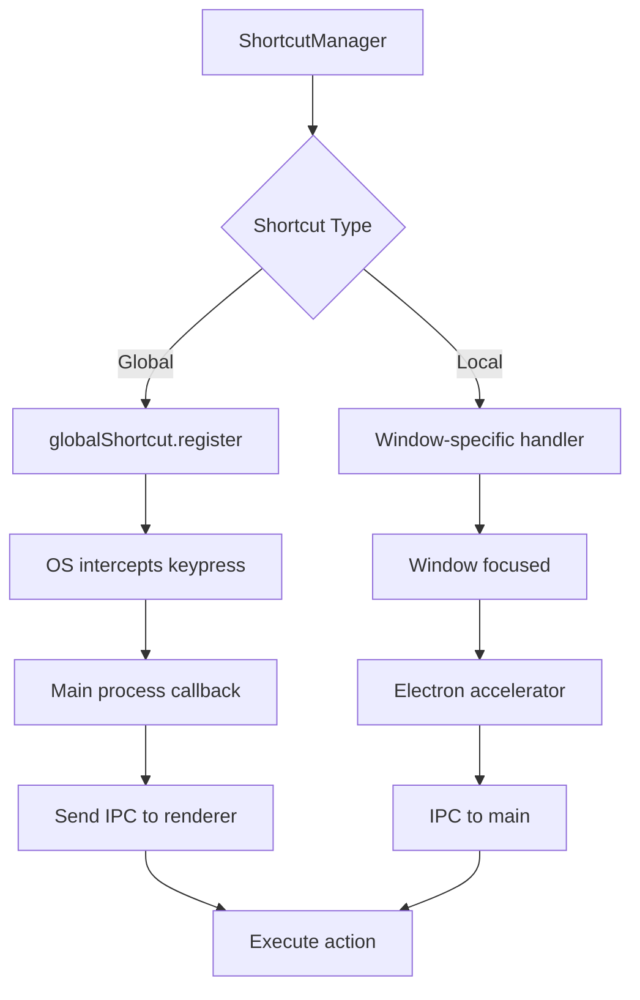
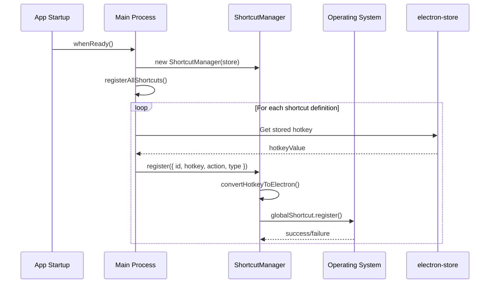

# Global Shortcuts

This document explains how keyboard shortcuts work in Snaplark, including global shortcuts (work from anywhere) and local shortcuts (work within specific windows).

## Overview

Snaplark uses two types of keyboard shortcuts:

1. **Global Shortcuts** - Work even when Snaplark is in the background
2. **Local Shortcuts** - Only work when a specific window is focused

## Default Shortcuts

### Global Shortcuts

| Shortcut (Mac) | Shortcut (Windows) | Action |
|----------------|-------------------|--------|
| `Cmd + Option + S` | `Ctrl + Alt + S` | Take Screenshot |
| `Cmd + Option + R` | `Ctrl + Alt + R` | Start Recording |
| `Cmd + Option + Q` | `Ctrl + Alt + Q` | Show Quick Menu |
| `Cmd + Shift + R` | `Ctrl + Shift + R` | Start/Stop Recording |
| `Cmd + Shift + M` | `Ctrl + Shift + M` | Toggle Microphone |
| `Cmd + Shift + W` | `Ctrl + Shift + W` | Toggle Webcam |

### Local Shortcuts (Screenshot Window)

| Shortcut (Mac) | Shortcut (Windows) | Action |
|----------------|-------------------|--------|
| `Cmd + U` | `Ctrl + U` | Upload Screenshot |
| `Cmd + C` | `Ctrl + C` | Copy to Clipboard |
| `Cmd + S` | `Ctrl + S` | Save to Folder |

## Architecture



## Implementation Details

### ShortcutManager Class

**Location:** `src/services/shortcut-manager.js`

The `ShortcutManager` handles all shortcut registration:

```javascript
class ShortcutManager {
    constructor(store) {
        this.store = store
        this.registeredShortcuts = new Map()
    }

    // Register a shortcut
    register({ id, hotkey, action, type, windowId, description }) {
        // Convert display format to Electron format
        const electronKey = this.convertHotkeyToElectron(hotkey)

        if (type === 'global') {
            const success = globalShortcut.register(electronKey, action)
            if (success) {
                this.registeredShortcuts.set(id, {
                    hotkey, electronKey, action, type
                })
            }
            return { success, electronKey }
        } else {
            // Local shortcuts handled differently
            this.registeredShortcuts.set(id, {
                hotkey, electronKey, action, type, windowId
            })
            return { success: true, electronKey }
        }
    }

    // Unregister a shortcut
    unregister(id) {
        const shortcut = this.registeredShortcuts.get(id)
        if (!shortcut) return false

        if (shortcut.type === 'global') {
            globalShortcut.unregister(shortcut.electronKey)
        }

        this.registeredShortcuts.delete(id)
        return true
    }
}
```

### Hotkey Format Conversion

The store uses display format (`Cmd + Option + S`), but Electron needs accelerator format (`CommandOrControl+Alt+S`):

```javascript
convertHotkeyToElectron(hotkey) {
    if (!hotkey) return null

    return hotkey
        .replace(/Cmd/g, 'CommandOrControl')
        .replace(/Command/g, 'CommandOrControl')
        .replace(/Ctrl/g, 'CommandOrControl')
        .replace(/Option/g, 'Alt')
        .replace(/\s*\+\s*/g, '+')
}
```

### Shortcut Definitions

**Location:** `src/config/shortcuts.js`

```javascript
export const SHORTCUT_DEFINITIONS = {
    screenshot: {
        id: 'screenshot',
        storeKey: 'hotkeyScreenshot',
        type: 'global',
        description: 'Take Screenshot',
        default: {
            mac: 'Cmd + Option + S',
            windows: 'Ctrl + Alt + S'
        }
    },
    recording: {
        id: 'recording',
        storeKey: 'hotkeyRecording',
        type: 'global',
        description: 'Start Recording',
        default: {
            mac: 'Cmd + Option + R',
            windows: 'Ctrl + Alt + R'
        }
    },
    // ... more definitions
}
```

### Registration Flow



### Action Execution

When a global shortcut is pressed:

```javascript
// Registration with action callback
action = () => {
    const mainWindow = windowManager.getWindow('main')
    if (mainWindow && mainWindow.webContents) {
        mainWindow.webContents.send('trigger-screenshot')
    }
}

// Renderer listens for trigger
window.electron.onScreenshotTrigger(() => {
    startScreenshotMode()
})
```

## Validation

Before saving a new shortcut, it's validated:

```javascript
validateHotkey(hotkeyValue, type, excludeId) {
    if (!hotkeyValue) {
        return { valid: true }  // Empty is valid (disables shortcut)
    }

    const electronKey = this.convertHotkeyToElectron(hotkeyValue)

    // Check for conflicts with other shortcuts
    for (const [id, shortcut] of this.registeredShortcuts) {
        if (id !== excludeId && shortcut.electronKey === electronKey) {
            return {
                valid: false,
                error: 'Shortcut already in use',
                duplicate: {
                    id,
                    description: shortcut.description
                }
            }
        }
    }

    // Test if it can be registered (global only)
    if (type === 'global') {
        const testSuccess = globalShortcut.register(electronKey, () => {})
        if (testSuccess) {
            globalShortcut.unregister(electronKey)
            return { valid: true, electronKey }
        } else {
            return {
                valid: false,
                error: 'Shortcut may be used by another application'
            }
        }
    }

    return { valid: true, electronKey }
}
```

## Settings UI

**Location:** `src/views/SettingsView.vue`

Users can customize shortcuts in Settings → Hotkeys:

```vue
<SettingsHotkeyItem
    label="Screenshot"
    :value="store.settings.hotkeyScreenshot"
    store-key="hotkeyScreenshot"
    @change="updateShortcut"
/>
```

The `SettingsHotkeyItem` component:
1. Displays current shortcut
2. Listens for key presses when editing
3. Validates new shortcut
4. Saves to store and re-registers

### Hotkey Capture

```javascript
function captureShortcut(event) {
    event.preventDefault()

    const modifiers = []
    if (event.metaKey) modifiers.push('Cmd')
    if (event.ctrlKey) modifiers.push('Ctrl')
    if (event.altKey) modifiers.push('Option')
    if (event.shiftKey) modifiers.push('Shift')

    const key = event.key.toUpperCase()

    // Ignore modifier-only presses
    if (['META', 'CONTROL', 'ALT', 'SHIFT'].includes(key)) {
        return
    }

    const hotkey = [...modifiers, key].join(' + ')
    validateAndSave(hotkey)
}
```

## IPC Handlers

```javascript
// Validate shortcut before assignment
ipcMain.handle('validate-shortcut', async (event, storeKey, hotkeyValue) => {
    const validation = shortcutManager.validateHotkey(hotkeyValue, type, id)
    return validation
})

// Update shortcut
ipcMain.handle('update-shortcut', async (event, storeKey, hotkeyValue) => {
    // Validate
    const validation = shortcutManager.validateHotkey(hotkeyValue, type, id)
    if (!validation.valid) {
        return { success: false, error: validation.error }
    }

    // Update store
    const settings = store.get('settings') || {}
    settings[storeKey] = hotkeyValue
    store.set('settings', settings)

    // Re-register shortcut
    const result = registerShortcutFromStore(shortcutKey)
    return result
})
```

## Platform Differences

### macOS
- `Cmd` = `Command` key (⌘)
- `Option` = `Alt` key (⌥)
- Shortcuts work even when app is hidden

### Windows
- `Ctrl` = Control key
- No `Cmd` key (mapped to `Ctrl`)
- `Alt` = Alt key
- Shortcuts may conflict with system shortcuts

## Conflict Resolution

If a shortcut conflicts:

1. **With another Snaplark shortcut:**
   - UI shows warning with conflicting shortcut name
   - User must choose different combination

2. **With system/other app:**
   - Registration may fail silently
   - `globalShortcut.register()` returns false
   - UI shows "may be used by another application"

## Storage

Shortcuts are stored in electron-store:

```javascript
{
    settings: {
        hotkeyScreenshot: 'Cmd + Option + S',
        hotkeyRecording: 'Cmd + Option + R',
        hotkeyQuickMenu: 'Cmd + Option + Q'
    }
}
```

## Cleanup

Shortcuts are unregistered on app quit:

```javascript
app.on('will-quit', () => {
    shortcutManager.unregisterAll()
})
```

## Troubleshooting

### Shortcut Not Working

1. Check if another app is using the same shortcut
2. Try re-registering in Settings
3. Check console for registration errors
4. Restart the app

### Shortcut Shows as "Invalid"

1. Ensure modifier keys are included (Cmd/Ctrl)
2. Try a different key combination
3. Check for conflicts

## File Locations

| File | Purpose |
|------|---------|
| `src/services/shortcut-manager.js` | Shortcut management |
| `src/config/shortcuts.js` | Shortcut definitions |
| `src/main.js` | Registration calls |
| `src/views/SettingsView.vue` | UI for configuration |
| `src/components/SettingsHotkeyItem.vue` | Hotkey input component |

## Next Steps

- [System Permissions](/features/permissions) - Required macOS permissions
- [Architecture Overview](/architecture/overview) - How shortcuts fit in
- [Main Process](/architecture/main-process) - Where shortcuts are registered
