# Video Recording

This document explains how video recording works in Snaplark, including screen capture, audio sources, webcam overlay, and the upload process.

## Overview

The video recording feature allows users to:
- Record any region of the screen or full screen
- Include webcam overlay (draggable, resizable)
- Capture microphone audio
- Capture system audio (macOS)
- Real-time upload while recording
- Preview before saving/uploading

## Complete Flow Diagram

### High-Level Architecture

```
┌─────────────────────────────────────────────────────────────────────────────┐
│                        VIDEO RECORDING FLOW                                  │
├─────────────────────────────────────────────────────────────────────────────┤
│                                                                              │
│   ┌─────────────┐     ┌─────────────┐     ┌─────────────┐     ┌───────────┐│
│   │   SETUP     │     │  RECORDING  │     │  REAL-TIME  │     │  FINALIZE ││
│   │             │     │             │     │   UPLOAD    │     │           ││
│   │ • Region    │────▶│ • Capture   │────▶│ • Buffer    │────▶│ • Preview ││
│   │ • Audio     │     │ • Webcam    │     │ • 5MB Chunk │     │ • Save    ││
│   │ • Countdown │     │ • Controls  │     │ • S3 Upload │     │ • Publish ││
│   └─────────────┘     └─────────────┘     └─────────────┘     └───────────┘│
│                                                                              │
├─────────────────────────────────────────────────────────────────────────────┤
│                          DATA FLOW                                           │
│                                                                              │
│   Screen ──▶ MediaRecorder ──▶ Blob Chunks ──▶ 5MB Buffer ──▶ S3 Upload    │
│      │                             │                              │          │
│      ▼                             ▼                              ▼          │
│   Webcam ─┐                   Temp File                      Cloud Video    │
│           │                   (Recovery)                                     │
│   Audio ──┴──▶ Combined Stream                                               │
│                                                                              │
└─────────────────────────────────────────────────────────────────────────────┘
```

### Detailed Sequence Diagram

```mermaid
sequenceDiagram
    autonumber
    participant U as 👤 User
    participant MP as ⚙️ Main Process
    participant VRS as 🎥 Video Service
    participant RW as 🖼️ Recording Window
    participant MR as 📹 MediaRecorder
    participant CUM as 📦 Chunk Upload Mgr
    participant API as ☁️ Cloud API
    participant S3 as 🗄️ S3 Storage

    rect rgb(240, 248, 255)
        Note over U,VRS: PHASE 1: SETUP
        U->>MP: Global Shortcut (Cmd+Option+R)
        MP->>VRS: startVideoRecordingMode()
        VRS->>RW: Create fullscreen selection window
        U->>RW: Select region + audio sources
        U->>RW: Toggle webcam overlay
        U->>RW: Click "Start Recording"
    end

    rect rgb(255, 250, 240)
        Note over RW,MR: PHASE 2: INITIALIZATION
        RW->>RW: 3... 2... 1... countdown
        RW->>MP: init-recording-stream
        MP->>MP: Create temp WriteStream
        RW->>MR: new MediaRecorder(stream)
        Note right of MR: VP9 codec<br/>2.5 Mbps<br/>WebM container
        RW->>CUM: queueInit(metadata)
        CUM->>API: POST /videos/init
        API-->>CUM: { sessionId }
    end

    rect rgb(240, 255, 240)
        Note over MR,S3: PHASE 3: RECORDING + UPLOAD
        loop Every 1 second (dataavailable)
            MR->>RW: Blob chunk (~300KB)
            RW->>MP: append-recording-chunk
            MP->>MP: writeStream.write(buffer)
            RW->>CUM: queueChunk(blob)
            CUM->>CUM: Add to buffer
            alt Buffer ≥ 5MB
                CUM->>CUM: Combine into single Blob
                CUM->>API: POST /videos/chunk
                API->>S3: Upload part
                S3-->>API: Part ETag
                API-->>CUM: { received: true }
            end
        end
    end

    rect rgb(255, 240, 240)
        Note over U,S3: PHASE 4: FINALIZATION
        U->>RW: Click Stop
        RW->>MR: recorder.stop()
        RW->>MP: stopRecordingStream()
        MP->>MP: writeStream.end()
        RW->>CUM: markRecordingFinished()
        CUM->>CUM: Flush remaining buffer
        CUM->>API: Upload final chunk(s)
        CUM->>API: POST /videos/finalize
        API->>S3: Complete multipart upload
        S3-->>API: { videoUrl }
        API-->>CUM: { key, url }
    end

    rect rgb(248, 248, 255)
        Note over U,MP: PHASE 5: SAVE
        RW->>U: Show preview window
        U->>RW: Confirm save
        RW->>MP: Move temp to Pictures/
        MP->>U: Success notification
    end
```



### Real-Time Upload Pipeline

```
┌─────────────────────────────────────────────────────────────────────────────┐
│                     CHUNK UPLOAD MANAGER PIPELINE                            │
├─────────────────────────────────────────────────────────────────────────────┤
│                                                                              │
│   MediaRecorder                Chunk Buffer                  Upload Queue    │
│   ┌─────────────┐             ┌─────────────┐              ┌─────────────┐  │
│   │             │             │             │              │             │  │
│   │   ~300KB    │────────────▶│  Accumulate │─────────────▶│  5MB+ Blob  │  │
│   │   chunks    │             │  until 5MB  │              │  ready      │  │
│   │             │             │             │              │             │  │
│   └─────────────┘             └─────────────┘              └─────────────┘  │
│        │                            │                            │          │
│        │ 1 second                   │ Size check                 │ Upload   │
│        │ interval                   │ threshold                  │ to API   │
│        ▼                            ▼                            ▼          │
│   ┌─────────────────────────────────────────────────────────────────────┐   │
│   │                        WHY 5MB MINIMUM?                             │   │
│   │                                                                      │   │
│   │   AWS S3 Multipart Upload Requirements:                             │   │
│   │   • Minimum part size: 5MB (except last part)                       │   │
│   │   • Maximum parts: 10,000                                           │   │
│   │   • Maximum file size: 5TB                                          │   │
│   │                                                                      │   │
│   │   Benefits:                                                          │   │
│   │   • Parallel uploads possible                                       │   │
│   │   • Resume on failure (per-chunk retry)                             │   │
│   │   • Efficient network utilization                                   │   │
│   └─────────────────────────────────────────────────────────────────────┘   │
│                                                                              │
├─────────────────────────────────────────────────────────────────────────────┤
│                        RETRY MECHANISM                                       │
│                                                                              │
│   ┌─────────┐    ┌─────────┐    ┌─────────┐    ┌─────────┐    ┌─────────┐  │
│   │ Attempt │───▶│ 1 sec   │───▶│ 2 sec   │───▶│ 4 sec   │───▶│ 8 sec   │  │
│   │    1    │    │  wait   │    │  wait   │    │  wait   │    │  wait   │  │
│   └─────────┘    └─────────┘    └─────────┘    └─────────┘    └─────────┘  │
│                                                                              │
│   Exponential backoff: [1s, 2s, 4s, 8s, 16s] then continues at 16s          │
│   No maximum retry limit - keeps trying until successful                     │
│                                                                              │
└─────────────────────────────────────────────────────────────────────────────┘
```

### Stream Composition

```
┌─────────────────────────────────────────────────────────────────────────────┐
│                       MEDIA STREAM COMPOSITION                               │
├─────────────────────────────────────────────────────────────────────────────┤
│                                                                              │
│   ┌──────────────────┐                                                       │
│   │  SCREEN CAPTURE  │ desktopCapturer.getSources({ chromeMediaSource })    │
│   │   Video Track    │────────────────────┐                                  │
│   └──────────────────┘                    │                                  │
│                                           │                                  │
│   ┌──────────────────┐                    ▼                                  │
│   │   MICROPHONE     │ getUserMedia({ audio: { deviceId } })                 │
│   │   Audio Track    │────────────────────┤                                  │
│   └──────────────────┘                    │     ┌────────────────────┐       │
│                                           ├────▶│  Combined Stream   │       │
│   ┌──────────────────┐                    │     │                    │       │
│   │  SYSTEM AUDIO    │ electron-audio-loopback (macOS only)          │       │
│   │   Audio Track    │────────────────────┤     │  • Video: VP9      │       │
│   └──────────────────┘                    │     │  • Audio: Opus     │       │
│                                           │     │  • Container: WebM │       │
│   ┌──────────────────┐                    │     └────────────────────┘       │
│   │     WEBCAM       │ (Separate window overlay - not in stream)             │
│   │   Not in main    │ Composited visually only                              │
│   │   recording      │                                                       │
│   └──────────────────┘                                                       │
│                                                                              │
└─────────────────────────────────────────────────────────────────────────────┘
```

## Step-by-Step Breakdown

### Step 1: Triggering Recording Mode

**Entry Points:**
1. Global shortcut: `Cmd+Option+R` (Mac) / `Ctrl+Alt+R` (Windows)
2. Click "Record" button in main window
3. System tray menu → "Record Video"

**What happens:**

```javascript
// main.js
action = () => {
    const mainWindow = windowManager.getWindow('main')
    mainWindow.webContents.send('trigger-video-recording')
}
```

### Step 2: Display Pre-capture

**Location:** `src/services/video-recording-service.js`

Similar to screenshots, displays are pre-captured:

```javascript
async preCaptureScreens() {
    if (this.displayCache && Date.now() - this.displayCacheTime < 2000) {
        return this.displayCache
    }

    const sources = await desktopCapturer.getSources({
        types: ['screen', 'window'],
        thumbnailSize: { width: 1920, height: 1080 }
    })

    this.displayCache = /* mapped display data */
    return this.displayCache
}
```

### Step 3: Recording Window Setup

**Location:** `src/views/VideoRecordingView.vue`

The recording window provides:

1. **Region Selection** - Same as screenshot selection
2. **Source Picker** - Choose screen or specific window
3. **Audio Controls:**
   - Microphone dropdown (list of input devices)
   - System audio toggle (macOS only)
4. **Webcam Toggle** - Enable/disable camera overlay
5. **Start Button** - Initiates recording

**Window Configuration:**

```javascript
// window-manager.js
recording: {
    width: display.bounds.width,
    height: display.bounds.height,
    frame: false,
    transparent: true,
    alwaysOnTop: true,
    fullscreen: true,
    skipTaskbar: true
}
```

### Step 4: Audio Source Configuration

**Microphone Selection:**

```javascript
// useRecorder.js
async function getAudioDevices() {
    const devices = await navigator.mediaDevices.enumerateDevices()
    return devices.filter(d => d.kind === 'audioinput')
}
```

**System Audio Capture (macOS):**

```javascript
// main.js - Audio loopback initialization
import { initMain as initAudioLoopback } from 'electron-audio-loopback'

initAudioLoopback({
    forceCoreAudioTap: true,
    loopbackWithMute: false,
    sourcesOptions: { types: ['screen', 'window'] }
})
```

System audio is captured using `electron-audio-loopback`, which uses macOS Core Audio tap to capture all system sound.

### Step 5: Webcam Overlay

**Location:** `src/views/WebcamView.vue`

When enabled, a separate window shows the webcam:

```javascript
// Window configuration
webcam: {
    width: 208,
    height: 208,
    frame: false,
    transparent: true,
    alwaysOnTop: true,
    resizable: true,
    movable: true
}
```

**Features:**
- Draggable position
- Resizable (maintains aspect ratio)
- Mirror/flip option
- Rounded corners (circular appearance)

### Step 6: Recording Countdown

When the user clicks "Start Recording":

```javascript
async startRecording() {
    // Show countdown (3, 2, 1)
    for (let i = 3; i > 0; i--) {
        this.countdown = i
        await new Promise(r => setTimeout(r, 1000))
    }
    this.countdown = null

    // Start actual recording
    this.beginCapture()
}
```

### Step 7: MediaRecorder Setup

**Creating the Media Stream:**

```javascript
// Combine video and audio streams
const displayStream = await navigator.mediaDevices.getUserMedia({
    video: {
        mandatory: {
            chromeMediaSource: 'desktop',
            chromeMediaSourceId: sourceId
        }
    }
})

const audioStream = await navigator.mediaDevices.getUserMedia({
    audio: {
        deviceId: selectedMicrophone
    }
})

// Merge streams
const tracks = [
    ...displayStream.getVideoTracks(),
    ...audioStream.getAudioTracks()
]
const combinedStream = new MediaStream(tracks)

// Create MediaRecorder
const recorder = new MediaRecorder(combinedStream, {
    mimeType: 'video/webm;codecs=vp9',
    videoBitsPerSecond: 2500000  // 2.5 Mbps
})
```

### Step 8: Real-Time Disk Writing

**Location:** `src/services/video-recording-service.js`

As recording progresses, chunks are written to a temp file:

```javascript
// IPC handler in main process
ipcMain.handle('init-recording-stream', async (event, filename) => {
    const tempPath = path.join(os.tmpdir(), filename)
    this.writeStream = fs.createWriteStream(tempPath)
    return tempPath
})

ipcMain.handle('append-recording-chunk', async (event, chunk) => {
    this.writeStream.write(Buffer.from(chunk))
})
```

**Why write to disk?**
- Prevents memory overflow for long recordings
- Allows recovery if app crashes
- Enables real-time upload

### Step 9: Chunk Upload (Real-Time)

**Location:** `src/services/chunk-upload-manager.js`

The upload manager handles real-time cloud synchronization:


**Key Features:**

1. **5MB Minimum Chunk Size:**
   ```javascript
   this.minChunkSize = 5 * 1024 * 1024  // S3 multipart requirement
   ```

2. **Buffer Management:**
   ```javascript
   addToBuffer(chunkBlob, originalChunkIndex) {
       this.chunkBuffer.push(chunkBlob)
       this.chunkBufferSize += chunkBlob.size

       while (this.chunkBufferSize >= this.minChunkSize) {
           // Combine chunks into 5MB+ blob
           const combinedBlob = new Blob(chunksToCombine, { type: 'video/webm' })
           this.queueChunkDirectly(combinedBlob, this.nextChunkIndex++)
       }
   }
   ```

3. **Exponential Backoff Retry:**
   ```javascript
   retryDelays = [1000, 2000, 4000, 8000, 16000]  // ms
   // After 5 retries, continues at 16s intervals
   ```

4. **Connectivity Awareness:**
   ```javascript
   connectivityService.on('restored', () => {
       if (this.uploadQueue.length > 0) {
           this.processQueue()
       }
   })
   ```

### Step 10: Recording Overlay

**Location:** `src/views/RecordingOverlayView.vue`

During recording, a small overlay window shows:

- Recording time (00:00:00)
- Pause/Resume button
- Stop button
- Microphone mute toggle
- Webcam toggle

**Keyboard Shortcuts During Recording:**

| Shortcut | Action |
|----------|--------|
| `Cmd+Shift+R` | Start/Stop recording |
| `Cmd+Shift+M` | Toggle microphone |
| `Cmd+Shift+W` | Toggle webcam |

### Step 11: Stopping Recording

When the user stops recording:

```javascript
async stopRecording() {
    // Stop MediaRecorder
    this.recorder.stop()

    // Close write stream
    await ipcRenderer.invoke('stopRecordingStream')

    // Flush remaining buffer and finalize upload
    chunkUploadManager.markRecordingFinished(this.chunkCount)

    // Wait for all uploads to complete
    const result = await chunkUploadManager.finalizeSession({
        duration: this.recordingDuration,
        totalChunks: this.chunkCount
    })
}
```

### Step 12: Finalization and Preview

**Finalize API Call:**

```javascript
// chunk-upload-manager.js
async finalizeSession(finalMetadata) {
    // Wait for all chunks to upload
    while (this.uploadQueue.length > 0 || this.isProcessing) {
        await new Promise(r => setTimeout(r, 500))
    }

    // Call finalize endpoint
    const response = await apiClient.post('/videos/finalize', {
        sessionId: this.sessionId,
        totalChunks: this.uploadedChunks.size,
        uploadedChunks: Array.from(this.uploadedChunks),
        duration: finalMetadata.duration
    })

    return response.data
}
```

**Preview Window:**
- Shows the recorded video
- Play/pause controls
- Options: Save, Upload, Delete

### Step 13: Final Save

```javascript
// Move from temp to Pictures folder
const finalPath = path.join(
    store.get('settings.defaultSaveFolder') || '~/Pictures/Snaplark',
    `recording-${Date.now()}.webm`
)

fs.renameSync(tempFilePath, finalPath)
```

## Technical Details

### Video Codec and Format

| Property | Value |
|----------|-------|
| Container | WebM |
| Video Codec | VP9 |
| Audio Codec | Opus |
| Default Bitrate | 2.5 Mbps |
| Frame Rate | Display refresh rate |

### Memory Management

- Chunks written to disk immediately (not held in memory)
- Maximum buffer size controlled by chunk threshold
- Temp files cleaned up after successful save

### Upload Progress Tracking

```javascript
getProgress() {
    return {
        uploaded: this.uploadedChunks.size,
        pending: this.uploadQueue.length,
        failed: this.failedChunks.size,
        percentage: Math.round((uploaded / total) * 100),
        isOnline: connectivityService.isOnline,
        hasSession: !!this.sessionId
    }
}
```

## Settings That Affect Recording

| Setting | Default | Description |
|---------|---------|-------------|
| `recordingCountdown` | `true` | Show 3-2-1 countdown |
| `flipCamera` | `false` | Mirror webcam horizontally |
| `webcamEnabled` | `false` | Enable webcam by default |
| `systemAudioEnabled` | `false` | Capture system audio |
| `selectedMicrophoneDeviceId` | `null` | Preferred microphone |
| `selectedWebcamDeviceId` | `null` | Preferred webcam |

## API Endpoints

| Endpoint | Method | Purpose |
|----------|--------|---------|
| `/videos/init` | POST | Initialize upload session |
| `/videos/chunk` | POST | Upload a 5MB+ chunk |
| `/videos/finalize` | POST | Complete upload session |

## File Locations

| File | Purpose |
|------|---------|
| `src/services/video-recording-service.js` | Recording coordination |
| `src/services/chunk-upload-manager.js` | Upload management |
| `src/views/VideoRecordingView.vue` | Recording setup UI |
| `src/views/RecordingOverlayView.vue` | Recording controls |
| `src/views/WebcamView.vue` | Webcam preview |
| `src/composables/useRecorder.js` | Recording state/methods |

## Error Handling

| Error | Handling |
|-------|----------|
| No camera permission | Shows permission dialog |
| No microphone permission | Shows permission dialog |
| Disk full | Shows error, saves what's possible |
| Network failure | Queues chunks for retry |
| Upload timeout | Retries with exponential backoff |
| Session expired | Re-initializes session |

## Platform Differences

| Feature | macOS | Windows |
|---------|-------|---------|
| System audio | Supported (Core Audio tap) | Not supported |
| Screen capture | Requires permission | Works immediately |
| Webcam | Requires permission | Works immediately |

## Next Steps

- [Cloud Upload](/features/cloud-upload) - Detailed upload documentation
- [Annotation Tools](/features/annotation-tools) - Drawing tool documentation
- [Screenshot Capture](/features/screenshot) - Screenshot documentation
